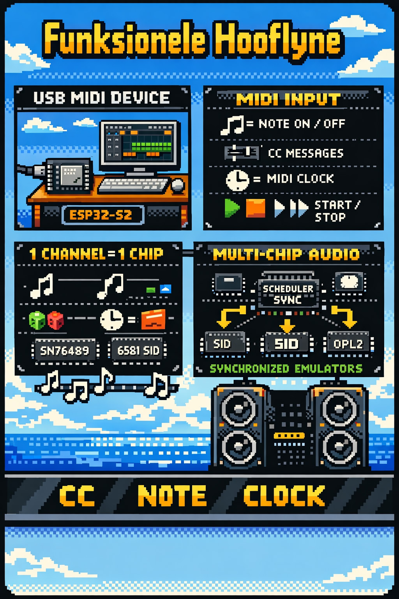
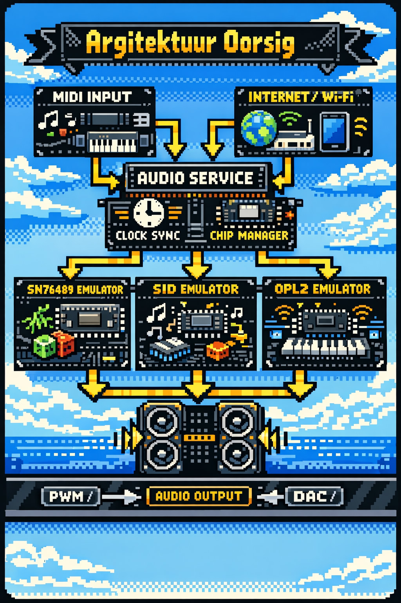

# MIDI Chip Platform (CircuitPython) — ESP32-S2

A modular “MIDI → retro sound chip” platform in CircuitPython.
Primary target: **LOLIN ESP32-S2 Mini** as a **USB MIDI device**.

The goal is a clean architecture that can run **multiple chip emulators side-by-side** (SN76489 first), with shared clock sync and strict pin/resource management.



---

## Status

- Functional Spec: **FS-1.0.3** ✅
- Technical Design: **TD-1.0.2** ✅
- Current release: **v0.1.2** (platform skeleton + test mode + logging + MIDI clock spike)

---

## What works in v0.1.2

### MIDI (USB Device)
Receives:
- Note On / Note Off
- Control Change
- MIDI Clock + Start / Stop / Continue

Routing rule:
- **1 MIDI channel = 1 chip instance**

### Panic / Stop behavior
- **CC123**: All Notes Off (per channel/instance)
- **CC120**: All Sound Off (panic/mute per channel/instance)
- Transport `Stop` uses `stop_behavior`:
  - `all_notes_off`
  - `hold`
  - `configurable_per_instance` (per-instance override)

### Runtime configuration (JSON)
- `config.json` is polled and applied at runtime
- Atomic apply pattern: load → validate → plan → claim pins → apply → commit
- On failure: rollback to previous config (no crash)

### Test mode (hardware sanity check)
A minimal “is PWM alive on this pin?” test you can measure on a scope:

- `test_mode.mode="square"` (DEFAULT): lowest CPU, easiest to validate
- `test_mode.mode="sine"`: PWM duty modulation with LUT (more CPU)

Frequency selection:
- `freq_hz` overrides everything
- otherwise parse `note` like `C2`, `F#3`, `Bb1`
- parsing failure falls back to `C2` and logs a warning

Defaults & clamps (per FS-1.0.3 / TD-1.0.2):
- `sample_rate_hz` (sine only): default 8000, clamp 4000..20000
- `pwm_carrier_hz` (sine only): default 62500, clamp 20000..100000
- `duration_s`: 0 = continuous, >0 auto stop + pin release

### Logging
- Levels: `OFF`, `LIGHT`, `VERBOSE`
- Console logging + optional file logging
- File logging is capped (`max_bytes`, default ~30KB) via tail-truncate

---

## Architecture (high level)



- **AudioService**  
  Main scheduler loop; orchestrates MIDI, clock, chips, test mode, metrics.

- **MidiService**  
  Receives USB MIDI messages (notes/CC/clock/transport).

- **ClockService**  
  Tracks MIDI clock, provides BPM estimate and run state.

- **ChipManager**  
  Instantiates chip instances from JSON, routes MIDI by channel, applies stop behavior, enforces exclusive pin claims.

- **PinAllocator**  
  Owns pin claiming and prevents collisions across instances and test mode.

- **ChipInstance interface**  
  Common contract for chip emulators (SN76489 now, others later).

---

## Quick start (CircuitPython)

1. Flash **CircuitPython 10** to the board.
2. Copy the project to `CIRCUITPY` (keep folder structure).
3. Ensure `adafruit_midi` is present in `/lib`.
4. Edit `config.json` and enable test mode:

```json
"test_mode": {
  "enabled": true,
  "pin": "A01",
  "mode": "square",
  "note": "C2",
  "duration_s": 0
}
```

	5.	Reboot the board.
	6.	Verify the PWM signal on the chosen pin with an oscilloscope.
	7.	Optional: route the pin through a small amplifier module to headphones for a rough audible check.

⸻

Configuration overview

Key fields in config.json:
```
	•	stop_behavior
	•	logging (level + file cap)
	•	test_mode (PWM test signal)
	•	instances[] (chip instances: type, midi_channel, pins, stop_behavior override)
```
See:
```
	•	docs/FS-1.0.3.md
	•	docs/TD-1.0.2.md
	•	docs/JSON-SCHEMA.md
```
⸻

# Development methodology

We work in explicit cycles:
	1.	Functional Spec (FS)
	2.	FS Review
	3.	FS Refinement
	4.	Decision: proceed to Technical Design (TD) or iterate

Same pattern applies for TD → code skeleton → tested release.

⸻

Versioning & traceability
```
	•	FS versions: FS-X.Y.Z
	•	TD versions: TD-X.Y.Z
	•	Code releases: vX.Y.Z
```

Each approved FS/TD is traceable to Git commits/tags.
Each release gets Markdown release notes under docs/releases/.

⸻

# Credits

Lead/Owner: Michiel Erasmus

This project is learning-driven and builds on the wider community:
	•	YouTube tutorials on MIDI, PWM audio, and chip emulation concepts
	•	Open-source projects and emulator authors on GitHub

## TODO: Add explicit links + names for proper attribution (please provide your shortlist).

⸻

# Roadmap (suggested)
	•	v0.2.x: SN76489 dual-mono PWM audio-out (first end-to-end audible output)
	•	v0.3.x: Web UI (status + config editor)
	•	v0.4.x: MIDI file playback via web UI
	•	Future: additional chip emulators (SID/6589 style, OPL2/YM3812 style)

⸻

```bash
### Snelle commands om dit te commit
```bash
cd "/Volumes/data1/michiele/Programmering/Python/python_normaal/uitprobeersels/Muziek_algemeen/midi_chip_platform"
nano README.md   # plak die nuwe teks
git add README.md
git commit -m "docs: refresh README (FS-1.0.3 / TD-1.0.2 / v0.1.2 overview)"
git push
```

# Jou review (wat ek van jou nodig het)

Sê vir my net hierdie 4 dinge (kort antwoorde is genoeg):
	1.	Wil jy die README hoofsaaklik Engels hou, of Afrikaans?
	2.	Moet “Fugro-style” eksplisiet genoem word, of liewer neutraal (“engineering workflow”)?
	3.	Watter 3–10 YouTube links en 3–10 GitHub repos moet ek in “Credits” hard insit?
	4.	Wil jy License nou op MIT/Apache-2.0 sit, of nog TBD?

Daarna vra ek jou: wil jy volgende stap doen as (a) v0.2 SN76489 audio-out, of (b) ’n FS iterasie vir web UI / MIDI-file playback.

