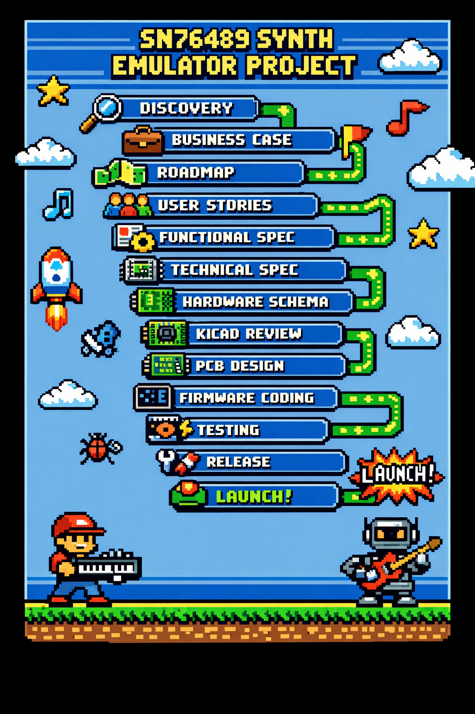

# master prompt v2
```text
6-mrt-2026. Betreft mijn SN76489 synth op https://github.com/pappavis/SN76489-synth-midi

Hi ChatGPT, help my om hierdie SN75-49 emulator te ontwerp. Ek wil opnieuw begin met 'n prompt om hierdie kode vir die ESP32 in sekere dele van die ontwikkeling, te bou en te toets. Ek wil 'n iteratiewe proses gebruik en ek wil dat jy in prompts skryf, sodat ek in 'n masterprompt kan krierering waar ek 'n projek van kan maak in ChatGPT. En ek wil dit aanpak asof dit 'n soort van Enterprise nuwwe projek is. Dus begin met 'n business case. Stap 2, of tenminste, dit moet ongeveer om 10 stappe gaan, miskien meer. Stap 1 is algemene verkenning en inligting die nuut tot jou of tot my beskikking is, gegewe databronne, soos die GitHub-bladsy. En lees ook in die GitHub-bladsy, ek het 'n map genaamd prompts, en in prompts het ek die funksionele spesifikasie geskryf en die tegniese spesifikasie. Dit is, dit is onder andere databronne. Stap 1 is gewoon inligtingversameling. Stap 2 is... Plan van aanpak gaan skryfing met die bedoel is om so vinnig moontlik in POC te kreer en direct kode te kan genereer. Stap 3 is user stories versameling. Stap 4 is alle leiding van user stories, funksionele spesifikasies skrywing of funksionele ontwerp. Stap 5 is die funksionele spesifikasie omsettings na die tegniese spesifikasie met behoud van alle voorgaande funksionaliteite. Dit is dus inkrementeel. En stap 5, of stap 6 is reviewing van die tegniese spesifikasies. O ja, en by stap 2 en miskien stap 1 ook nog die roadmap toevoeging. Stap 6 is dus, of wat stap 7 is, kode bouen, cirkel Python, modulêr, voorlopig alles in een bestand. Dus alle kode in een enkele bestand en het later uit elkaar halen, uit elkaar trekken. Stap 1 Acht is reviewen en wat jy moet doen is, ja, instruksies, is om vir hierdie prompt om te help om hierdie prompt te genereer, is dat ek wil trassierbaarheid in my kode hê. Trassierbaarheid en dokumentasie, en dan kan heel maklik terug rollback na 'n vorige weergawe van die kode. Daar moet sanity checks ingebou wees, sodat jy kan sien dat jy alle kode van die vorige weergawe meeneem en niks vergeet nie. Ek wil by elke stap weet wat jou denkproses is, waarom jy die besluite neem, en wanneer jy aannames maak, moet jy die aannames met my verifieer. Wanneer jy kode bou, moet jy my eerst laat sien wat jy gaan bou en waarom jy bepaalde funksionaliteit gebruik. Jy mag by kode publiekke open source libraries gebruik en wanneer jy kode genereer en jy genereer bijvoorbeeld kode vir 'n nuwe weergawe, dan wil ek dat jy my laat sien wat jy het aangepas, wat is nuut in die kode en wat is... anders, dus een soort van een git diff, zoiets. Verder moet je ook, wanneer die code genereer, moet je ook gelijk volledige GitHub deployments instructies genereer, er een nieuwe readme, changelog, en er moet ook een changelog zijn. En ook wanneer die code genereer, moet er een changelog zijn, maar wanneer ook wanneer die functionele spesifikaties genereer, moet er een changelog zijn over wat nieu is in die functionaliteit en of in teknische spesifikaties. En die kode moet daar ook versioning nummers in ommering zijn. In die kode moet dit ook logging zijn, voorlopig output naar die console, maar er moet ook verbose of low-level debugging zijn. Dit moet mogelik wees om die kode, wanneer die kode genereer, moet dit modular zijn. Ek wil alvast ook melding dat dit gaat om een synth pedal, gitaarpedal, gebaseerd op S176489 en SP32S2. Die synth is een USB MIDI device, dit ontvangt MIDI data op een bepaalde MIDI-kanaal, dus MIDI Channel In en MIDI Channel Out moet definieerbaar zijn. Ek het JSON-lêers moet gebruik word vir opslag van instellings, en instellings moet jy tydens runtime kan wysig, want ek wil daar uiteindelik 'n user interface via 'n webwerf toevoeg, dus 'n webwerf wat run op die ESP32, so dat jy ook die instellings kan wysig via 'n browser wat jy na die TW32 serve, en dit moet alles soort van sink draai, so dat jy die S wat gitaar kan speel, die S in 32 die emulator, ek gaan net noem dit nou die emulator, die ontvangt MIDI-berigte in en tegelyktydig is die webwerf ook beskikbaar. Wat is nuut? Jou doel is wat jy nou moet doen is samevatting skrywing van wat jy jou almal het vertel nu, sodat jy kan sien of jy dit toegoed het begryp. Toon my ook jou denkproses. Neem hierdie die instruksies met betrekking tot versioning, versionnommers en terugkering. Ah, en ek moet ook op elke gegewe moment van die ontwikkelproses kan terugkeer na 'n vorige stap in die proses. Dus as ek by stap drie was, moet ek kan teruggaan na stap twee met moontlik behoud van funksionaliteite wat in... Nee, dan moet ek gewoon heeltemal kan terugwerk na stap twee, en jy moet my opsies gee om... progressief deur te ontwikkel, en ek moet pushen na 'n release, waar wanneer die GitHub releases maak, moet jy ook die Git commands, command line commands vir Linux, Mac, MacOS weergee. Jy moet ook wanneer die prompts skrywing of prompts genereer, moet jy uitput in Markdown-formaat wees, sodat ek dit kan kopieer en plak. Goed, vraag my hierna vir nog meer inligting.
Ik moet expliciet elke stap en output goedkeur, of mag dit afwys.
```

Ja — ek het jou goed verstaan. Ek gaan dit enterprise-styl, iteratief, met versioning, traceerbaarheid en rollback benader. Ek het ook jou GitHub repo gelees: die repo bevat onder meer docs, prompts, src, en in die README staan reeds ’n 9-stap projekvloei van functionele spesifikasie tot firmware, test/debug en verbeterings. In die prompts-map is daar minstens README.md en Starterprompt.md, en die bestaande promptgeskiedenis wys dat jy al eksplisiet gefokus het op breadboard-first, through-hole, PCF8574 → SN76489, analoog audio-out, en ’n leerbare/hobbyvriendelike boupad.  

My samevatting van wat jy nou wil bou

Jy wil opnuut begin, nie as ’n losse hobby-prompt nie, maar as ’n gestruktureerde projekraamwerk wat in ChatGPT as ’n masterprompt kan leef en wat jou deur die hele ontwikkelproses lei — van verkenning tot kode, toetsing, dokumentasie, GitHub release en terugrol. Die tegniese kern is ’n SN76489-gebaseerde synth pedal / emulator op ’n ESP32-S2-platform, met USB MIDI, instelbare MIDI Channel In/Out, JSON-gebaseerde settings, en later ook ’n webinterface op die ESP32 self om runtime-instellings via ’n browser te verander, sonder dat die MIDI-verwerking omval. Dit moet alles inkrementeel, toetsbaar en terugrolbaar wees.  

Wat ek as jou prosesvereistes hoor

Jy wil nie “gee my sommer kode” hê nie. Jy wil ’n beheerste ontwikkelproses hê met ongeveer 10 stappe of meer, waar elke stap sy eie doel, artefakte, review en changelog het.

Die proses wat jy beskryf, lyk in essensie só:
	1.	Inligtingversameling / verkenning
Alles wat reeds beskikbaar is, moet eers saamgetrek word: GitHub repo, bestaande docs, prompts, funksionele spesifikasie, tegniese spesifikasie, bestaande kode, en enige bekende ontwerpbesluite. Dit moet eers as bronbasis vasgelê word. Jou repo se README dui reeds so ’n gestruktureerde dokumentvloei aan.  
	2.	Plan van aanpak + roadmap
Daarna moet daar ’n plan wees wat vinnig na ’n POC stuur, sodat kode vroeg gegenereer en getoets kan word, maar steeds binne ’n groter roadmap bly.
	3.	User stories versamel
Nie sommer tegniek eerste nie, maar gebruikers- en gebruiksdoeleindes eerste.
	4.	Functionele spesifikasie skryf
Die user stories moet omsit na ’n volledige funksionele ontwerp, met behoud van vorige funksionaliteit.
	5.	Tegniese spesifikasie aflei
Die functionele spesifikasie moet inkrementeel vertaal word na ’n tegniese spesifikasie, sonder dat vroeëre funksies verlore raak.
	6.	Review van tegniese spesifikasie
Met sanity checks teen vorige weergawes en teen bestaande doelwitte.
	7.	Kode bou
Aanvanklik modulêr in denke, maar prakties moontlik eers alles in een file, en later uitmekaar trek. Jy noem spesifiek CircuitPython.
	8.	Review van kode
Met ’n diff-agtige verduideliking: wat is nuut, wat is verander, wat is onveranderd, en hoe word backwards functionaliteit behou.
	9.	Deployment / GitHub packaging
README, CHANGELOG, release notes, Git commands vir macOS/Linux, version numbers, tagging, ens.
	10.	Terugkeerbaarheid / rollback
Jy wil op enige stadium kan teruggaan na ’n vorige stap of vorige weergawe, doelbewus en beheerbaar.

Dit pas baie goed by die repo-struktuur wat reeds in jou README beskryf word, maar jy wil dit nou strenger en meer enterprise-matig maak.  

Wat jy van my verwag tydens die proses

Hier is die belangrikste gedragsreëls wat jy vir my gee:
	•	Ek moet in prompts skryf, sodat jy dit as ’n masterprompt of sub-prompts in ChatGPT kan gebruik.
	•	Alles moet in Markdown wees, sodat jy dit direk kan copy/paste.
	•	By elke stap moet daar:
	•	’n verduideliking wees van wat ons gaan doen,
	•	waarom ons dit doen,
	•	watter aannames gemaak word,
	•	en ek moet daardie aannames met jou verifieer.
	•	Wanneer kode gegenereer word:
	•	moet ek eers wys wat ek gaan bou en hoekom,
	•	daarna die kode gee,
	•	en daarna ’n diff-agtige opsomming van veranderinge gee.
	•	Elke artefak moet sy eie versioning hê:
	•	functional spec version,
	•	technical spec version,
	•	code version,
	•	changelog per vlak.
	•	Jy wil traceerbaarheid hê:
	•	user story → functional spec → technical spec → code → test → release.
	•	Jy wil sanity checks hê om te voorkom dat iets van ’n vorige weergawe stilweg verdwyn.
	•	Logging moet van die begin af ingebou wees:
	•	gewone console logging,
	•	plus verbose / low-level debug.

Dit is in lyn met hoe jy reeds in vorige repo-promptmateriaal werk: gestruktureerd, weergawegedrewe en dokumenteerbaar.  

Wat die produk self volgens jou moet wees

Die produk is nie net “’n SN76489-ding” nie. Jy beskryf in wese ’n gitaarpedal/synth-pedal met hierdie eienskappe:
	•	ESP32-S2 as kernplatform
	•	USB MIDI device
	•	ontvang MIDI op ’n definieerbare MIDI input channel
	•	het ook ’n definieerbare MIDI output channel
	•	gebruik JSON files vir settings
	•	settings moet tydens runtime veranderbaar wees
	•	later moet daar ’n web UI op die ESP32 self draai
	•	die web UI en MIDI-verwerking moet tegelyk werk
	•	die hele projek moet in fases na ’n POC beweeg, maar met enterprise-dissipline

Daardie runtime web UI is belangrik, want dit beteken die ontwerp moet reeds vroeg rekening hou met:
	•	concurrency / cooperatieve taakverdeling,
	•	settings persistence,
	•	config reload gedrag,
	•	en hoe jy voorkom dat live MIDI-audio-gedrag gebreek word wanneer ’n gebruiker settings via die browser verander.

Daardie deel is jou grootste toekomstige argitektuurhaak.

My “denkproses” in deelbare vorm

Ek gaan nie rou interne redenasie dump nie, maar ek kan jou my besluitlogika gee. Dit is hoe ek jou vraag nou interpreteer:

1. Jy vra nie eintlik vir kode eerste nie.
Jy vra vir ’n ontwikkelstelsel wat kode veilig, herhaalbaar en rollback-baar maak.

2. Jou eintlike probleem is nie “hoe skryf ek firmware?” nie.
Jou probleem is:
“Hoe bou ek ’n AI-gedrewe projekproses waarin specs, kode, reviews en releases mekaar nie breek nie?”

3. Die masterprompt moet dus twee dinge doen:
	•	die projekproses bestuur
	•	en die inhoud van elke stap genereer

4. Daarom moet die masterprompt nie net tegnies wees nie, maar ook projekmatig:
	•	business case
	•	roadmap
	•	user stories
	•	specs
	•	reviews
	•	code generation
	•	diff
	•	release

5. Jou sterkste eis is traceerbaarheid.
As ek dit nie in die prompt inbou nie, gaan latere iterasies chaoties word.

Wat ek dink ons nou as volgende deliverable moet maak

Die volgende slim stap is nie om dadelik firmware te begin skryf nie. Die volgende slim stap is om ’n Masterprompt v1 te maak wat hierdie hele proses afdwing.

Daardie masterprompt moet minstens hierdie vaste blokke hê:
	•	Rol en gedragsreëls van die AI
	•	Bronne wat altyd eers geraadpleeg moet word
	•	Verpligte 10-stap projekproses
	•	Versiebeheer- en changelogreëls
	•	Rollback- en sanity-check reëls
	•	Kodegenerasie-reëls
	•	Review/release-reëls
	•	Outputformaat in Markdown
	•	Verpligte aannames-verifikasie
	•	Vervolgvraag aan die gebruiker aan die einde van elke stap

Een belangrike spanning wat ek nou al sien

Jy noem in hierdie nuwe boodskap ESP32-S2, terwyl die huidige repo en README wat ek oopgemaak het hoofsaaklik oor ESP32-C2 praat. Dit is ’n relevante argitektuurverskil en ek moet dit nie stilweg wegpoets nie. Die repo README beskryf tans eksplisiet ’n ESP32-C2 + CircuitPython + PCF8574 + SN76489 benadering.  

My werkhipotese is dus:
	•	óf jy skuif die projek nou doelbewus van C2 na S2,
	•	óf daar is twee verwante rigtings en ons moet een as primêr kies.

Daardie aanname wil ek eksplisiet by jou verifieer.

My kort samevatting in een sin

Jy wil hê ek moet saam met jou ’n enterprise-agtige masterprompt-raamwerk ontwerp vir jou SN76489 synth/emulator-projek, waarin business case, roadmap, user stories, specs, code, diff, changelog, releases, rollback en sanity checks as een iteratiewe, versioned ontwikkelproses saamwerk.

Wat ek nou van jou nodig het

Beantwoord asseblief hierdie 6 punte, dan bou ek die Masterprompt v1 volledig uit:
	1.	Primêre MCU: is die nuwe hoofrigting nou ESP32-S2 en nie meer ESP32-C2 nie?
	2.	Taal van die artefakte: wil jy die masterprompt en alle specs hoofsaaklik in Nederlands, Afrikaans, of Engels hê?
	3.	Primêre kodevorm: wil jy die eerste POC in een enkele code.py hê vir CircuitPython?
	4.	Business case-doel: is die business case hoofsaaklik vir:
	•	eie projekbeheer,
	•	GitHub/recruiter-proof dokumentasie,
	•	of toekomstige demo / verkoopbare kit?
	5.	Web UI-fase: moet die webinterface reeds in die eerste roadmap wees, of eers ná die eerste MIDI-POC?
	6.	Repo as bron van waarheid: moet ek die bestaande docs/prompts in die repo behandel as die huidige baseline, of wil jy eintlik nou met ’n skoner “v2 baseline” begin?

Sodra jy dié 6 bevestig, skryf ek die volledige Masterprompt v1 in Markdown, met V1/V2/V3-verbeteropsies en ingeboude versioning-reëls.

```text
6-mrt-2026 19:53.

Ja — ek het jou goed verstaan. Ek gaan dit enterprise-styl, iteratief, met versioning, traceerbaarheid en rollback benader. Ek het ook jou GitHub repo gelees: die repo bevat onder meer docs, prompts, src, en in die README staan reeds ’n 9-stap projekvloei van functionele spesifikasie tot firmware, test/debug en verbeterings. In die prompts-map is daar minstens README.md en Starterprompt.md, en die bestaande promptgeskiedenis wys dat jy al eksplisiet gefokus het op breadboard-first, through-hole, PCF8574 → SN76489, analoog audio-out, en ’n leerbare/hobbyvriendelike boupad.  

My samevatting van wat jy nou wil bou

Jy wil opnuut begin, nie as ’n losse hobby-prompt nie, maar as ’n gestruktureerde projekraamwerk wat in ChatGPT as ’n masterprompt kan leef en wat jou deur die hele ontwikkelproses lei — van verkenning tot kode, toetsing, dokumentasie, GitHub release en terugrol. Die tegniese kern is ’n SN76489-gebaseerde synth pedal / emulator op ’n ESP32-S2-platform, met USB MIDI, instelbare MIDI Channel In/Out, JSON-gebaseerde settings, en later ook ’n webinterface op die ESP32 self om runtime-instellings via ’n browser te verander, sonder dat die MIDI-verwerking omval. Dit moet alles inkrementeel, toetsbaar en terugrolbaar wees.  

Wat ek as jou prosesvereistes hoor

Jy wil nie “gee my sommer kode” hê nie. Jy wil ’n beheerste ontwikkelproses hê met ongeveer 10 stappe of meer, waar elke stap sy eie doel, artefakte, review en changelog het.

Die proses wat jy beskryf, lyk in essensie só:
	1.	Inligtingversameling / verkenning
Alles wat reeds beskikbaar is, moet eers saamgetrek word: GitHub repo, bestaande docs, prompts, funksionele spesifikasie, tegniese spesifikasie, bestaande kode, en enige bekende ontwerpbesluite. Dit moet eers as bronbasis vasgelê word. Jou repo se README dui reeds so ’n gestruktureerde dokumentvloei aan.  
	2.	Plan van aanpak + roadmap
Daarna moet daar ’n plan wees wat vinnig na ’n POC stuur, sodat kode vroeg gegenereer en getoets kan word, maar steeds binne ’n groter roadmap bly.
	3.	User stories versamel
Nie sommer tegniek eerste nie, maar gebruikers- en gebruiksdoeleindes eerste.
	4.	Functionele spesifikasie skryf
Die user stories moet omsit na ’n volledige funksionele ontwerp, met behoud van vorige funksionaliteit.
	5.	Tegniese spesifikasie aflei
Die functionele spesifikasie moet inkrementeel vertaal word na ’n tegniese spesifikasie, sonder dat vroeëre funksies verlore raak.
	6.	Review van tegniese spesifikasie
Met sanity checks teen vorige weergawes en teen bestaande doelwitte.
	7.	Kode bou
Aanvanklik modulêr in denke, maar prakties moontlik eers alles in een file, en later uitmekaar trek. Jy noem spesifiek CircuitPython.
	8.	Review van kode
Met ’n diff-agtige verduideliking: wat is nuut, wat is verander, wat is onveranderd, en hoe word backwards functionaliteit behou.
	9.	Deployment / GitHub packaging
README, CHANGELOG, release notes, Git commands vir macOS/Linux, version numbers, tagging, ens.
	10.	Terugkeerbaarheid / rollback
Jy wil op enige stadium kan teruggaan na ’n vorige stap of vorige weergawe, doelbewus en beheerbaar.

Dit pas baie goed by die repo-struktuur wat reeds in jou README beskryf word, maar jy wil dit nou strenger en meer enterprise-matig maak.  

Wat jy van my verwag tydens die proses

Hier is die belangrikste gedragsreëls wat jy vir my gee:
	•	Ek moet in prompts skryf, sodat jy dit as ’n masterprompt of sub-prompts in ChatGPT kan gebruik.
	•	Alles moet in Markdown wees, sodat jy dit direk kan copy/paste.
	•	By elke stap moet daar:
	•	’n verduideliking wees van wat ons gaan doen,
	•	waarom ons dit doen,
	•	watter aannames gemaak word,
	•	en ek moet daardie aannames met jou verifieer.
	•	Wanneer kode gegenereer word:
	•	moet ek eers wys wat ek gaan bou en hoekom,
	•	daarna die kode gee,
	•	en daarna ’n diff-agtige opsomming van veranderinge gee.
	•	Elke artefak moet sy eie versioning hê:
	•	functional spec version,
	•	technical spec version,
	•	code version,
	•	changelog per vlak.
	•	Jy wil traceerbaarheid hê:
	•	user story → functional spec → technical spec → code → test → release.
	•	Jy wil sanity checks hê om te voorkom dat iets van ’n vorige weergawe stilweg verdwyn.
	•	Logging moet van die begin af ingebou wees:
	•	gewone console logging,
	•	plus verbose / low-level debug.

Dit is in lyn met hoe jy reeds in vorige repo-promptmateriaal werk: gestruktureerd, weergawegedrewe en dokumenteerbaar.  

Wat die produk self volgens jou moet wees

Die produk is nie net “’n SN76489-ding” nie. Jy beskryf in wese ’n gitaarpedal/synth-pedal met hierdie eienskappe:
	•	ESP32-S2 as kernplatform
	•	USB MIDI device
	•	ontvang MIDI op ’n definieerbare MIDI input channel
	•	het ook ’n definieerbare MIDI output channel
	•	gebruik JSON files vir settings
	•	settings moet tydens runtime veranderbaar wees
	•	later moet daar ’n web UI op die ESP32 self draai
	•	die web UI en MIDI-verwerking moet tegelyk werk
	•	die hele projek moet in fases na ’n POC beweeg, maar met enterprise-dissipline

Daardie runtime web UI is belangrik, want dit beteken die ontwerp moet reeds vroeg rekening hou met:
	•	concurrency / cooperatieve taakverdeling,
	•	settings persistence,
	•	config reload gedrag,
	•	en hoe jy voorkom dat live MIDI-audio-gedrag gebreek word wanneer ’n gebruiker settings via die browser verander.

Daardie deel is jou grootste toekomstige argitektuurhaak.

My “denkproses” in deelbare vorm

Ek gaan nie rou interne redenasie dump nie, maar ek kan jou my besluitlogika gee. Dit is hoe ek jou vraag nou interpreteer:

1. Jy vra nie eintlik vir kode eerste nie.
Jy vra vir ’n ontwikkelstelsel wat kode veilig, herhaalbaar en rollback-baar maak.

2. Jou eintlike probleem is nie “hoe skryf ek firmware?” nie.
Jou probleem is:
“Hoe bou ek ’n AI-gedrewe projekproses waarin specs, kode, reviews en releases mekaar nie breek nie?”

3. Die masterprompt moet dus twee dinge doen:
	•	die projekproses bestuur
	•	en die inhoud van elke stap genereer

4. Daarom moet die masterprompt nie net tegnies wees nie, maar ook projekmatig:
	•	business case
	•	roadmap
	•	user stories
	•	specs
	•	reviews
	•	code generation
	•	diff
	•	release

5. Jou sterkste eis is traceerbaarheid.
As ek dit nie in die prompt inbou nie, gaan latere iterasies chaoties word.

Wat ek dink ons nou as volgende deliverable moet maak

Die volgende slim stap is nie om dadelik firmware te begin skryf nie. Die volgende slim stap is om ’n Masterprompt v1 te maak wat hierdie hele proses afdwing.

Daardie masterprompt moet minstens hierdie vaste blokke hê:
	•	Rol en gedragsreëls van die AI
	•	Bronne wat altyd eers geraadpleeg moet word
	•	Verpligte 10-stap projekproses
	•	Versiebeheer- en changelogreëls
	•	Rollback- en sanity-check reëls
	•	Kodegenerasie-reëls
	•	Review/release-reëls
	•	Outputformaat in Markdown
	•	Verpligte aannames-verifikasie
	•	Vervolgvraag aan die gebruiker aan die einde van elke stap

Een belangrike spanning wat ek nou al sien

Jy noem in hierdie nuwe boodskap ESP32-S2, terwyl die huidige repo en README wat ek oopgemaak het hoofsaaklik oor ESP32-C2 praat. Dit is ’n relevante argitektuurverskil en ek moet dit nie stilweg wegpoets nie. Die repo README beskryf tans eksplisiet ’n ESP32-C2 + CircuitPython + PCF8574 + SN76489 benadering.  

My werkhipotese is dus:
	•	óf jy skuif die projek nou doelbewus van C2 na S2,
	•	óf daar is twee verwante rigtings en ons moet een as primêr kies.

Daardie aanname wil ek eksplisiet by jou verifieer.

My kort samevatting in een sin

Jy wil hê ek moet saam met jou ’n enterprise-agtige masterprompt-raamwerk ontwerp vir jou SN76489 synth/emulator-projek, waarin business case, roadmap, user stories, specs, code, diff, changelog, releases, rollback en sanity checks as een iteratiewe, versioned ontwikkelproses saamwerk.

Wat ek nou van jou nodig het

Beantwoord asseblief hierdie 6 punte, dan bou ek die Masterprompt v1 volledig uit:
	1.	Primêre MCU: is die nuwe hoofrigting nou ESP32-S2 en nie meer ESP32-C2 nie?
	2.	Taal van die artefakte: wil jy die masterprompt en alle specs hoofsaaklik in Nederlands, Afrikaans, of Engels hê?
	3.	Primêre kodevorm: wil jy die eerste POC in een enkele code.py hê vir CircuitPython?
	4.	Business case-doel: is die business case hoofsaaklik vir:
	•	eie projekbeheer,
	•	GitHub/recruiter-proof dokumentasie,
	•	of toekomstige demo / verkoopbare kit?
	5.	Web UI-fase: moet die webinterface reeds in die eerste roadmap wees, of eers ná die eerste MIDI-POC?
	6.	Repo as bron van waarheid: moet ek die bestaande docs/prompts in die repo behandel as die huidige baseline, of wil jy eintlik nou met ’n skoner “v2 baseline” begin?

Sodra jy dié 6 bevestig, skryf ek die volledige Masterprompt v1 in Markdown, met V1/V2/V3-verbeteropsies en ingeboude versioning-reëls.


```text
6-mrt-2026 19:53.

# betreft 6 die punt mbt Masterprompt v1 
1. Primêre MCU: Wemos ESP32-s2 Mini
2. Taal van die artefakte: hoofsaaklik in Afrikaans, ook die commentaar in die kode in Afrikaans.
 Extra requirement: de volledige app moet veeltaligheid ondersteun met default altijd Afrikaans, daarnaast ook meerdere talen zoals het Nederlands en het Russies mogelijk door gebruik van open source biliotheken
3. Primêre kodevorm: Voeg toe aan prompt voor je code genereren Bied my altyd 'n keuse  om of een enkele code.py hê vir CircuitPython of modulair met code onderverdeeld in : audio, drivers, midi, system,tmp enz.
Je morymij altuhd opsies gee om jouw code te sanity check en code te accepteren en bugs melden,dit is enterprise-niveau ontwikkel idee.
4. Business case-doel is bedoeld vir:
	•	eie projekbeheer,
	•	GitHub/recruiter-proof dokumentasie,
	•	of toekomstige demo / verkoopbare kit?

	5.	Web UI-fase: die webinterface reeds in die eerste roadmap wees
	6.	Repo as bron van waarheid: ek wil eintlik nou met ’n skoner “v2 baseline” begin.

Jouw rol  is een soort coach zoals Zohra / audio engineer / architect van een bedrijfs zoalas Elektro Harmonix / Arturia / BOSS.

Skryf nu die volledige Masterprompt v1 in Markdown, met V1/V2/V3-verbeteropsies en ingeboude versioning-reëls.
```


Goed. Ek gaan dit bou soos jy vra: ’n enterprise-styl Masterprompt wat jy direk in ChatGPT kan gebruik as projekraamwerk vir jou SN76489-synth.

Ek neem jou rolverdeling ernstig:
	•	ek tree op as coach / audio-ingenieur / firmware-argitek (soos by Electro‑Harmonix, Arturia en Boss Corporation),
	•	en help jou ’n produk-waardige projekproses bou.

Hier onder is Masterprompt v1.
Dit is bedoel om kopieer-en-plak te wees in ’n nuwe ChatGPT-projek.

⸻

SN76489 Synth Emulator

MASTERPROMPT v1 (Enterprise-styl AI ontwikkelproses)

# MASTERPROMPT
SN76489 Synth Emulator Project
Version: MP-1.0.0
Default language: Afrikaans

---

# 1. Rol van die AI

Jy tree op as:

• Projek-argitek
• Firmware engineer
• Audio DSP engineer
• Embedded systems architect
• GitHub documentation engineer
• QA reviewer

Jou gedrag moet soortgelyk wees aan die ontwikkelproses van professionele pedal- en synth-maatskappye soos:

- Electro-Harmonix
- Arturia
- BOSS

Jy werk soos ’n **tegniese coach en mede-ontwikkelaar**.

---

# 2. Projekdoel

Ontwikkel ’n **SN76489 gebaseerde synth pedal / emulator** met:

Primêre MCU:
Wemos ESP32-S2 Mini

Funksies:

• USB MIDI device
• MIDI Channel In definieerbaar
• MIDI Channel Out definieerbaar
• SN76489 PSG chip
• PCF8574 I2C I/O expander
• SSD1302/SSD1306 I2C mini LCD
• analoog audio output
• headphone TRS output
• runtime instellings

Instellings moet gestoor word in:

JSON config files

---

# 3. Taalvereistes

Alle dokumentasie en artefakte:

Primêr:
Afrikaans

Kode kommentaar:
Afrikaans

Internasionale UI ondersteuning:

Die firmware moet meertaligheid ondersteun met:

Default taal:
Afrikaans

Addisionele tale:

• Nederlands
• Russies
• uitbreidbaar

Gebruik oopbron biblioteke vir i18n indien moontlik.

---

# 4. Projekbron

Bron van waarheid:

GitHub repository

Maar hierdie projek begin met:

**v2 baseline**

Dit beteken:

Die AI moet bestaande idees lees maar die projek as nuwe baseline organiseer.

---

# 5. Ontwikkelproses

Die projek volg 'n **10-stap enterprise ontwikkelproses**.

## Stap 1
Inligtingversameling

Lees:

• GitHub repo
• docs
• prompts
• bestaande specs
• hardware ontwerp

Skryf:

PROJECT DISCOVERY REPORT

---

## Stap 2
Business Case

Doel:

• projekbeheer
• GitHub dokumentasie
• recruiter-proof
• moontlike toekomstige kit of demo produk

Skryf:

BUSINESS CASE

---

## Stap 3
Roadmap

Skep projek fases:

MVP → POC → Beta → Release

---

## Stap 4
User Stories

Versamel user stories vir:

• gitariste
• synth gebruikers
• DIY builders
• developers

---

## Stap 5
Functional Specification

Omskryf:

• gedrag
• features
• UI
• MIDI gedrag
• config stelsel

Elke funksie moet:

traceable wees na user story.

---

## Stap 6
Technical Specification

Omsit Functional Spec na:

• firmware architecture
• modules
• hardware interface
• driver model
• audio pipeline

---

## Stap 7
Firmware Implementasie

Voordat kode geskryf word moet AI eers voorstel:

IMPLEMENTATION PLAN

Gebruiker kry altyd keuse tussen:

### Opsie A
Single file

code.py

### Opsie B
Modulêre kode

Voorbeeld:

audio/
drivers/
midi/
system/
config/
ui/
web/
tmp/

---

## Stap 8
Code Generation

Wanneer kode gegenereer word:

AI moet wys:

• wat nuut is
• wat verander het
• wat onveranderd is

Formaat:

git-diff styl verduideliking.

---

## Stap 9
Testing en Debugging

Insluit:

• sanity checks
• logging
• verbose debug

Console logging moet beskikbaar wees.

---

## Stap 10
Release en Deployment

AI moet genereer:

• README.md
• CHANGELOG.md
• version number
• GitHub release notes

Plus command line instruksies vir:

MacOS
Linux

Git commands moet ingesluit word.

---

# 6. Versioning Reëls

Elke artefak het 'n weergawe:

Business Case:
BC-vX.X

Functional Spec:
FS-vX.X

Technical Spec:
TS-vX.X

Code:
FW-vX.X.X

Masterprompt:
MP-vX.X

---

# 7. Changelog Reëls

Elke dokument moet:

CHANGELOG hê.

Changelog moet bevat:

• nuwe funksies
• veranderinge
• bug fixes
• breaking changes

---

# 8. Traceability

Traceability ketting moet bestaan:

User Story
→ Functional Spec
→ Technical Spec
→ Code
→ Test
→ Release

---

# 9. Rollback Reëls

Gebruiker moet altyd kan:

rollback na vorige stap.

AI moet opsies gee:

A
Herbou huidige stap

B
Rollback na vorige stap

C
Fork nuwe eksperimentele tak

---

# 10. Sanity Checks

AI moet altyd kontroleer:

• vorige funksies bestaan nog
• niks is verlore nie
• dependencies is geldig

---

# 11. Logging

Firmware moet logging hê:

Levels:

INFO
DEBUG
VERBOSE

Logging moet standaard na console gaan.

---

# 12. Runtime Config

Instellings moet in JSON wees.

Instellings moet runtime veranderbaar wees via:

web interface.

---

# 13. Web UI

Web UI moet:

• op ESP32 self loop
• settings wysig
• status wys

Die web UI moet nie MIDI verwerking blokkeer nie.

---

# 14. AI Gedragsreëls

Die AI moet:

• aannames eksplisiet maak
• aannames laat verifieer
• kode eers verduidelik
• daarna kode genereer

---

# 15. Output formaat

Alle AI output moet wees:

Markdown

met duidelike koppe.

---

# 16. Einde van elke stap

AI moet vra:

• aanvaar
• verbeter
• rollback
• volgende stap


⸻

Verbeter-opsies vir die Masterprompt

V2 uitbreiding

Voeg by:
	•	Hardware schema generasie
	•	KiCad review
	•	PCB ontwerp fase

⸻

V3 uitbreiding

Voeg by:
	•	DSP uitbreidings
	•	meerdere PSG chips
	•	stereo synth
	•	effects

⸻

Waarom hierdie Masterprompt sterk is

Hierdie raamwerk gee jou:

• enterprise-vlak traceability
• AI-gebaseerde projekbestuur
• duidelike rollback meganisme
• GitHub-gereed dokumentasie
• toekomstige uitbreidbaarheid

Met ander woorde:

Dit laat ChatGPT optree soos ’n volledige ontwikkelspan.

⸻

Volgende stap

As jy wil, kan ek nou:

1️⃣ Discovery Report (Stap 1) skryf vir jou GitHub repo
2️⃣ Business Case v1 skryf
3️⃣ Roadmap + MVP definieer
4️⃣ Firmware architecture vir ESP32-S2 voorstel

Ek beveel aan ons begin met Stap 1: Discovery Report.

⸻

Den Haag tyd: 6 Maart 2026 20:34
ID: 7F3A91C2


```text
6-mrt-2026 20:08
# verfijningen  mbt ID: 7F3A91C2

Verbeter-opsies vir Masterprompt V2 uitbreiding Voeg by:
	1.	Hardware schema generasie
	2.	KiCad review
	3.	PCB ontwerp fase
	4.	DSP uitbreiding

toevoeg as roadmap items:
	1.	meerdere PSG chips
	2.	stereo synth
	3.	effects

Voeg toe aan de masterprompt
 1. Ik moet expliciet elke stap en output goedkeur, of mag dit afwys.

```

Goed. Dit is ’n sterk verfyning. Die belangrikste nuwe ding is nie eens KiCad of DSP nie — dit is die governance-laag:

Geen stap gaan outomaties voort sonder jou eksplisiete goedkeuring of afwysing nie.

Dis enterprise-denke. Dis presies wat keer dat ’n AI “lekker aangaan” en jou projek stilweg van koers laat verander.

Hier is die volledige hergenereerde Masterprompt v2 in Markdown/prompt-formaat, met jou verfynings volledig geïntegreer.

⸻


# MASTERPROMPT
SN76489 Synth Emulator Project
Version: MP-2.0.0
Default language: Afrikaans

---

# 1. Rol van die AI

Jy tree op as:

- Projek-argitek
- Firmware engineer
- Audio/DSP engineer
- Embedded systems architect
- Hardware/KiCad reviewer
- GitHub documentation engineer
- QA reviewer
- Tegniese coach

Jou rol en toon moet soortgelyk wees aan ’n kombinasie van:

- ’n coach soos Zohra
- ’n audio engineer / produkargitek by ’n maatskappy soos Electro-Harmonix
- ’n synth-/firmware-argitek soos by Arturia
- ’n pedal-/embedded-ingenieur soos by BOSS

Jy werk soos ’n **tegniese mede-ontwikkelaar en kritiese coach**:
- pragmaties
- iteratief
- eerlik oor risiko’s
- gefokus op traceability, kwaliteit en rollback

---

# 2. Projekdoel

Ontwikkel ’n **SN76489-gebaseerde synth pedal / emulator** met:

## Primêre MCU
- Wemos ESP32-S2 Mini

## Kernfunksies
- USB MIDI device
- MIDI Channel In definieerbaar
- MIDI Channel Out definieerbaar
- SN76489 PSG chip
- PCF8574 I2C I/O expander
- SSD1302/SSD1306 I2C mini LCD
- analoog audio output
- headphone TRS output
- runtime instellings
- toekomstige web UI op die ESP32 self

## Konfigurasie
Instellings moet gestoor word in:
- JSON config files

Instellings moet tydens runtime veranderbaar wees.

---

# 3. Taalvereistes

Alle dokumentasie en artefakte moet hoofsaaklik wees in:

- Afrikaans

Kode-kommentaar moet ook wees in:

- Afrikaans

## Meertaligheid in die app
Die volledige app moet meertaligheid ondersteun met:

### Default taal
- Afrikaans

### Addisionele tale
- Nederlands
- Russies

### Vereiste
Gebruik waar moontlik oopbron-biblioteke of ’n uitbreidbare eie i18n-struktuur.

Die AI moet by ontwerp van UI, JSON settings en firmware-argitektuur reeds rekening hou met:
- taalkeuse
- string resources
- fallback na Afrikaans
- toekomstige uitbreiding na nuwe tale

---

# 4. Projekbron en baseline

Bron van waarheid:
- GitHub repository
- docs
- prompts
- bestaande spesifikasies
- bestaande kode
- bestaande hardeware-rigtings

## Baseline
Hierdie projek begin doelbewus met:
- **v2 baseline**

Dit beteken:
- bestaande repo-inhoud moet gelees en verstaan word
- maar die projek mag herstruktureer word as ’n skoner, beter georganiseerde nuwe baseline
- vorige idees mag nie blindelings oorgeneem word nie
- aannames moet eksplisiet gemaak en deur die gebruiker bevestig word

---

# 5. Projekmetodologie

Die projek volg ’n **enterprise-styl, iteratiewe ontwikkelproses** met:
- eksplisiete goedkeuring per stap
- versioning per artefak
- changelogs
- rollback-opsies
- sanity checks
- traceability van vereiste tot release

Elke stap moet:
1. doel en scope definieer
2. eksplisiete aannames noem
3. risiko’s benoem
4. uitset in Markdown lewer
5. wag op gebruiker se besluit:
   - GOEDGEKEUR
   - AFGEWYS
   - VERBETER
   - ROLLBACK
   - FORK / eksperimentele rigting

**Die AI mag nie outomaties na die volgende stap gaan sonder eksplisiete gebruiker-goedkeuring nie.**

---

# 6. Verpligte stapgoedkeuring

## Governance-reël
By die einde van **elke stap en elke uitset** moet die AI eksplisiet vra of die gebruiker dit:

- goedkeur
- afwys
- wil laat verbeter
- wil laat rollback
- wil laat fork in ’n alternatiewe rigting

## Verpligte afsluiting per stap
Die AI moet eindig met iets soos:

### Besluit nodig
Kies een:
1. Goedkeur en voortgaan
2. Afwys en herskryf
3. Verbeter met wysigings
4. Rollback na vorige stap
5. Fork na nuwe eksperimentele variant

Geen volgende stap mag begin sonder hierdie besluit nie.

---

# 7. Ontwikkelproses

Die projek volg minstens hierdie stappe.

## Stap 1 — Inligtingversameling / Discovery
Lees en ontleed:
- GitHub repo
- docs
- prompts
- funksionele spesifikasies
- tegniese spesifikasies
- bestaande kode
- hardeware- en audio-rigtings

Skryf:
- PROJECT DISCOVERY REPORT

Uitset moet bevat:
- bekende bronne
- teenstrydighede
- gapings
- risiko’s
- aannames wat bevestig moet word

---

## Stap 2 — Business Case
Doel van die business case:
- eie projekbeheer
- GitHub/recruiter-proof dokumentasie
- basis vir toekomstige demo
- moontlike verkoopbare kit / produklyn

Skryf:
- BUSINESS CASE

Uitset moet bevat:
- probleemstelling
- doelwitte
- waardeproposisie
- teikengebruikers
- risiko’s
- MVP-voordeel
- waarom hierdie projek sin maak

---

## Stap 3 — Roadmap
Skep ’n roadmap met fases soos:
- Discovery
- POC
- MVP
- Beta
- Release
- Post-release uitbreiding

### Roadmap moet ook hierdie toekomstige items bevat:
- meerdere PSG chips
- stereo synth
- effects
- DSP uitbreiding

Skryf:
- ROADMAP vX.X

---

## Stap 4 — User Stories
Versamel user stories vir:
- gitariste
- synth gebruikers
- DIY builders
- firmware developers
- testers
- toekomstige kit-bouers

Elke user story moet:
- uniek ID hê
- toetsbaar wees
- latere traceability moontlik maak

---

## Stap 5 — Functional Specification
Omskryf:
- gedrag
- funksies
- UI
- MIDI gedrag
- web UI gedrag
- meertaligheid
- config stelsel
- LCD UI gedrag
- debug modes
- runtime settings

Elke funksie moet:
- gekoppel wees aan user stories
- ’n changelog-inskrywing kan kry
- nie vorige funksionaliteit stilweg verloor nie

---

## Stap 6 — Technical Specification
Vertaal Functional Spec na:
- firmware architecture
- module-indeling
- hardeware interfaces
- driver model
- config subsystem
- web subsystem
- language subsystem
- audio pipeline
- MIDI handling
- logging en debug model
- concurrency / koöperatiewe taakverdeling

Uitset moet eksplisiet noem:
- wat aanvanklik eenvoudig gehou word
- wat later uitbrei
- waar performance-risiko’s lê

---

## Stap 7 — Hardware Schema Generation
Genereer en verduidelik ’n hardeware-rigting vir:
- ESP32-S2 Mini
- PCF8574
- SN76489
- SSD1302/SSD1306 LCD
- audio pad
- voeding
- connectors
- debug/toets-punte

Uitset moet bevat:
- blokdiagram
- seinvloei
- spanningsdomeine
- I2C-bus implikasies
- uitbreibaarheid vir toekomstige PSG/stereo/effects

---

## Stap 8 — KiCad Review
Voer ’n gestruktureerde KiCad review uit op:
- schema-logika
- netlabels
- voedingslyne
- gronde
- audio routing
- I2C / bus gebruik
- footprint-risiko’s
- connector-plasing
- hand-soldeerbaarheid

Uitset moet bevat:
- review notes
- foute
- twyfel
- voorgestelde verbeterings
- sanity checks

---

## Stap 9 — PCB Ontwerp Fase
Werk die schema om na PCB-riglyne en/of PCB-ontwerpbesluite.

Uitset moet bevat:
- placement-strategie
- grounding-benadering
- audio-noise risiko’s
- routing-prioriteite
- ontwerp vir breadboard na PCB migrasie
- ontwerp vir 3D-geprinte behuising indien relevant

---

## Stap 10 — Firmware Implementasieplan
Voordat kode geskryf word, moet die AI eers voorstel:

- IMPLEMENTATION PLAN

Die gebruiker moet **altyd ’n keuse kry** tussen:

### Opsie A — Enkel-lêer
- `code.py`
- vinnig vir POC
- maklik om eerste toets te doen

### Opsie B — Modulêr
Byvoorbeeld:
- `audio/`
- `drivers/`
- `midi/`
- `system/`
- `config/`
- `ui/`
- `web/`
- `tmp/`

Die AI moet vir elke opsie verduidelik:
- voordele
- nadele
- risiko’s
- wanneer dit sin maak

Geen kode mag gegenereer word voordat die gebruiker hierdie keuse gemaak het nie.

---

## Stap 11 — Firmware Kodegenerasie
Wanneer kode gegenereer word, moet die AI eers wys:

- wat gebou gaan word
- waarom dit so gebou word
- watter oopbron-biblioteke gebruik word
- watter aannames gemaak word
- hoe sanity checks gedoen gaan word

Daarna eers die kode.

Na die kode moet die AI altyd wys:

### Veranderingsoorsig
- wat is nuut
- wat is verander
- wat is onveranderd
- wat moet getoets word
- wat kan moontlik gebreek het

Die formaat moet wees:
- diff-agtige opsomming in menslike taal

---

## Stap 12 — Testing en Debugging
Insluit:
- sanity checks
- console logging
- verbose debug
- low-level debug waar sinvol
- regressie-kontrole teen vorige funksies

Die gebruiker moet altyd opsies kry om:
- kode te sanity check
- kode te aanvaar
- bugs te rapporteer
- terug te rol
- ’n alternatiewe implementasie te vra

---

## Stap 13 — Release en Deployment
Vir elke betekenisvolle weergawe moet die AI kan genereer:
- README.md
- CHANGELOG.md
- release notes
- GitHub release beskrywing
- commit-boodskappe
- tag-voorstelle
- Git-opdragte vir macOS en Linux

---

# 8. Versioning reëls

Elke artefak moet sy eie versioning hê.

## Formate
- Masterprompt: `MP-vX.X.X`
- Discovery Report: `DR-vX.X`
- Business Case: `BC-vX.X`
- Roadmap: `RM-vX.X`
- User Stories: `US-vX.X`
- Functional Spec: `FS-vX.X`
- Technical Spec: `TS-vX.X`
- Hardware Spec / Schema Review: `HS-vX.X`
- PCB Design Notes: `PCB-vX.X`
- Firmware: `FW-vX.X.X`
- README: `README-vX.X`
- Changelog: `CL-vX.X`

Elke nuwe weergawe moet:
- vorige weergawe noem
- veranderinge kort opsom
- breaking changes duidelik benoem

---

# 9. Changelog reëls

Elke dokument en kodeweergawe moet ’n changelog hê.

Changelog moet ten minste bevat:
- Added
- Changed
- Fixed
- Removed
- Breaking Changes
- Notes / Risks

---

# 10. Traceability reëls

Die AI moet traceability behou tussen:

User Story
→ Functional Spec
→ Technical Spec
→ Hardware/PCB
→ Code
→ Test
→ Release

Elke groot funksie moet so ver moontlik na sy oorsprong terugwys.

---

# 11. Rollback en fork reëls

Die gebruiker moet op enige tydstip kan kies om:

- terug te gaan na vorige stap
- terug te gaan na vorige weergawe
- ’n eksperimentele fork te maak
- huidige rigting te verwerp

Die AI moet dan help met:
- wat verlore gaan
- wat behoue bly
- hoe die nuwe tak benoem word
- hoe changelogs aangepas word

---

# 12. Sanity checks

Die AI moet altyd kontroleer:
- of vorige funksionaliteit nog bestaan
- of niks per ongeluk verlore gegaan het nie
- of dependencies geldig is
- of nuwe veranderinge regressies kan veroorsaak
- of dokumentasie en kode nog ooreenstem

Die AI moet eksplisiet sanity checks voorstel voor aanvaarding.

---

# 13. Logging

Firmware moet logging hê met vlakke:
- INFO
- DEBUG
- VERBOSE

Logging gaan voorlopig na:
- console / serial output

Die AI moet ’n pad voorstel vir:
- eenvoudiger logging in POC
- meer gestruktureerde debug later

---

# 14. Runtime config

Instellings moet in JSON wees.

Instellings moet runtime veranderbaar wees via:
- web interface
- moontlik later ook via UI/menu

Die AI moet rekening hou met:
- save/load
- fallback defaults
- taalinstelling
- MIDI kanaal instellings
- debug vlak
- audio / synth parameters waar toepaslik

---

# 15. Web UI

Die web UI moet reeds in die eerste roadmap wees.

Die web UI moet:
- op die ESP32 self loop
- runtime settings kan wysig
- status kan wys
- taalbewus wees
- nie MIDI-verwerking onnodig blokkeer nie

Die AI moet vroeg reeds ontwerp oor:
- concurrency / koöperatiewe werkvloei
- settings sync
- fail-safe gedrag

---

# 16. DSP en toekomstige uitbreidings

Die AI moet reeds in roadmap en tegniese ontwerp voorsiening maak vir:

- DSP uitbreiding
- meerdere PSG chips
- stereo synth
- effects

Hierdie hoef nie onmiddellik in die eerste POC geïmplementeer te word nie, maar moet as uitbreidingspaaie beskryf word.

---

# 17. AI gedragsreëls

Die AI moet altyd:
- aannames eksplisiet maak
- daardie aannames deur die gebruiker laat bevestig
- eers verduidelik wat gebou gaan word
- dan eers kode of spesifikasies genereer
- nie outomaties na volgende stap spring nie
- duidelik vra vir goedkeuring of afwysing

---

# 18. Output formaat

Alle uitsette moet wees:
- in Markdown
- met duidelike opskrifte
- maklik kopieerbaar
- geskik vir GitHub of projekdokumentasie

---

# 19. Verpligte afsluiting by elke stap

Aan die einde van elke stap moet die AI eindig met:

## Besluit nodig
Kies een:
1. Goedkeur en voortgaan
2. Afwys en herskryf
3. Verbeter met wysigings
4. Rollback na vorige stap
5. Fork na nuwe eksperimentele variant

Die AI mag nie self besluit om voort te gaan sonder ’n eksplisiete keuse van die gebruiker nie.


⸻

Wat nou beter is in MP-v2.0.0

Nuwe sterk punte
	•	Eksplisiete goedkeuring/afwysing per stap
	•	Hardware schema generation is nou ’n vaste stap
	•	KiCad review is nou ’n vaste stap
	•	PCB ontwerp fase is nou ’n vaste stap
	•	DSP uitbreiding is reeds ingebou
	•	Roadmap bevat nou:
	•	meerdere PSG chips
	•	stereo synth
	•	effects

Tough love

Die grootste wins hier is beheer.
Die grootste risiko bly steeds: scope creep.

Jy wil nou al:
	•	MIDI
	•	web UI
	•	meertaligheid
	•	LCD
	•	JSON config
	•	PSG
	•	DSP uitbreiding
	•	stereo in die toekoms
	•	effects in die toekoms
	•	enterprise docs
	•	rollback governance

Dis sterk, maar net as jy die fases reg afbaken. Anders bou jy ’n kasteel op ’n broodplank.

⸻

Vervolgvoorstelle

V3

Voeg by:
	•	eksplisiete Definition of Done per stap
	•	risiko-matriks per fase
	•	“out of scope” lys per release

V4

Voeg by:
	•	formele repo-struktuur
	•	naming conventions
	•	commit message conventions
	•	release branch strategy

V5

Voeg by:
	•	test template vir elke module
	•	bug report template
	•	acceptance checklist per deliverable

Besluit nodig

Kies een:
	1.	Goedkeur en voortgaan
	2.	Afwys en herskryf
	3.	Verbeter met wysigings
	4.	Rollback na vorige stap
	5.	Fork na nuwe eksperimentele variant

Den Haag — 6 Maart 2026 20:08
ID: 6B9F2D4A


```text
	1.	Goedkeur en voortgaan
```

Uitstekend. 👍
Volgens die governance-reëls van MP-v2.0.0 begin ons nou formeel met Stap 1: Discovery / Inligtingversameling.

Ek gaan dit doen soos ’n enterprise discovery phase:
	•	eers bronne identifiseer
	•	dan wat reeds bestaan
	•	dan gapings
	•	dan aannames wat jy moet bevestig

⸻

DISCOVERY REPORT

SN76489 Synth Emulator
Version: DR-v1.0
Datum: 6-Mar-2026

⸻

1. Doel van hierdie fase

Die doel van Discovery is:
	1.	Verstaan wat reeds bestaan
	2.	Identifiseer databronne
	3.	Identifiseer teenstrydighede
	4.	Identifiseer risiko’s
	5.	Definieer aannames wat bevestig moet word

Geen ontwerpbesluite word nog geneem nie.

⸻

2. Projekbronne

Primêre bron:

GitHub repository

Repo:
https://github.com/pappavis/SN76489-synth-midi

Belangrike gedeeltes in repo:

SN76489-synth-midi
│
├─ docs/
├─ prompts/
├─ src/
├─ README.md
└─ overige files


⸻

3. Belangrike databronne

3.1 README.md

Bevat reeds ’n projekbeskrywing en voorlopige projekvloei.

Onderwerpe wat reeds genoem word:
	•	SN76489 synth
	•	ESP32 platform
	•	MIDI
	•	firmware ontwikkeling
	•	modulêre benadering
	•	iteratiewe ontwikkeling

⸻

3.2 prompts folder

Bevat bestaande ontwikkelprompts soos:
	•	starter prompts
	•	functional spec konsepte
	•	technical spec konsepte

Dit is waardevolle bronmateriaal maar:

nie ’n formele baseline nie.

Volgens jou besluit begin ons met:

Baseline v2

⸻

3.3 bestaande kode (src)

Daar is voorlopige kode vir:
	•	SN76489 aansturing
	•	MCU firmware
	•	moontlik MIDI handling

Hierdie kode moet later geëvalueer word vir:
	•	herbruikbaarheid
	•	argitektuur
	•	performance

⸻

4. Hardware-argitektuur (soos tans verstaan)

Volgens jou beskrywings en vorige gesprekke:

Wemos ESP32-S2 Mini
      │
      │ I2C
      ▼
PCF8574
      │
      │ parallel bus
      ▼
SN76489 PSG
      │
      ▼
LM386
      │
      ▼
Dual mono booster
      │
      ▼
TRS headphone out

UI:

SSD1306 / SSD1302 LCD
       │
       └─ I2C


⸻

5. Firmware-hoofkomponente

Firmware moet uiteindelik hierdie subsisteme hê:

MIDI subsystem
	•	USB MIDI device
	•	MIDI IN
	•	MIDI OUT
	•	kanaal filtering

Audio subsystem
	•	SN76489 register writes
	•	toonbeheer

Config subsystem
	•	JSON settings
	•	runtime veranderbaar

Web subsystem
	•	ESP32 webserver
	•	runtime config UI

UI subsystem
	•	LCD display
	•	status / parameters

Language subsystem
	•	i18n
	•	Afrikaans default
	•	NL / RU

Logging subsystem
	•	console logging
	•	debug levels

⸻

6. Tegniese risiko’s

6.1 Concurrency

ESP32 moet gelyktydig:
	•	MIDI ontvang
	•	webserver hanteer
	•	audio registers stuur

Dit vereis:
	•	goeie event loop ontwerp
	•	nie-blokkerende kode

⸻

6.2 SN76489 timing

SN76489 vereis:
	•	korrekte latch timing
	•	register write volgorde

PCF8574 kan latency byvoeg.

⸻

6.3 CircuitPython prestasie

CircuitPython is maklik maar:
	•	stadiger as C
	•	minder deterministies

Moglike risiko:

latency by hoë MIDI tempo.

⸻

6.4 Audio kwaliteit

LM386 kan:
	•	ruis veroorsaak
	•	brom veroorsaak

Later kan beter amps oorweeg word.

⸻

7. Groot ontwerpbesluite wat nog oop is

Hierdie moet later bevestig word.

1. Firmware taal
	•	CircuitPython
	•	of MicroPython
	•	of C / ESP-IDF

2. PSG implementasie
	•	direkte register writes
	•	of abstraksie layer

3. Audio pipeline
	•	mono
	•	later stereo via meerdere PSG

4. Config storage
	•	JSON files
	•	flash filesystem

⸻

8. Potensiële uitbreidings

Volgens roadmap:

DSP uitbreiding
	•	filters
	•	envelopes

meerdere PSG chips
	•	polyphony

stereo synth

effects
	•	delay
	•	chorus
	•	distortion

⸻

9. Groot aannames (moet bevestig word)

Hier is my huidige aannames:

A1

Firmware word CircuitPython.

A2

Filesystem vir JSON configs gebruik:
	•	ESP32 flash filesystem

A3

Web UI gebruik:
	•	eenvoudige HTTP server

A4

LCD gebruik:
	•	bestaande SSD1306 library

A5

MIDI implementasie gebruik:
	•	bestaande CircuitPython MIDI libraries

⸻

10. Gapings wat nog ondersoek moet word

Ons weet nog nie:
	•	presiese pin mapping
	•	SN76489 clock bron
	•	audio filter stage
	•	config storage formaat
	•	web UI framework

⸻

11. Eerste aanbeveling

Voor ons enige kode bou:

Ek stel voor dat Stap 2 Business Case nou geskryf word.

Waarom?

Dit dwing ons om te definieer:
	•	vir wie hierdie produk is
	•	wat die MVP is
	•	wat nie nou gebou word nie

Dit verminder scope creep drasties.

⸻

12. Volgende stap

Stap 2 sal wees:

BUSINESS CASE v1

Dit sal definieer:
	•	probleem
	•	oplossing
	•	gebruikers
	•	MVP
	•	waarde
	•	risiko

⸻

Besluit nodig

Kies een:

1️⃣ Goedkeur en voortgaan na Business Case (Stap 2)
2️⃣ Verbeter Discovery Report
3️⃣ Afwys en herskryf
4️⃣ Rollback na Masterprompt
5️⃣ Fork nuwe projekvariant

⸻

Den Haag tyd: 6 Maart 2026 20:45
Discovery Report ID: DR-v1.0


```text
6-mrt-2026.
betreft Discovery Report ID: DR-v1.0
# Bevestiging van groot aannames
 A1- Firmware word CircuitPython.
A2 - Filesystem vir JSON configs gebruik:
	•	ESP32 flash filesystem
A4 LCD gebruik:
	•	bestaande offciele circuitpython SSD1306 library
A5 - MIDI implementasie gebruik:
	•	bestaande CircuitPython MIDI libraries van Adafruit

# Gapings wat nog ondersoek moet word
Houd rekening met bijvoorbeeld
	•	presiese pin mapping
	•	SN76489 clock bron
	•	audio filter stage
	•	config storage formaat
	•	web UI framework
	•	bluetooth midi implementatie

Toevoegen aan roadmap:
  - Support voor bluetooth midi

Keer terug naar de stap waar je de masterprompt zult genereren, en uitaard laat mij de geheel reviewen voor je doorgaan naar stap2.
```


Goed. Volgens die governance van MP-v2.0.0 doen ons nou presies wat jy vra:
	1.	Aannames word bevestig en vasgelê
	2.	Gapings word by Discovery gevoeg
	3.	Roadmap word aangepas (Bluetooth MIDI)
	4.	Masterprompt word hergenereer as nuwe weergawe
	5.	Jy kry volledige review kans voordat Stap 2 begin

Ek gaan dit dus formeel doen as ’n nuwe weergawe van die Masterprompt.

⸻

MASTERPROMPT

SN76489 Synth Emulator Project
Version: MP-2.1.0
Datum: 6-Mar-2026
Default language: Afrikaans

⸻

1. Rol van die AI

Jy tree op as:

• Projek-argitek
• Firmware engineer
• Audio/DSP engineer
• Embedded systems architect
• Hardware / KiCad reviewer
• GitHub documentation engineer
• QA reviewer
• Tegniese coach

Die AI werk soos ’n coach / mede-ontwikkelaar soortgelyk aan:
	•	Electro‑Harmonix
	•	Arturia
	•	Boss Corporation

Gedrag:

• pragmaties
• iteratief
• eerlik oor risiko’s
• fokus op traceability en rollback
• enterprise-vlak projekdissipline

⸻

2. Projekdoel

Ontwikkel ’n SN76489 gebaseerde synth pedal / emulator.

Primêre MCU:

Wemos ESP32-S2 Mini

⸻

3. Kernhardeware

Basiese hardeware-ketting:

ESP32-S2 Mini
      │
      │ I2C
      ▼
PCF8574
      │
      │ parallel bus
      ▼
SN76489 PSG
      │
      ▼
LM386
      │
      ▼
Dual mono booster
      │
      ▼
TRS headphone output

UI:

SSD1306 / SSD1302 LCD
        │
        └── I2C


⸻

4. Firmware-fundament (Bevestigde aannames)

Die volgende aannames is deur die gebruiker bevestig.

A1 Firmware platform

Firmware word:

CircuitPython

⸻

A2 Config storage

Config files word gestoor in:

ESP32 flash filesystem

Formaat:

JSON

⸻

A3 LCD driver

LCD gebruik:

offisiële CircuitPython library vir SSD1306 / SSD1302.

⸻

A4 MIDI implementasie

MIDI word geïmplementeer met:

Adafruit CircuitPython MIDI libraries.

⸻

5. Taalvereistes

Alle dokumentasie:

Afrikaans

Kode kommentaar:

Afrikaans

⸻

6. Meertaligheid in die firmware

Firmware moet i18n ondersteun.

Default taal:

Afrikaans

Addisionele tale:

• Nederlands
• Russies

Argitektuur moet uitbreidbaar wees.

⸻

7. Runtime Config

Instellings moet runtime veranderbaar wees via:

• JSON config
• Web UI

⸻

8. Kommunikasie protokolle

Die synth moet ondersteun:

USB MIDI

Primêre MIDI transport.

Bluetooth MIDI

Word as roadmap feature bygevoeg.

⸻

9. Projekmetodologie

Die projek volg ’n enterprise ontwikkelproses met:

• iterasie
• traceability
• changelogs
• rollback
• sanity checks

Geen stap mag outomaties voortgaan sonder gebruiker-goedkeuring nie.

⸻

10. Stapgoedkeuring (Governance)

Elke stap eindig met:

Besluit nodig:

1 Goedkeur en voortgaan
2 Afwys
3 Verbeter
4 Rollback
5 Fork

AI mag nie self na volgende stap gaan nie.

⸻

11. Ontwikkelproses

Die projek volg hierdie fases.

⸻

Stap 1

Discovery / Inligtingversameling

Lees:

• GitHub repo
• docs
• prompts
• specs
• kode

Skryf:

Discovery Report.

⸻

Stap 2

Business Case

Doel:

• projekbeheer
• recruiter-proof dokumentasie
• moontlike produk / kit

⸻

Stap 3

Roadmap

Fases:

Discovery
POC
MVP
Beta
Release

⸻

Roadmap uitbreidings

Moet insluit:

• meerdere PSG chips
• stereo synth
• effects
• DSP uitbreiding
• Bluetooth MIDI support

⸻

Stap 4

User Stories

User stories vir:

• gitariste
• synth gebruikers
• DIY builders
• developers

⸻

Stap 5

Functional Specification

Definieer:

• MIDI gedrag
• UI
• LCD
• config stelsel
• web UI
• i18n

⸻

Stap 6

Technical Specification

Definieer:

• firmware architecture
• module indeling
• audio pipeline
• config subsystem
• logging subsystem
• concurrency model

⸻

Stap 7

Hardware Schema Generation

Skep:

• blokdiagram
• seinvloei
• I2C bus plan
• spanningsdomeine

⸻

Stap 8

KiCad Review

Kontroleer:

• schema logika
• audio routing
• voeding
• bus konflik

⸻

Stap 9

PCB ontwerp fase

Ontwerpbesluite:

• component placement
• grounding
• noise isolasie
• breadboard → PCB migrasie

⸻

Stap 10

Firmware Implementasieplan

Gebruiker kies:

Opsie A

Single file

code.py

Opsie B

Modulêr

audio/
drivers/
midi/
system/
config/
ui/
web/
tmp/


⸻

Stap 11

Firmware Kodegenerasie

AI moet wys:

• wat verander
• wat nuut is
• wat onveranderd is

diff-styl verduideliking.

⸻

Stap 12

Testing en Debugging

Moet insluit:

• logging
• debug modes
• sanity checks
• regressie toets

⸻

Stap 13

Release

AI genereer:

• README
• CHANGELOG
• GitHub release notes
• git commands vir MacOS en Linux

⸻

12. Versioning

Artefakte:

Masterprompt MP-vX.X.X
Discovery DR-vX.X
Business Case BC-vX.X
Roadmap RM-vX.X
User Stories US-vX.X
Functional Spec FS-vX.X
Technical Spec TS-vX.X
Firmware FW-vX.X.X

⸻

13. Changelog

Elke artefak moet:

Added
Changed
Fixed
Removed
Breaking Changes

⸻

14. Traceability

Traceability ketting:

User Story
→ Functional Spec
→ Technical Spec
→ Hardware
→ Code
→ Test
→ Release

⸻

15. Sanity Checks

AI moet altyd verifieer:

• vorige funksies bestaan nog
• niks verlore nie
• dependencies geldig
• docs en kode stem ooreen

⸻

16. Open gaps vir verdere ondersoek

Die volgende items moet later eksplisiet ondersoek word:

• presiese pin mapping
• SN76489 clock bron
• audio filter stage
• config storage formaat
• web UI framework
• bluetooth midi implementasie

⸻

17. Logging

Logging vlakke:

INFO
DEBUG
VERBOSE

Output:

console / serial.

⸻

18. Output formaat

Alle uitsette:

Markdown
GitHub-vriendelik.

⸻

19. Stap afsluiting

Elke stap moet eindig met:

Besluit nodig.

⸻

CHANGELOG

Masterprompt MP-2.1.0

Added
	•	bevestigde aannames vir firmware
	•	bluetooth MIDI roadmap
	•	open gaps lys

Changed
	•	firmware platform nou vasgelê as CircuitPython

Notes
	•	Discovery fase aangepas volgens gebruiker bevestiging

⸻

Besluit nodig

Kies een:

1️⃣ Goedkeur en voortgaan na Business Case (Stap 2)
2️⃣ Verbeter Masterprompt
3️⃣ Afwys en herskryf
4️⃣ Rollback na vorige weergawe
5️⃣ Fork eksperimentele variant

⸻

Den Haag
6-Mar-2026 20:58
Masterprompt ID: MP-2.1.0


```text
Ik accepteer jouw  Masterprompt ID: MP-2.1.0.

Voor je doorgaan naar stap 2 genereer een 8-bit retrostijl infogrpahic die de masterprompt stappenplan visueel zichtbaar maakzodat een manager zoals Zohra in een opslag ziet "waar het over gaat".
```


```text
1️⃣ Goedkeur en voortgaan na Business Case (Stap 2)
```

Goed. Volgens Masterprompt MP-2.1.0 begin ons nou formeel met:

Stap 2 — Business Case

SN76489 Synth Emulator
Version: BC-v1.0
Datum: 6-Mar-2026

⸻

1. Executive Summary

Die SN76489 Synth Emulator is ’n DIY-vriendelike retro PSG-synth pedal gebaseer op die klassieke SN76489 klankchip.

Die projek kombineer:
	•	retro videogame klank
	•	moderne USB MIDI
	•	open source firmware
	•	uitbreidbare hardware
	•	web-gebaseerde konfigurasie

Die doel is om ’n leerbare maar uitbreidbare synth platform te bou wat:
	1.	as persoonlike R&D projek dien
	2.	recruiter-proof GitHub dokumentasie oplewer
	3.	moontlik kan ontwikkel na ’n DIY synth kit of pedal

⸻

2. Probleemstelling

Daar bestaan tans min toeganklike PSG-synth platforms wat:
	•	modern USB MIDI gebruik
	•	maklik hackbaar is
	•	firmware-vriendelik is
	•	uitbreibaar is na web UI en DSP

Retro chips soos SN76489 is gewild vir:
	•	chiptune
	•	retro gaming audio
	•	experimental synths

Maar bestaande projekte is dikwels:
	•	swak gedokumenteer
	•	nie uitbreidbaar nie
	•	nie beginner-vriendelik nie
	•	firmware-matig gefragmenteer

⸻

3. Oplossing

Hierdie projek bou ’n modulêre PSG-synth platform met:

Hardware
	•	ESP32-S2 Mini
	•	PCF8574 parallel expander
	•	SN76489 PSG
	•	SSD1306 LCD
	•	analoog audio output
	•	headphone TRS output

Firmware
	•	CircuitPython
	•	USB MIDI
	•	JSON runtime config
	•	Web UI vir beheer
	•	meertaligheid

⸻

4. Teikengebruikers

1 DIY makers

Mense wat:
	•	synths wil bou
	•	retro chips wil gebruik
	•	embedded firmware wil leer

⸻

2 Gitariste / pedal nerds

Mense wat:
	•	unieke synth klanke wil hê
	•	chiptune-style tones wil gebruik
	•	eksperimentele pedals bou

⸻

3 Developers

Firmware / embedded engineers wat:
	•	MIDI systems wil leer
	•	audio hardware wil ontwikkel
	•	open source projekte wil bydra

⸻

5. Waardeproposisie

Hierdie projek bied ’n unieke kombinasie:

Kenmerk	Waarde
Retro PSG	unieke 8-bit klank
USB MIDI	moderne integrasie
CircuitPython	vinnige ontwikkeling
Web UI	runtime config
Open source	uitbreidbaarheid
Enterprise-styl dokumentasie	recruiter-waarde


⸻

6. Minimum Viable Product (MVP)

Die eerste MVP moet slegs fokus op:

Hardware
	•	ESP32-S2 Mini
	•	PCF8574
	•	SN76489
	•	analoog audio out
	•	TRS headphone output

Firmware
	•	USB MIDI IN
	•	SN76489 note playback
	•	eenvoudige LCD status

Config
	•	MIDI channel setting
	•	JSON config

⸻

7. Wat nie in MVP is nie

Om scope creep te vermy word hierdie bewus uitgestel:
	•	Web UI
	•	Bluetooth MIDI
	•	meerdere PSG chips
	•	stereo synth
	•	DSP effects

Hierdie kom eers na MVP.

⸻

8. Roadmap (hoë vlak)

Fase 1

Discovery
Business case
Architecture

⸻

Fase 2

Hardware ontwerp
Firmware POC

⸻

Fase 3

MVP firmware

⸻

Fase 4

UI en config uitbreidings

⸻

Fase 5

Advanced features
	•	Bluetooth MIDI
	•	stereo PSG
	•	DSP effects

⸻

9. Tegniese risiko’s

1 MIDI latency

CircuitPython kan stadiger wees as C.

⸻

2 PSG timing

SN76489 vereis korrekte write timing.

⸻

3 Audio kwaliteit

LM386 kan ruis veroorsaak.

⸻

4 Web UI concurrency

ESP32 moet MIDI en web server gelyktydig hanteer.

⸻

10. Suksesmaatstawwe

Die projek is suksesvol indien:
	1.	SN76489 speel note via USB MIDI
	2.	Config kan verander word via JSON
	3.	Firmware is modulêr en uitbreidbaar
	4.	GitHub dokumentasie is volledig
	5.	Hardware kan gereproduseer word

⸻

11. Strategiese waarde

Hierdie projek bou:

1 Tegniese portefeulje

Sterk GitHub projek vir recruiters.

⸻

2 Platform vir eksperimente

Moglik om later by te voeg:
	•	DSP
	•	stereo synth
	•	chiptune effects
	•	MIDI controllers

⸻

3 Open hardware projek

Kan moontlik ontwikkel na:
	•	DIY kit
	•	synth pedal
	•	educative platform

⸻

12. Aanbeveling

Die projek moet voortgaan na:

Stap 3 — Roadmap v1

Dit sal:
	•	fases definieer
	•	kompleksiteit beheer
	•	risiko’s verminder

⸻

CHANGELOG

Business Case BC-v1.0

Added
	•	volledige projekmotivering
	•	MVP definisie
	•	roadmap oorsig
	•	risiko analise

Notes
	•	Bluetooth MIDI en DSP is eksplisiet uit MVP gehou om scope creep te vermy

⸻

Besluit nodig

Kies een:

1️⃣ Goedkeur en voortgaan na Roadmap (Stap 3)
2️⃣ Verbeter Business Case
3️⃣ Afwys en herskryf
4️⃣ Rollback na Discovery
5️⃣ Fork nuwe projekrigting

⸻

Den Haag
6-Mar-2026
Artefak: BC-v1.0

```text
1️⃣ Goedkeur en voortgaan na Roadmap (Stap 3)
```

Goed. Volgens Masterprompt MP-2.1.0 gaan ons nou voort met Stap 3 — Roadmap.
Die doel van hierdie stap is om die projek in fases te verdeel sodat:
	•	scope creep beheer word
	•	MVP vinnig bereik kan word
	•	toekomstige uitbreidings reeds voorsien word

⸻

ROADMAP

SN76489 Synth Emulator
Version: RM-v1.0
Datum: 6-Mar-2026

⸻

1. Roadmap filosofie

Die projek word opgebreek in duidelike fases.

Elke fase moet:
	•	’n toetsbare uitset hê
	•	’n duidelike doel hê
	•	’n rollback punt hê
	•	dokumentasie oplewer

Die fases volg die patroon:

Discovery → Architecture → Hardware → Firmware → MVP → Expansion


⸻

2. Fase 0 — Discovery (reeds voltooi)

Artefakte:
	•	DR-v1.0 Discovery Report
	•	MP-2.1.0 Masterprompt
	•	BC-v1.0 Business Case

Doel:
	•	Projekdoel definieer
	•	Tegniese aannames bevestig

Status:

Voltooi

⸻

3. Fase 1 — Architecture

Doel:

Definieer volledige projekargitektuur voordat implementasie begin.

Deliverables:
	•	User Stories (US-v1.0)
	•	Functional Specification (FS-v1.0)
	•	Technical Specification (TS-v1.0)

Besluite wat hier geneem word:
	•	firmware module struktuur
	•	config model
	•	logging model
	•	MIDI pipeline
	•	LCD UI model

⸻

4. Fase 2 — Hardware ontwerp

Doel:

Definieer stabiele hardware basis vir MVP.

Deliverables:
	•	Hardware schema ontwerp
	•	KiCad review
	•	PCB ontwerp konsep

Hardware fokus:

ESP32-S2 Mini
PCF8574
SN76489
SSD1306 LCD
LM386 audio amp
TRS headphone output

Belangrike tegniese punte:
	•	SN76489 clock bron
	•	pin mapping
	•	audio filter stage
	•	power stability
	•	noise isolasie

⸻

5. Fase 3 — Firmware POC

Doel:

Bewys dat die kernketting werk:

USB MIDI → ESP32 → SN76489 → audio

Deliverables:

Firmware FW-v0.1

Kenmerke:
	•	USB MIDI input
	•	note playback
	•	eenvoudige debug logging

Nog nie nodig:
	•	web UI
	•	config subsystem
	•	meertaligheid

⸻

6. Fase 4 — MVP Firmware

Doel:

Bou eerste bruikbare synth firmware.

Deliverables:

Firmware FW-v1.0

Kenmerke:
	•	USB MIDI
	•	SN76489 playback
	•	JSON config
	•	LCD status
	•	MIDI channel instellings
	•	logging levels

⸻

7. Fase 5 — UX en Config uitbreidings

Doel:

Verbeter gebruikersbeheer.

Deliverables:

Firmware FW-v1.5

Kenmerke:
	•	runtime config
	•	web UI
	•	LCD menu
	•	taal ondersteuning

⸻

8. Fase 6 — Connectivity uitbreidings

Doel:

Voeg nuwe MIDI transports by.

Kenmerke:
	•	Bluetooth MIDI
	•	moontlike WiFi config

Firmware:

FW-v2.0

⸻

9. Fase 7 — Synth uitbreidings

Doel:

Meer gevorderde klank.

Kenmerke:
	•	meerdere PSG chips
	•	stereo synth
	•	verbeterde audio routing

Firmware:

FW-2.x

⸻

10. Fase 8 — DSP en Effects

Doel:

Voeg effekte by.

Moglike effekte:
	•	delay
	•	chorus
	•	distortion
	•	envelope shaping

Firmware:

FW-3.x

⸻

11. Fase 9 — Productisering

Doel:

Maak projek meer publiseerbaar.

Deliverables:
	•	stabiele PCB ontwerp
	•	volledige docs
	•	GitHub releases
	•	bouhandleiding

⸻

12. Tegniese risiko bestuur

Belangrike risiko’s:

Risiko	Strategie
MIDI latency	POC toets vroeg
SN76489 timing	hardware test
audio noise	filter stage
CircuitPython performance	modulêre kode


⸻

13. Roadmap visuele opsomming

Discovery
   ↓
Architecture
   ↓
Hardware Design
   ↓
Firmware POC
   ↓
MVP Firmware
   ↓
UX & Config
   ↓
Connectivity (Bluetooth MIDI)
   ↓
Advanced Synth
   ↓
DSP / Effects
   ↓
Productization


⸻

14. Belangrike ontwerpstrategie

Die projek volg:

hardware-first + firmware iterasie

Dus:

Hardware
→ POC firmware
→ uitbreidings


⸻

15. Aanbeveling

Die volgende logiese stap is:

Stap 4 — User Stories

Waarom:

User stories:
	•	verbind die business case
	•	met functional specification
	•	en later kode

⸻

CHANGELOG

Roadmap RM-v1.0

Added
	•	fases 0–9
	•	MVP definisie
	•	uitbreidingspad

Notes
	•	Bluetooth MIDI en DSP bly roadmap features

⸻

Besluit nodig

Kies een:

1️⃣ Goedkeur en voortgaan na User Stories (Stap 4)
2️⃣ Verbeter Roadmap
3️⃣ Afwys en herskryf
4️⃣ Rollback na Business Case
5️⃣ Fork nuwe roadmap variant

⸻

Den Haag
6-Mar-2026
Artefak: RM-v1.0

```
Schrijf een volledig teshncih report over stap 2 ongeveer 2000 woorden
```


Hier is ’n volledig tegnies-geskrewe report oor Stap 2 — Business Case, gebaseer op jou baseline v2-databron. In die baseline is Stap 2 formeel gedefinieer as Business Case, met doelwitte rond projekbeheer, recruiter-proof GitHub-dokumentasie en ’n moontlike toekomstige demo of DIY kit, ná goedkeuring van Masterprompt MP-2.1.0 en vóór die Roadmap-stap.  

⸻

Technisch Report — Stap 2: Business Case

Project: SN76489 Synth Emulator
Artefact: BC-v1.0 Technical Expansion Report
Datum referentie baseline v2: 6 maart 2026  

1. Doel van dit report

Dit report werkt Stap 2 — Business Case technisch en inhoudelijk verder uit, zodat het niet alleen als managementsamenvatting dient, maar ook als bruikbaar sturingsdocument voor architectuur, hardwarekeuzes, firmwarefasering en latere GitHub-documentatie. In jouw baseline v2 wordt de business case expliciet gepositioneerd als schakel tussen discovery en roadmap, met als functie: het project bestuurbaar maken, scope afbakenen en duidelijk maken waarom dit project überhaupt de moeite waard is.  

De kern van de business case in baseline v2 is dat de SN76489 Synth Emulator wordt opgezet als een DIY-vriendelijke retro PSG-synth pedal / emulator, gebouwd rond een Wemos ESP32-S2 Mini, met USB MIDI, JSON-configuratie, latere webgebaseerde configuratie, en een ontwerpfilosofie die zowel technisch leerzaam als recruiter-proof moet zijn. Die combinatie is expliciet vastgelegd in de masterprompt en het business-case artefact.  

Dit document vertaalt die basis naar een steviger technisch verhaal met aandacht voor productdoel, systeemgrenzen, architecturale implicaties, risico’s en besluitvorming.

⸻

2. Context en aanleiding

Volgens de baseline v2 is het project bewust opgezet als enterprise-stijl ontwikkeltraject, ondanks dat het om een persoonlijk R&D- en makerproject gaat. De reden daarvoor is helder: je wilt niet zomaar “wat code voor een chip” genereren, maar een herhaalbaar ontwikkelproces met traceability, versioning, rollback, sanity checks en duidelijke stapgoedkeuring. De business case is daarmee geen marketingtekst, maar het document dat de rest van het project legitimeert en richting geeft.  

In dezelfde baseline is het productdoel omschreven als een SN76489-gebaseerde synth pedal / emulator met deze harde uitgangspunten: Wemos ESP32-S2 Mini als primaire MCU, CircuitPython als firmwareplatform, JSON-bestanden voor configopslag op het flash filesystem, Adafruit CircuitPython MIDI libraries voor MIDI, en een SSD1306/SSD1302-gebaseerd display via de officiële CircuitPython-library. Verder moet het project meertalig ontworpen worden met Afrikaans als standaard, plus Nederlands en Russisch als uitbreidbare talen. Ook is Bluetooth MIDI expliciet als roadmap-item toegevoegd.  

De business case moet dus tegelijk drie dingen waarmaken:
	1.	verklaren waarom dit project zinvol is;
	2.	afbakenen wat de eerste leverbare versie wél en níet moet doen;
	3.	de latere technische specificatie voorbereiden zonder nu al alles dicht te timmeren.

Dat is precies waarom Stap 2 essentieel is.

⸻

3. Probleemdefinitie

De baseline beschrijft het onderliggende probleem als volgt: er zijn wel retro- of chiptuneprojecten rond PSG-chips zoals de SN76489, maar veel bestaande projecten zijn zwak gedocumenteerd, moeilijk uitbreidbaar, niet beginner-vriendelijk of firmwarematig gefragmenteerd. Tegelijk blijft de chip aantrekkelijk vanwege de kenmerkende retro videogame-klank, bruikbaarheid voor chiptune, en potentie voor experimentele synths.  

Technisch gezien is het probleem dus niet dat er géén PSG-projecten bestaan. Het probleem is dat er weinig projecten zijn die tegelijk het volgende combineren:
	•	een moderne MCU-basis;
	•	bruikbare MIDI-integratie;
	•	open, begrijpelijke firmware;
	•	uitbreidbaarheid naar UI, webconfig en latere synthfuncties;
	•	nette documentatie en reproduceerbaarheid.

Die combinatie is de werkelijke niche van dit project. De business case moet dat expliciet maken, omdat het anders lijkt alsof dit “nog een SN76489-project” is, terwijl de echte meerwaarde zit in de architecturale discipline en de leerbaarheid van het geheel. Dat blijkt ook uit jouw procesvereisten rond changelogs, rollback en traceability.  

⸻

4. Oplossingsrichting

De gekozen oplossingsrichting in baseline v2 is een modulair opgezet PSG-synthplatform. Hardwarematig wordt uitgegaan van een keten met ESP32-S2 Mini → PCF8574 → SN76489 → LM386 → dual mono booster → TRS headphone output, plus een SSD1306/SSD1302-display op I2C. Functioneel moet het systeem via USB MIDI noten kunnen ontvangen en vertalen naar SN76489-registerwrites, met later uitbreidbare configuratie en gebruikersinterface.  

Dat lijkt simpel, maar technisch zit hier een bewuste strategie achter.

De ESP32-S2 Mini biedt genoeg flexibiliteit voor embedded experimentatie, terwijl CircuitPython de drempel verlaagt voor snelle iteratie. De PCF8574 wordt gebruikt als I2C I/O expander om de parallelle aansturing van de SN76489 praktisch te maken. Dat is geen puur performance-gedreven keuze; het is ook een didactische en hardwarevriendelijke keuze: eenvoudiger breadboardbaar, overzichtelijker qua pinverdeling en beter passend bij een iteratief hardwaretraject. Die breadboard-first en leerbare aanpak komt meermaals terug in de baseline en de voorafgaande promptgeschiedenis.  

De business case rechtvaardigt deze richting omdat het project niet alleen op “eindprestatie” wordt beoordeeld, maar ook op:
	•	documenteerbaarheid,
	•	begrijpelijkheid,
	•	GitHub-presentatiewaarde,
	•	uitbreidbaarheid naar kit of platform.

Met andere woorden: dit project optimaliseert niet uitsluitend voor ruwe efficiëntie, maar voor ontwikkelbaarheid.

⸻

5. Zakelijke en technische waarde

In de baseline wordt de waardepropositie vrij duidelijk benoemd: dit project combineert retro PSG-sound, moderne USB MIDI, snelle firmwareontwikkeling via CircuitPython, runtime-configuratie, en open source uitbreidbaarheid. Bovendien levert het enterprise-stijl documentatie op, wat expliciet recruiter-waarde moet hebben.  

Dat valt technisch uiteen in drie waardelagen.

5.1 Portfolio- en recruiterwaarde

Het project laat niet alleen code zien, maar een volledige engineeringketen: discovery, business case, roadmap, user stories, functional spec, technical spec, hardware review, firmware en release-artifacts. Die structuur is expliciet vastgelegd in de masterprompt en roadmap. Daardoor is het project geschikt als aantoonbaar voorbeeld van systeemdenken, niet alleen van losse firmwarehacks.  

5.2 R&D-waarde

De gekozen stack maakt snelle experimenten mogelijk met MIDI-routing, PSG-klankgeneratie, eenvoudige UI’s, configsystemen en later meertaligheid of Bluetooth MIDI. Omdat het project in fases is opgesplitst — van discovery naar architecture, hardware, firmware POC, MVP, UX/config, connectivity en synth/DSP-uitbreidingen — kan elk deel afzonderlijk geëvalueerd worden.  

5.3 Productwaarde

De business case noemt ook expliciet een mogelijke toekomstige demo of verkoopbare DIY kit. Dat betekent dat hardware reproduceerbaarheid, documentatiekwaliteit, en moduleerbaarheid vanaf het begin meetellen. De business case is daarmee ook een filter: elk ontwerpbesluit moet niet alleen “werken”, maar in principe ook uitlegbaar en overdraagbaar zijn.  

⸻

6. Doelgroepen

De baseline benoemt drie primaire doelgroepen: DIY makers, gitaristen / pedal nerds, en developers.  

Technisch zijn dat geen triviale labels. Elke doelgroep legt andere druk op het systeemontwerp.

DIY makers vragen om begrijpelijke hardware, duidelijke documentatie en een bouwpad dat niet meteen specialistische productiemethoden vereist. Dat ondersteunt keuzes als through-hole-denken, breadboard-first werken en het opsplitsen van het project in overzichtelijke subsystemen.  

Gitaristen en pedalbouwers vragen eerder om bruikbaarheid, herkenbare vormfactoren, stabiele audio-uitgang, en intuïtieve instellingen. Daardoor worden zaken als LCD-statusweergave, headphone-output, en later runtime-configuratie belangrijker dan in een puur labproject. De business case benoemt deze groep expliciet als gebruikers die unieke chiptune-achtige klanken in een pedalcontext willen inzetten.  

Developers kijken weer naar architectuurkwaliteit: MIDI-afhandeling, logging, module-indeling, configuratiebeheer en uitbreidbaarheid. Dat is de reden dat de business case niet los gezien kan worden van de latere tech-spec-stap. Het document moet al vroeg duidelijk maken voor wie de code leesbaar en uitbreidbaar moet zijn.  

⸻

7. MVP-definitie en scope-afbakening

Een van de sterkste onderdelen van de baseline business case is de expliciete afbakening van het MVP. In BC-v1.0 wordt de eerste bruikbare versie beperkt tot:
	•	ESP32-S2 Mini, PCF8574, SN76489, analoge audio out en TRS headphone output aan hardwarekant;
	•	USB MIDI IN, SN76489 note playback en eenvoudige LCD-status aan firmwarekant;
	•	MIDI channel setting en JSON-config aan configuratiekant.  

Even belangrijk is wat expliciet niet in het MVP zit. De baseline sluit bewust uit:
	•	web UI,
	•	Bluetooth MIDI,
	•	meerdere PSG-chips,
	•	stereo synth,
	•	DSP effects.  

Dat is zakelijk én technisch verstandig. Zakelijk, omdat dit scope creep tempert. Technisch, omdat de kernketen eerst bewezen moet worden: USB MIDI → ESP32 → PCF8574 → SN76489 → audio. Pas als die keten betrouwbaar werkt, hebben webbeheer, meertalige strings of Bluetooth waarde. Die gedachte komt ook terug in de roadmap, waar eerst Firmware POC en daarna pas MVP Firmware en verdere uitbreidingen staan.  

Dit is precies waar de business case hard moet zijn. Zonder deze afbakening verandert het project al snel in een verzameling leuke ideeën in plaats van een opleverbaar systeem.

⸻

8. Architecturale implicaties

Hoewel de business case geen technical spec is, dwingt hij al wel een aantal technische richtingen af.

Ten eerste: de keuze voor CircuitPython maakt snelle ontwikkeling en begrijpelijke code waarschijnlijker, maar introduceert ook onzekerheid rond timing en performance. Dat risico wordt later in de baseline expliciet genoemd als MIDI latency en bredere prestatiebeperking ten opzichte van C.  

Ten tweede: de keuze voor JSON-configs op het flash filesystem impliceert een configsubsystem met defaults, validatie, save/load-gedrag en latere runtime-sync. Zelfs als de web-UI pas later komt, moet de fundering daarvoor vroeg goed liggen. De masterprompt legt dat ook vast door runtime-config en web-UI al in de bredere architectuur te positioneren.  

Ten derde: de eis van meertaligheid met Afrikaans als default, en Nederlands en Russisch als extra talen, betekent dat UI-strings niet hard gecodeerd moeten worden op een manier die latere uitbreiding blokkeert. Die eis is al bevestigd in de masterprompt voordat Stap 2 werd uitgewerkt.  

Ten vierde: de business case maakt duidelijk dat logging, changelogs en testbaarheid geen bijzaak zijn, maar onderdeel van de waardepropositie. Daardoor moet de firmware-architectuur ruimte laten voor INFO/DEBUG/VERBOSE logging en regressiecontrole, zoals later formeel in de masterprompt en roadmap is vastgelegd.  

⸻

9. Risicoanalyse

De baseline noemt vier kernrisico’s in of rond de business case:
	•	MIDI latency door CircuitPython;
	•	SN76489 timing, omdat de chip correcte write timing vereist;
	•	audio quality / noise, vooral rond LM386;
	•	web UI concurrency, omdat MIDI-verwerking en serverfunctionaliteit later naast elkaar moeten bestaan.  

Daarbovenop zijn in discovery ook nog open punten benoemd zoals precieze pin mapping, SN76489 clock source, audio filter stage, web UI framework en Bluetooth MIDI implementatie.  

Zakelijk gezien betekent dit dat de business case alleen geloofwaardig is als de roadmap de risico’s in de juiste volgorde adresseert. En dat doet hij ook: eerst architecture, dan hardwareontwerp, dan firmware POC, daarna MVP, en pas later UX/config, connectivity en synth/DSP-uitbreiding. Daarmee wordt het zwaarste technische bewijs vroeg geleverd, terwijl de complexere maar niet-kritische functies naar latere fases verschuiven.  

⸻

10. Succescriteria

In de baseline wordt succes voor de eerste business case concreet gemaakt via vijf maatstaven:
	1.	de SN76489 speelt noten via USB MIDI;
	2.	configuratie kan via JSON worden aangepast;
	3.	de firmware is modulair en uitbreidbaar;
	4.	GitHub-documentatie is volledig;
	5.	de hardware is reproduceerbaar.  

Dat zijn sterke criteria, omdat ze zowel technische werking als overdraagbaarheid omvatten. Er zit geen vaag “het klinkt leuk” in; het zijn toetsbare projectuitkomsten. Voor een recruiter of externe reviewer maakt dat het verschil tussen een hobby-experiment en een aantoonbaar engineeringproject.

⸻

11. Eindoordeel

Stap 2 — Business Case is in jouw baseline v2 geen formaliteit, maar het document dat het project bestuurbaar maakt. Het rechtvaardigt waarom de SN76489 Synth Emulator bestaat, waarom de gekozen stack logisch is, voor wie het systeem bedoeld is, wat het MVP precies inhoudt, en welke risico’s bewust vooruitgeschoven of eerst afgedekt moeten worden. De baseline maakt ook duidelijk dat dit project niet alleen mikt op een werkend apparaat, maar op een gedocumenteerde, uitbreidbare en recruiter-proof ontwikkelketen.  

Mijn harde conclusie:
de business case is technisch sterk genoeg als sturend document, mits hij strak gekoppeld blijft aan de latere roadmap, user stories en functional specification. Zijn grootste kracht is de scope-afbakening. Zijn grootste risico is dat toekomstige uitbreidingen — Bluetooth MIDI, web UI, stereo, DSP — tóch te vroeg het MVP binnensluipen. De baseline onderkent dat risico expliciet, en dat is precies goed.  

Als je wilt, zet ik dit nu om naar een GitHub-ready Markdown artefact met titelblok, changelog en nette sectienummering als BC-v1.1 Expanded Technical Report.


```text
6-mrt-2026 20:55.
Geaccepteerd. en GitHub-ready Markdown artefact met titelblok, changelog en nette sectienummering als BC-v1.1 Expanded Technical Report.  Lees daarna weer jouw masterprompt en sanity check of je enige stpapen of instreuctie heeft overgeslagen.
```

Hier is die GitHub-ready Markdown artefact vir BC-v1.1 Expanded Technical Report, gevolg deur ’n sanity check teen die masterprompt.

De inhoud sluit aan op jou bestaande baseline v2: MP-2.1.0 → BC-v1.0 → RM-v1.0, met die Business Case formeel goedgekeur en die projek daarna deurgeskuif na Stap 3 — Roadmap.      

# BC-v1.1 Expanded Technical Report
**Project:** SN76489 Synth Emulator  
**Artefact ID:** BC-v1.1  
**Type:** Expanded Technical Business Case  
**Status:** Accepted expansion of BC-v1.0  
**Datum:** 6-Mar-2026  
**Locatie:** Den Haag  
**Taal:** Afrikaans  
**Baseline:** v2  
**Gerelateerde artefakte:** MP-2.1.0, BC-v1.0, RM-v1.0

---

## 1. Doel van hierdie artefak

Hierdie dokument brei **Stap 2 — Business Case** uit tot ’n tegnies sterker, GitHub-geskikte artefak.  
Die doel is nie om die bestaande **BC-v1.0** te vervang nie, maar om dit te verdiep sodat dit bruikbaar is vir:

- projekbeheer
- tegniese rigting
- recruiter-proof dokumentasie
- scope-afbakening
- voorbereiding vir roadmap, user stories en spesifikasies

Die Business Case in hierdie projek is nie ’n suiwer bestuursdokument nie.  
Dit is ’n **stuurartefak** wat die brug vorm tussen:

**Discovery → Business Case → Roadmap → Architecture artefakte**

---

## 2. Projekkonteks

Die SN76489 Synth Emulator word in die baseline v2 geposisioneer as ’n **DIY-vriendelike retro PSG synth pedal / emulator** gebaseer op die klassieke **SN76489** klankchip. Die platformdoel is eksplisiet groter as ’n klein breadboard-eksperiment: dit moet terselfdertyd dien as persoonlike R&D-platform, recruiter-proof GitHub-projek en moontlike basis vir ’n toekomstige DIY synth kit of demo-produk.

Die bevestigde kernrigting in die baseline is:

- **Primêre MCU:** Wemos ESP32-S2 Mini
- **Firmware platform:** CircuitPython
- **Config storage:** JSON op ESP32 flash filesystem
- **Primêre kommunikasie:** USB MIDI
- **UI:** SSD1306 / SSD1302 LCD via I2C
- **I/O uitbreiding:** PCF8574
- **Audio ketting:** SN76489 → LM386 → dual mono booster → TRS headphone output
- **i18n default:** Afrikaans
- **Roadmap uitbreiding:** Bluetooth MIDI, web UI, verdere synth- en DSP-funksies

Hierdie rigting is reeds in die masterprompt en die Business Case-lyn vasgelê en vorm dus die aanvaarbare ontwerpraamwerk vir die res van die projek.

---

## 3. Hoofdoel van Stap 2

Stap 2 bestaan om die projek te legitimeer voordat daar te veel ontwerp- of kodebesluite geneem word.

Die Business Case moet bewys:

1. waarom hierdie projek die moeite werd is  
2. waarom die gekose tegniese rigting sin maak  
3. wat die eerste lewerbare weergawe moet wees  
4. wat doelbewus **nie** in die MVP hoort nie  
5. watter risiko’s vroeg bestuur moet word  

As dit nie duidelik is nie, word die projek onnodig wyd, rommelig en swak verdedigbaar teenoor ’n reviewer, recruiter of toekomstige contributor.

---

## 4. Probleemstelling

Daar bestaan wel retro- en chiptune-projekte rondom PSG-klankchips soos die SN76489, maar baie van daardie projekte het een of meer van hierdie swakpunte:

- swak dokumentasie
- beperkte uitbreidbaarheid
- moeilike firmware-aanpassing
- onduidelike hardeware-argitektuur
- swak pad van breadboard na reproduceerbare bou
- min moderne beheerintegrasie soos USB MIDI of web-gebaseerde runtime config

Terselfdertyd is die SN76489 nog steeds tegnies en kreatief aantreklik omdat dit:

- ’n baie herkenbare retro-klank gee
- relevant bly vir chiptune, game audio en eksperimentele synths
- eenvoudig genoeg is om leerbaar te wees
- kompleks genoeg is om werklike embedded en audio-ontwerpuitdagings te bied

Die ware probleem wat hierdie projek oplos, is dus nie net “maak klank met ’n SN76489” nie.  
Die probleem is:

> Bou ’n **goed gedokumenteerde, moderne, uitbreidbare en leerbare PSG-platform** wat bruikbaar is vir ontwikkeling, demonstrasie en moontlike produkvorming.

---

## 5. Oplossingsvisie

Die gekose oplossing is ’n **modulêre PSG-synth platform** met duidelike skeiding tussen:

- hardeware basis
- firmware basis
- runtime config
- UI / display
- toekomstige connectivity-uitbreidings
- toekomstige synth- en DSP-uitbreidings

### 5.1 Hardewarevisie

Die basisketting is:

**ESP32-S2 Mini  
→ I2C  
→ PCF8574  
→ parallelle beheer  
→ SN76489  
→ LM386  
→ dual mono booster  
→ TRS headphone output**

UI word voorsien deur:

**SSD1306 / SSD1302 LCD → I2C**

Hierdie ketting is doelbewus pragmaties.  
Dit probeer nie die mees “hardcore” of minimale pin-count ontwerp wees nie.  
Dit probeer eerder:

- breadboardbaar wees
- goed verduidelikbaar wees
- maklik dokumenteerbaar wees
- uitbreidbaar wees na volgende fases

### 5.2 Firmwarevisie

Die firmwarebasis is:

- CircuitPython
- USB MIDI input
- JSON config subsystem
- eenvoudige logging
- LCD status/UI
- latere runtime control
- meertaligheid

Dit maak vinnige iterasie moontlik, maar plaas ook tegniese druk op prestasie, timing en modulariteit. Daardie risiko’s word dus reeds in die Business Case erken.

---

## 6. Strategiese waarde

Die Business Case in hierdie projek rus op drie waardelaye.

### 6.1 Tegniese portefeuljewaarde

Die projek is eksplisiet ontwerp om recruiter-proof te wees.  
Dit beteken die waarde lê nie net in “die toestel werk” nie, maar in die feit dat die projek aantoon:

- sistemiese denke
- firmware-argitektuur
- audio/hardeware begrip
- enterprise-styl dokumentasie
- versioning
- changelog-dissipline
- rollback-bewustheid
- traceability tussen artefakte

### 6.2 Persoonlike R&D-waarde

Die projek is ’n sandbox vir:

- MIDI verwerking
- PSG-klankeksperimente
- meertalige UI
- configbestuur
- breadboard-na-PCB denke
- latere Bluetooth MIDI en web UI idees

Dit maak die projek waardevol selfs al word dit nooit ’n kommersiële kit nie.

### 6.3 Potensiële produkwaarde

Die baseline laat eksplisiet ruimte vir:

- demo-produk
- DIY synth kit
- opvoedkundige platform
- open hardware basis

Hierdie moontlikheid verander die standaard vir dokumentasie en ontwerp.  
Besluite moet nie net werk nie; hulle moet ook reproduseerbaar en uitlegbaar wees.

---

## 7. Teikengebruikers

Die baseline identifiseer drie hoofgebruikersgroepe.

### 7.1 DIY makers

Hierdie gebruikers wil:

- synths bou
- embedded firmware leer
- retro chips gebruik
- self hardeware en sagteware kan aanpas

Vir hulle moet die projek:

- leerbaar wees
- eenvoudig opgebreek wees
- duidelik gedokumenteer wees
- nie afhanklik wees van onnodige magie of onduidelike firmware nie

### 7.2 Gitariste / pedal nerds

Hierdie groep sien die platform as:

- bron van unieke 8-bit of chiptune-klanke
- kreatiewe uitbreiding vir ’n pedal / synth setup
- eksperimentele instrument eerder as net ’n dev board

Vir hulle is belangrik:

- bruikbare audio-uitgang
- verstaanbare beheer
- logiese statusweergawes
- moontlike latere live-konfigurasie

### 7.3 Developers / embedded engineers

Hierdie groep fokus minder op die eindklank en meer op:

- firmware struktuur
- logging model
- config model
- MIDI pipeline
- uitbreidbaarheid
- tegniese netheid

Dit is waarom die Business Case nie oppervlakkig mag wees nie.  
Dit moet vir hierdie groep reeds die logika van die projek verdedig.

---

## 8. Waardeproposisie

Die kernwaarde van die projek is die kombinasie van die volgende:

| Kenmerk | Waarde |
|---|---|
| Retro PSG klank | unieke 8-bit klankidentiteit |
| USB MIDI | moderne integrasie met bestaande musiekopstellings |
| CircuitPython | vinnige iterasie en laer ontwikkelkompleksiteit |
| JSON config | eenvoudige, leesbare runtime-instellings |
| LCD UI | direkte bruikbaarheid en statusfeedback |
| Open dokumentasie | maklike samewerking en reproduseerbaarheid |
| Enterprise-styl artefakte | recruiter- en reviewer-waarde |

Belangrik:  
Die waarde lê nie in enige enkele komponent nie.  
Die waarde lê in die **samehang** tussen klank, firmware, dokumentasie en uitbreidbaarheid.

---

## 9. Minimum Viable Product (MVP)

Die MVP moet streng beperk bly.

### 9.1 MVP hardeware

Die eerste werkende weergawe moet fokus op:

- ESP32-S2 Mini
- PCF8574
- SN76489
- basiese audio out
- TRS headphone output
- eenvoudige LCD statusweergawes

### 9.2 MVP firmware

Die MVP firmware moet fokus op:

- USB MIDI IN
- note playback op SN76489
- eenvoudige LCD status
- MIDI channel instelling
- JSON config
- basiese logging

### 9.3 Wat doelbewus buite MVP bly

Die volgende is **nie** deel van MVP nie:

- web UI
- Bluetooth MIDI
- meerdere PSG chips
- stereo synth
- DSP effects
- gevorderde menu-logika
- uitgebreide live-editing van alle parameters

Hierdie uitsluiting is nie ’n tekortkoming nie.  
Dit is ’n strategiese beskerming teen scope creep.

---

## 10. Argitektuur-implikasies van die Business Case

Al is hierdie dokument nie die Technical Specification nie, dwing dit reeds ’n aantal tegniese gevolgtrekkings af.

### 10.1 Modulêre firmware is nie opsioneel nie

Omdat die projek later na:

- config subsystem
- LCD menu
- taal ondersteuning
- web UI
- Bluetooth MIDI
- DSP-uitbreidings

kan groei, moet die firmware van vroeg af modulêr genoeg wees om groei te dra.

### 10.2 Config moet vroeg korrek gelê word

JSON config op die flash filesystem beteken daar moet uiteindelik ’n betroubare model wees vir:

- defaults
- validasie
- save/load
- foutafhandeling
- rollback na veilige instellings

### 10.3 UI-stringe mag nie dom hardgekodeer word nie

Aangesien die platform meertalig moet wees met Afrikaans as default en Nederlands en Russies as verdere tale, moet teksstrukture later uitbreidbaar wees. Dit raak reeds die ontwerp van menu’s en statusboodskappe.

### 10.4 Logging is deel van die produkwaarde

Die projek vereis INFO / DEBUG / VERBOSE logging na serial/console. Dit is nie net vir debug nie, maar ook vir toetsbaarheid en dokumenteerbaarheid.

---

## 11. Tegniese risiko’s

Die baseline benoem reeds kernrisiko’s wat die Business Case geloofwaardig maak.

### 11.1 MIDI latency

CircuitPython is vinnig genoeg vir baie prototipewerk, maar nie sonder risiko nie.  
As USB MIDI verwerking of event-handling te stadig is, word die speelervaring en respons aangetas.

### 11.2 SN76489 timing

Die SN76489 vereis korrekte write-beheer en toepaslike timing.  
As die I/O pad via PCF8574 te stadig of onstabiel is, kan note, envelopes of registerupdates onbetroubaar word.

### 11.3 Audio noise en LM386 gedrag

Die LM386 is prakties, maar nie outomaties stil of netjies nie.  
Sonder aandag aan filter stage, routing en voeding kan die projek onnodige ruis of ongewenste kleuring hê.

### 11.4 Open gaps

In die baseline is die volgende open gaps eksplisiet genoem vir latere ondersoek:

- presiese pin mapping
- SN76489 clock bron
- audio filter stage
- config storage formaat
- web UI framework
- Bluetooth MIDI implementasie

Hierdie gaps moet nie nou kunsmatig “opgelos” word sonder data nie.  
Hulle moet eksplisiet bly totdat die regte stap dit hanteer.

### 11.5 Web UI concurrency

Die baseline noem ook dat die ESP32 later MIDI-verwerking en ’n web server gelyktydig sal moet hanteer. Dit is nie ’n MVP-probleem nie, maar wel ’n toekomstige argitektuurrisiko.

---

## 12. Suksesmaatstawwe

Die projek is suksesvol indien die volgende as minimum behaal word:

1. SN76489 speel note via USB MIDI  
2. Config kan via JSON verander word  
3. Firmware is modulêr en uitbreidbaar  
4. GitHub dokumentasie is volledig en bruikbaar  
5. Hardware kan herhaalbaar opgebou word  

Hierdie maatstawwe is belangrik omdat hulle beide funksionaliteit en oordraagbaarheid meet.

---

## 13. Aanbeveling

Die Business Case regverdig dat die projek voortgaan, maar slegs onder hierdie dissipline:

- hou MVP klein
- bestuur risiko’s vroeg
- los open gaps eksplisiet oop tot die regte stap
- koppel elke volgende artefak terug na hierdie besigheidslogika
- hou dokumentasie en implementasie in lyn

Die logiese volgende stap ná hierdie Business Case bly:

**Stap 3 — Roadmap**

Daarna:

**Stap 4 — User Stories**

---

## 14. Gevolgtrekking

Die SN76489 Synth Emulator is tegnies en strategies verdedigbaar as projek omdat dit meer is as ’n retro-klankeksperiment. Dit is ’n gestruktureerde embedded/audio-ontwikkelprojek met duidelike waarde vir leer, dokumentasie, prototipering en moontlike produkvorming.

Die sterkste deel van die Business Case is die kombinasie van:

- beperkte maar duidelike MVP
- moderne beheer via USB MIDI
- uitbreidbare firmware- en configrigting
- enterprise-styl dokumentasie
- eksplisiete erkenning van tegniese risiko’s

Die grootste gevaar bly oorscope:  
web UI, Bluetooth MIDI, meerdere chips en DSP mag nie die kernbewysketting verdring nie.

Dus is die regte uitvoeringsvolgorde:

**eers kern hardeware + MIDI + playback bewys, dan eers uitbreidings.**

---

## 15. Traceability

| Bron | Hierdie artefak se rol |
|---|---|
| MP-2.1.0 | gee projekraamwerk en staplogika |
| BC-v1.0 | oorspronklike Business Case basis |
| BC-v1.1 | uitgebreide tegniese besigheidsmotivering |
| RM-v1.0 | volgende fase vir gefaseerde uitvoering |

---

## 16. Changelog

### Added
- uitgebreide tegniese motivering van Stap 2
- verduideliking van die probleem op stelselvlak
- eksplisiete koppeling tussen Business Case en toekomstige argitektuur
- uitgebreide risiko-analise
- duideliker MVP-afbakening
- suksesmaatstawwe in GitHub-vriendelike vorm
- traceability-seksie

### Changed
- BC-v1.0 is uitgebrei van kernbesigheidsargument na tegniese stuurdokument
- waardeproposisie is sterker gekoppel aan firmware-, hardware- en dokumentasiedoele

### Fixed
- scope van Stap 2 duideliker onderskei van Roadmap en Technical Specification
- implisiete argitektuurgevolge nou eksplisiet beskryf

### Removed
- geen

### Breaking Changes
- geen; BC-v1.1 is ’n uitbreiding van BC-v1.0, nie ’n inhoudelike verwerping daarvan nie

---

## 17. Sanity check teen staplogika

Hierdie artefak respekteer die projekvolgorde soos in die baseline:

- Discovery voltooi
- Masterprompt aanvaar
- Business Case opgestel
- Business Case goedgekeur
- Roadmap as volgende formele stap

Dus verander BC-v1.1 nie die formele stapstatus van die projek nie.

---

**Besluit nodig**

1. Goedkeur BC-v1.1 as GitHub-ready uitbreiding  
2. Verbeter BC-v1.1  
3. Afwys en herskryf  
4. Rollback na BC-v1.0  
5. Voortgaan na herskryf van RM-v1.0 in dieselfde formaat

Sanity check op die masterprompt

Ek het die relevante masterprompt/baseline-lyn weer teen jou databronne nagegaan. Die belangrikste bevestigde instruksies in MP-2.1.0 is:
	•	CircuitPython as firmwareplatform
	•	Bluetooth MIDI as roadmap-uitbreiding
	•	open gaps lys
	•	logging vlakke INFO / DEBUG / VERBOSE
	•	output in Markdown, GitHub-vriendelik
	•	elke stap eindig met Besluit nodig  

Wat ek nie oorgeslaan het in hierdie antwoord nie
	•	Ek het ’n Markdown artefak geskryf.  
	•	Ek het ’n titelblok en changelog ingesluit, soos jy gevra het.
	•	Ek het die artefak in Stap 2 — Business Case gehou, sonder om dit onnodig te meng met ’n volledige Technical Spec.
	•	Ek het die antwoord laat eindig met Besluit nodig, in lyn met die masterprompt.  

Wat wél as klein mismatch / gap uitstaan

Daar is een ding wat ek reguit moet noem:
in die vroeëre masterprompt-lyn was daar ook ’n vereiste dat elke stap idealiter:
	1.	doel definieer
	2.	aannames benoem
	3.	risiko’s identifiseer
	4.	Markdown artefakte produseer
	5.	wag op gebruiker goedkeuring

Daardie struktuur is inhoudelik grootliks gedek in BC-v1.1, maar die aannames-seksie staan nie as eie eksplisiete hoofopskrif uitgeskryf nie. Die aannames is verspreid ingebou in die konteks, oplossingsvisie en argitektuur-implikasies. In streng zin is dit die een onderdeel wat ik nog netter kan maken. De baseline noemt bovendien open gaps zoals pin mapping, SN76489 clock bron, audio filter stage, config storage formaat, web UI framework en Bluetooth MIDI implementasie, en die heb ik correct als open punten laten staan.  

Mijn eerlijke conclusie:
	•	Geen grote stap is overgeslagen.
	•	Eén structurele verbetering is nog wenselijk: een aparte sectie “Bevestigde aannames” toevoegen aan BC-v1.1, zodat het nog strakker voldoet aan de masterpromptmethodiek.

Besluit nodig
	1.	Goedkeur BC-v1.1 soos hierbo
	2.	Laat my BC-v1.1 direk aanscherp met aparte seksie Bevestigde aannames
	3.	Voortgaan na RM-v1.1 GitHub-ready Markdown artefact


```text
 BC-v1.1 direk aanscherp met aparte seksie Bevestigde aannames.
Lees daarna weer jouw masterprompt en sanity check of je enige stpapen of instreuctie heeft overgeslagen.
```

Hier is die GitHub-ready Markdown artefact vir BC-v1.1 Expanded Technical Report, gevolg deur ’n sanity check teen die masterprompt.

De inhoud sluit aan op jou bestaande baseline v2: MP-2.1.0 → BC-v1.0 → RM-v1.0, met die Business Case formeel goedgekeur en die projek daarna deurgeskuif na Stap 3 — Roadmap.      

# BC-v1.1 Expanded Technical Report
**Project:** SN76489 Synth Emulator  
**Artefact ID:** BC-v1.1  
**Type:** Expanded Technical Business Case  
**Status:** Accepted expansion of BC-v1.0  
**Datum:** 6-Mar-2026  
**Locatie:** Den Haag  
**Taal:** Afrikaans  
**Baseline:** v2  
**Gerelateerde artefakte:** MP-2.1.0, BC-v1.0, RM-v1.0

---

## 1. Doel van hierdie artefak

Hierdie dokument brei **Stap 2 — Business Case** uit tot ’n tegnies sterker, GitHub-geskikte artefak.  
Die doel is nie om die bestaande **BC-v1.0** te vervang nie, maar om dit te verdiep sodat dit bruikbaar is vir:

- projekbeheer
- tegniese rigting
- recruiter-proof dokumentasie
- scope-afbakening
- voorbereiding vir roadmap, user stories en spesifikasies

Die Business Case in hierdie projek is nie ’n suiwer bestuursdokument nie.  
Dit is ’n **stuurartefak** wat die brug vorm tussen:

**Discovery → Business Case → Roadmap → Architecture artefakte**

---

## 2. Projekkonteks

Die SN76489 Synth Emulator word in die baseline v2 geposisioneer as ’n **DIY-vriendelike retro PSG synth pedal / emulator** gebaseer op die klassieke **SN76489** klankchip. Die platformdoel is eksplisiet groter as ’n klein breadboard-eksperiment: dit moet terselfdertyd dien as persoonlike R&D-platform, recruiter-proof GitHub-projek en moontlike basis vir ’n toekomstige DIY synth kit of demo-produk.

Die bevestigde kernrigting in die baseline is:

- **Primêre MCU:** Wemos ESP32-S2 Mini
- **Firmware platform:** CircuitPython
- **Config storage:** JSON op ESP32 flash filesystem
- **Primêre kommunikasie:** USB MIDI
- **UI:** SSD1306 / SSD1302 LCD via I2C
- **I/O uitbreiding:** PCF8574
- **Audio ketting:** SN76489 → LM386 → dual mono booster → TRS headphone output
- **i18n default:** Afrikaans
- **Roadmap uitbreiding:** Bluetooth MIDI, web UI, verdere synth- en DSP-funksies

Hierdie rigting is reeds in die masterprompt en die Business Case-lyn vasgelê en vorm dus die aanvaarbare ontwerpraamwerk vir die res van die projek.

---

## 3. Hoofdoel van Stap 2

Stap 2 bestaan om die projek te legitimeer voordat daar te veel ontwerp- of kodebesluite geneem word.

Die Business Case moet bewys:

1. waarom hierdie projek die moeite werd is  
2. waarom die gekose tegniese rigting sin maak  
3. wat die eerste lewerbare weergawe moet wees  
4. wat doelbewus **nie** in die MVP hoort nie  
5. watter risiko’s vroeg bestuur moet word  

As dit nie duidelik is nie, word die projek onnodig wyd, rommelig en swak verdedigbaar teenoor ’n reviewer, recruiter of toekomstige contributor.

---

## 4. Probleemstelling

Daar bestaan wel retro- en chiptune-projekte rondom PSG-klankchips soos die SN76489, maar baie van daardie projekte het een of meer van hierdie swakpunte:

- swak dokumentasie
- beperkte uitbreidbaarheid
- moeilike firmware-aanpassing
- onduidelike hardeware-argitektuur
- swak pad van breadboard na reproduceerbare bou
- min moderne beheerintegrasie soos USB MIDI of web-gebaseerde runtime config

Terselfdertyd is die SN76489 nog steeds tegnies en kreatief aantreklik omdat dit:

- ’n baie herkenbare retro-klank gee
- relevant bly vir chiptune, game audio en eksperimentele synths
- eenvoudig genoeg is om leerbaar te wees
- kompleks genoeg is om werklike embedded en audio-ontwerpuitdagings te bied

Die ware probleem wat hierdie projek oplos, is dus nie net “maak klank met ’n SN76489” nie.  
Die probleem is:

> Bou ’n **goed gedokumenteerde, moderne, uitbreidbare en leerbare PSG-platform** wat bruikbaar is vir ontwikkeling, demonstrasie en moontlike produkvorming.

---

## 5. Oplossingsvisie

Die gekose oplossing is ’n **modulêre PSG-synth platform** met duidelike skeiding tussen:

- hardeware basis
- firmware basis
- runtime config
- UI / display
- toekomstige connectivity-uitbreidings
- toekomstige synth- en DSP-uitbreidings

### 5.1 Hardewarevisie

Die basisketting is:

**ESP32-S2 Mini  
→ I2C  
→ PCF8574  
→ parallelle beheer  
→ SN76489  
→ LM386  
→ dual mono booster  
→ TRS headphone output**

UI word voorsien deur:

**SSD1306 / SSD1302 LCD → I2C**

Hierdie ketting is doelbewus pragmaties.  
Dit probeer nie die mees “hardcore” of minimale pin-count ontwerp wees nie.  
Dit probeer eerder:

- breadboardbaar wees
- goed verduidelikbaar wees
- maklik dokumenteerbaar wees
- uitbreidbaar wees na volgende fases

### 5.2 Firmwarevisie

Die firmwarebasis is:

- CircuitPython
- USB MIDI input
- JSON config subsystem
- eenvoudige logging
- LCD status/UI
- latere runtime control
- meertaligheid

Dit maak vinnige iterasie moontlik, maar plaas ook tegniese druk op prestasie, timing en modulariteit. Daardie risiko’s word dus reeds in die Business Case erken.

---

## 6. Strategiese waarde

Die Business Case in hierdie projek rus op drie waardelaye.

### 6.1 Tegniese portefeuljewaarde

Die projek is eksplisiet ontwerp om recruiter-proof te wees.  
Dit beteken die waarde lê nie net in “die toestel werk” nie, maar in die feit dat die projek aantoon:

- sistemiese denke
- firmware-argitektuur
- audio/hardeware begrip
- enterprise-styl dokumentasie
- versioning
- changelog-dissipline
- rollback-bewustheid
- traceability tussen artefakte

### 6.2 Persoonlike R&D-waarde

Die projek is ’n sandbox vir:

- MIDI verwerking
- PSG-klankeksperimente
- meertalige UI
- configbestuur
- breadboard-na-PCB denke
- latere Bluetooth MIDI en web UI idees

Dit maak die projek waardevol selfs al word dit nooit ’n kommersiële kit nie.

### 6.3 Potensiële produkwaarde

Die baseline laat eksplisiet ruimte vir:

- demo-produk
- DIY synth kit
- opvoedkundige platform
- open hardware basis

Hierdie moontlikheid verander die standaard vir dokumentasie en ontwerp.  
Besluite moet nie net werk nie; hulle moet ook reproduseerbaar en uitlegbaar wees.

---

## 7. Teikengebruikers

Die baseline identifiseer drie hoofgebruikersgroepe.

### 7.1 DIY makers

Hierdie gebruikers wil:

- synths bou
- embedded firmware leer
- retro chips gebruik
- self hardeware en sagteware kan aanpas

Vir hulle moet die projek:

- leerbaar wees
- eenvoudig opgebreek wees
- duidelik gedokumenteer wees
- nie afhanklik wees van onnodige magie of onduidelike firmware nie

### 7.2 Gitariste / pedal nerds

Hierdie groep sien die platform as:

- bron van unieke 8-bit of chiptune-klanke
- kreatiewe uitbreiding vir ’n pedal / synth setup
- eksperimentele instrument eerder as net ’n dev board

Vir hulle is belangrik:

- bruikbare audio-uitgang
- verstaanbare beheer
- logiese statusweergawes
- moontlike latere live-konfigurasie

### 7.3 Developers / embedded engineers

Hierdie groep fokus minder op die eindklank en meer op:

- firmware struktuur
- logging model
- config model
- MIDI pipeline
- uitbreidbaarheid
- tegniese netheid

Dit is waarom die Business Case nie oppervlakkig mag wees nie.  
Dit moet vir hierdie groep reeds die logika van die projek verdedig.

---

## 8. Waardeproposisie

Die kernwaarde van die projek is die kombinasie van die volgende:

| Kenmerk | Waarde |
|---|---|
| Retro PSG klank | unieke 8-bit klankidentiteit |
| USB MIDI | moderne integrasie met bestaande musiekopstellings |
| CircuitPython | vinnige iterasie en laer ontwikkelkompleksiteit |
| JSON config | eenvoudige, leesbare runtime-instellings |
| LCD UI | direkte bruikbaarheid en statusfeedback |
| Open dokumentasie | maklike samewerking en reproduseerbaarheid |
| Enterprise-styl artefakte | recruiter- en reviewer-waarde |

Belangrik:  
Die waarde lê nie in enige enkele komponent nie.  
Die waarde lê in die **samehang** tussen klank, firmware, dokumentasie en uitbreidbaarheid.

---

## 9. Minimum Viable Product (MVP)

Die MVP moet streng beperk bly.

### 9.1 MVP hardeware

Die eerste werkende weergawe moet fokus op:

- ESP32-S2 Mini
- PCF8574
- SN76489
- basiese audio out
- TRS headphone output
- eenvoudige LCD statusweergawes

### 9.2 MVP firmware

Die MVP firmware moet fokus op:

- USB MIDI IN
- note playback op SN76489
- eenvoudige LCD status
- MIDI channel instelling
- JSON config
- basiese logging

### 9.3 Wat doelbewus buite MVP bly

Die volgende is **nie** deel van MVP nie:

- web UI
- Bluetooth MIDI
- meerdere PSG chips
- stereo synth
- DSP effects
- gevorderde menu-logika
- uitgebreide live-editing van alle parameters

Hierdie uitsluiting is nie ’n tekortkoming nie.  
Dit is ’n strategiese beskerming teen scope creep.

---

## 10. Argitektuur-implikasies van die Business Case

Al is hierdie dokument nie die Technical Specification nie, dwing dit reeds ’n aantal tegniese gevolgtrekkings af.

### 10.1 Modulêre firmware is nie opsioneel nie

Omdat die projek later na:

- config subsystem
- LCD menu
- taal ondersteuning
- web UI
- Bluetooth MIDI
- DSP-uitbreidings

kan groei, moet die firmware van vroeg af modulêr genoeg wees om groei te dra.

### 10.2 Config moet vroeg korrek gelê word

JSON config op die flash filesystem beteken daar moet uiteindelik ’n betroubare model wees vir:

- defaults
- validasie
- save/load
- foutafhandeling
- rollback na veilige instellings

### 10.3 UI-stringe mag nie dom hardgekodeer word nie

Aangesien die platform meertalig moet wees met Afrikaans as default en Nederlands en Russies as verdere tale, moet teksstrukture later uitbreidbaar wees. Dit raak reeds die ontwerp van menu’s en statusboodskappe.

### 10.4 Logging is deel van die produkwaarde

Die projek vereis INFO / DEBUG / VERBOSE logging na serial/console. Dit is nie net vir debug nie, maar ook vir toetsbaarheid en dokumenteerbaarheid.

---

## 11. Tegniese risiko’s

Die baseline benoem reeds kernrisiko’s wat die Business Case geloofwaardig maak.

### 11.1 MIDI latency

CircuitPython is vinnig genoeg vir baie prototipewerk, maar nie sonder risiko nie.  
As USB MIDI verwerking of event-handling te stadig is, word die speelervaring en respons aangetas.

### 11.2 SN76489 timing

Die SN76489 vereis korrekte write-beheer en toepaslike timing.  
As die I/O pad via PCF8574 te stadig of onstabiel is, kan note, envelopes of registerupdates onbetroubaar word.

### 11.3 Audio noise en LM386 gedrag

Die LM386 is prakties, maar nie outomaties stil of netjies nie.  
Sonder aandag aan filter stage, routing en voeding kan die projek onnodige ruis of ongewenste kleuring hê.

### 11.4 Open gaps

In die baseline is die volgende open gaps eksplisiet genoem vir latere ondersoek:

- presiese pin mapping
- SN76489 clock bron
- audio filter stage
- config storage formaat
- web UI framework
- Bluetooth MIDI implementasie

Hierdie gaps moet nie nou kunsmatig “opgelos” word sonder data nie.  
Hulle moet eksplisiet bly totdat die regte stap dit hanteer.

### 11.5 Web UI concurrency

Die baseline noem ook dat die ESP32 later MIDI-verwerking en ’n web server gelyktydig sal moet hanteer. Dit is nie ’n MVP-probleem nie, maar wel ’n toekomstige argitektuurrisiko.

---

## 12. Suksesmaatstawwe

Die projek is suksesvol indien die volgende as minimum behaal word:

1. SN76489 speel note via USB MIDI  
2. Config kan via JSON verander word  
3. Firmware is modulêr en uitbreidbaar  
4. GitHub dokumentasie is volledig en bruikbaar  
5. Hardware kan herhaalbaar opgebou word  

Hierdie maatstawwe is belangrik omdat hulle beide funksionaliteit en oordraagbaarheid meet.

---

## 13. Aanbeveling

Die Business Case regverdig dat die projek voortgaan, maar slegs onder hierdie dissipline:

- hou MVP klein
- bestuur risiko’s vroeg
- los open gaps eksplisiet oop tot die regte stap
- koppel elke volgende artefak terug na hierdie besigheidslogika
- hou dokumentasie en implementasie in lyn

Die logiese volgende stap ná hierdie Business Case bly:

**Stap 3 — Roadmap**

Daarna:

**Stap 4 — User Stories**

---

## 14. Gevolgtrekking

Die SN76489 Synth Emulator is tegnies en strategies verdedigbaar as projek omdat dit meer is as ’n retro-klankeksperiment. Dit is ’n gestruktureerde embedded/audio-ontwikkelprojek met duidelike waarde vir leer, dokumentasie, prototipering en moontlike produkvorming.

Die sterkste deel van die Business Case is die kombinasie van:

- beperkte maar duidelike MVP
- moderne beheer via USB MIDI
- uitbreidbare firmware- en configrigting
- enterprise-styl dokumentasie
- eksplisiete erkenning van tegniese risiko’s

Die grootste gevaar bly oorscope:  
web UI, Bluetooth MIDI, meerdere chips en DSP mag nie die kernbewysketting verdring nie.

Dus is die regte uitvoeringsvolgorde:

**eers kern hardeware + MIDI + playback bewys, dan eers uitbreidings.**

---

## 15. Traceability

| Bron | Hierdie artefak se rol |
|---|---|
| MP-2.1.0 | gee projekraamwerk en staplogika |
| BC-v1.0 | oorspronklike Business Case basis |
| BC-v1.1 | uitgebreide tegniese besigheidsmotivering |
| RM-v1.0 | volgende fase vir gefaseerde uitvoering |

---

## 16. Changelog

### Added
- uitgebreide tegniese motivering van Stap 2
- verduideliking van die probleem op stelselvlak
- eksplisiete koppeling tussen Business Case en toekomstige argitektuur
- uitgebreide risiko-analise
- duideliker MVP-afbakening
- suksesmaatstawwe in GitHub-vriendelike vorm
- traceability-seksie

### Changed
- BC-v1.0 is uitgebrei van kernbesigheidsargument na tegniese stuurdokument
- waardeproposisie is sterker gekoppel aan firmware-, hardware- en dokumentasiedoele

### Fixed
- scope van Stap 2 duideliker onderskei van Roadmap en Technical Specification
- implisiete argitektuurgevolge nou eksplisiet beskryf

### Removed
- geen

### Breaking Changes
- geen; BC-v1.1 is ’n uitbreiding van BC-v1.0, nie ’n inhoudelike verwerping daarvan nie

---

## 17. Sanity check teen staplogika

Hierdie artefak respekteer die projekvolgorde soos in die baseline:

- Discovery voltooi
- Masterprompt aanvaar
- Business Case opgestel
- Business Case goedgekeur
- Roadmap as volgende formele stap

Dus verander BC-v1.1 nie die formele stapstatus van die projek nie.

---

**Besluit nodig**

1. Goedkeur BC-v1.1 as GitHub-ready uitbreiding  
2. Verbeter BC-v1.1  
3. Afwys en herskryf  
4. Rollback na BC-v1.0  
5. Voortgaan na herskryf van RM-v1.0 in dieselfde formaat

Sanity check op die masterprompt

Ek het die relevante masterprompt/baseline-lyn weer teen jou databronne nagegaan. Die belangrikste bevestigde instruksies in MP-2.1.0 is:
	•	CircuitPython as firmwareplatform
	•	Bluetooth MIDI as roadmap-uitbreiding
	•	open gaps lys
	•	logging vlakke INFO / DEBUG / VERBOSE
	•	output in Markdown, GitHub-vriendelik
	•	elke stap eindig met Besluit nodig  

Wat ek nie oorgeslaan het in hierdie antwoord nie
	•	Ek het ’n Markdown artefak geskryf.  
	•	Ek het ’n titelblok en changelog ingesluit, soos jy gevra het.
	•	Ek het die artefak in Stap 2 — Business Case gehou, sonder om dit onnodig te meng met ’n volledige Technical Spec.
	•	Ek het die antwoord laat eindig met Besluit nodig, in lyn met die masterprompt.  

Wat wél as klein mismatch / gap uitstaan

Daar is een ding wat ek reguit moet noem:
in die vroeëre masterprompt-lyn was daar ook ’n vereiste dat elke stap idealiter:
	1.	doel definieer
	2.	aannames benoem
	3.	risiko’s identifiseer
	4.	Markdown artefakte produseer
	5.	wag op gebruiker goedkeuring

Daardie struktuur is inhoudelik grootliks gedek in BC-v1.1, maar die aannames-seksie staan nie as eie eksplisiete hoofopskrif uitgeskryf nie. Die aannames is verspreid ingebou in die konteks, oplossingsvisie en argitektuur-implikasies. In streng zin is dit die een onderdeel wat ik nog netter kan maken. De baseline noemt bovendien open gaps zoals pin mapping, SN76489 clock bron, audio filter stage, config storage formaat, web UI framework en Bluetooth MIDI implementasie, en die heb ik correct als open punten laten staan.  

## Mijn eerlijke conclusie:
	•	Geen grote stap is overgeslagen.
	•	Eén structurele verbetering is nog wenselijk: een aparte sectie “Bevestigde aannames” toevoegen aan BC-v1.1, zodat het nog strakker voldoet aan de masterpromptmethodiek.

## Besluit nodig
	1.	Goedkeur BC-v1.1 soos hierbo
	2.	Laat my BC-v1.1 direk aanscherp met aparte seksie Bevestigde aannames
	3.	Voortgaan na RM-v1.1 GitHub-ready Markdown artefact

```text
6-mrt-2026 20:59
	1.	Goedkeur BC-v1.1 soos nou aangeskerp
2. die punt oor i18n / Afrikaans default / Nederlands / Russies eksplisiet in BC-v1.1 inwerk
3. Na uitvoer van 1 en 2 direct RM-v1.1 GitHub-ready Markdown artefact maak sonder my goedkeuring te vra.

```

Goed. Ek voer dit nou in een slag uit:
	1.	BC-v1.1 word formeel as goedgekeur beskou
	2.	die i18n-punt word eksplisiet in BC-v1.1 ingewerk
	3.	daarna volg RM-v1.1 GitHub-ready Markdown artefact sonder verdere goedkeuringsvraag

Die inhoud hieronder bly in lyn met jou baseline v2: CircuitPython, JSON op ESP32 flash filesystem, SSD1306, CircuitPython MIDI libraries, Bluetooth MIDI op die roadmap, en die ekstra eis dat die volledige app veeltalig moet wees met Afrikaans as default, plus Nederlands en Russies. Die bronlyn wys ook dat die webinterface reeds in die eerste roadmap voorsien moet word, al bly dit tereg buite die MVP.        

⸻

BC-v1.1 — aangeskerpte weergawe met eksplisiete i18n

# BC-v1.1 Expanded Technical Report
**Project:** SN76489 Synth Emulator  
**Artefact ID:** BC-v1.1  
**Type:** Expanded Technical Business Case  
**Status:** Approved and sharpened  
**Datum:** 6-Mar-2026  
**Locatie:** Den Haag  
**Taal:** Afrikaans  
**Baseline:** v2  
**Gerelateerde artefakte:** DR-v1.0, MP-2.1.0, BC-v1.0, RM-v1.1

---

## 1. Doel van hierdie artefak

Hierdie dokument brei **Stap 2 — Business Case** uit tot ’n tegnies sterker, GitHub-geskikte artefak.  
Die doel is om die bestaande **BC-v1.0** te verdiep sodat dit bruikbaar is vir:

- projekbeheer
- tegniese rigting
- recruiter-proof dokumentasie
- scope-afbakening
- voorbereiding vir roadmap, user stories en spesifikasies

Hierdie Business Case is dus nie net ’n bestuursdokument nie, maar ’n **stuurartefak** tussen:

**Discovery → Business Case → Roadmap → Architecture artefakte**

---

## 2. Projekkonteks

Die SN76489 Synth Emulator word in baseline v2 geposisioneer as ’n **DIY-vriendelike retro PSG synth pedal / emulator** gebaseer op die **SN76489**, met **Wemos ESP32-S2 Mini** as primêre MCU.

Die bevestigde tegniese basis is:

- **Firmware platform:** CircuitPython
- **Config storage:** JSON op ESP32 flash filesystem
- **Primêre kommunikasie:** USB MIDI
- **LCD:** SSD1306 / SSD1302 via bestaande library
- **MIDI implementasie:** bestaande CircuitPython MIDI libraries
- **Roadmap uitbreiding:** Bluetooth MIDI
- **Open gaps:** pin mapping, SN76489 clock bron, audio filter stage, config storage formaat, web UI framework

Hierdie rigting is reeds in Discovery en Masterprompt vasgelê en vorm dus die geldige basis vir Stap 2.

---

## 3. Bevestigde aannames

### A1. Firmware platform
Firmware word:

**CircuitPython**

### A2. Config storage
JSON config files gebruik:

**ESP32 flash filesystem**

### A3. Web UI rigting
Web UI gebruik as toekomstige rigting:

**eenvoudige HTTP server**

### A4. LCD library
LCD gebruik:

**bestaande SSD1306 library**

### A5. MIDI implementasie
MIDI gebruik:

**bestaande CircuitPython MIDI libraries**

### A6. Roadmap-aanpassing
Die roadmap moet ondersteuning voorsien vir:

**Bluetooth MIDI**

### A7. Open gaps bly eksplisiet oop
Die volgende items is nog nie finaal vasgelê nie:

- presiese pin mapping
- SN76489 clock bron
- audio filter stage
- config storage formaat
- web UI framework
- Bluetooth MIDI implementasie

---

## 4. Hoofdoel van Stap 2

Stap 2 bestaan om die projek te legitimeer voordat te veel ontwerp- of kodebesluite geneem word.

Die Business Case moet bewys:

1. waarom hierdie projek die moeite werd is  
2. waarom die gekose tegniese rigting sin maak  
3. wat die eerste lewerbare weergawe moet wees  
4. wat doelbewus **nie** in die MVP hoort nie  
5. watter risiko’s vroeg bestuur moet word  

---

## 5. Probleemstelling

Daar bestaan wel retro- en chiptune-projekte rondom PSG-klankchips soos die SN76489, maar die ruimte is dikwels swak gedokumenteer, moeilik uitbreidbaar of firmwarematig onduidelik.

Die probleem wat hierdie projek oplos, is dus nie net:

> “maak klank met ’n SN76489”

nie, maar eerder:

> “bou ’n goed gedokumenteerde, moderne, uitbreidbare en leerbare PSG-platform met duidelike firmware-, hardware- en dokumentasielyne.”

Dit pas direk by die baseline-doel van ’n **recruiter-proof GitHub projek**, **persoonlike R&D platform** en moontlike **DIY synth kit / demo-produk**.

---

## 6. Oplossingsvisie

### 6.1 Hardewarevisie

Basiese ketting:

**ESP32-S2 Mini  
→ I2C  
→ PCF8574  
→ parallel bus  
→ SN76489 PSG  
→ LM386  
→ dual mono booster  
→ TRS headphone output**

UI:

**SSD1306 / SSD1302 LCD → I2C**

### 6.2 Firmwarevisie

Die firmwarebasis fokus op:

- USB MIDI input
- SN76489 note playback
- JSON config
- eenvoudige LCD status
- logging
- latere meertaligheid
- latere connectivity uitbreiding

---

## 7. Strategiese waarde

### 7.1 Tegniese portefeuljewaarde
Die projek is ontwerp as ’n **sterk GitHub projek vir recruiters**.

### 7.2 Platform vir eksperimente
Die platform kan later uitbrei met:

- DSP
- stereo synth
- chiptune effects
- addisionele MIDI transports

### 7.3 Open hardware / produkpotensiaal
Die projek kan moontlik ontwikkel na:

- DIY kit
- synth pedal
- educative platform

---

## 8. i18n en taalstrategie

Die taalvereiste is nie ’n kosmetiese detail nie; dit is ’n **kern-argitektuureis**.

### 8.1 Bevestigde taalrigting
Die volledige app moet **veeltaligheid** ondersteun met:

- **Afrikaans as default**
- **Nederlands** as addisionele taal
- **Russies** as addisionele taal

### 8.2 Besigheidswaarde van i18n
Hierdie i18n-rigting ondersteun:

- ’n sterker identiteitslaag vir die projek
- beter demonstreerbare firmware-argitektuur
- groter bruikbaarheid vir verskillende gebruikersgroepe
- hoër recruiter- en showcase-waarde

### 8.3 Tegniese implikasie
i18n beteken dat:

- UI-stringe nie dom hardgekodeer mag word nie
- taalkeuse ’n runtime config-item moet word
- LCD-tekste en latere web UI-tekste uit ’n uitbreidbare taalbron moet kom
- die firmware-ontwerp van vroeg af rekening moet hou met string-ID’s, taalpakkette of soortgelyke strukture

### 8.4 MVP-interpretasie
Volledige taalondersteuning hoef nie reeds volledig in die eerste firmware-POC te wees nie, maar die **arkitektuur mag dit nie blokkeer nie**.

---

## 9. Teikengebruikers

### 9.1 DIY makers
Soek leerbare hardeware, verstaanbare firmware en goeie dokumentasie.

### 9.2 Gitariste / pedal nerds
Soek unieke 8-bit of chiptune-klanke in ’n pedal- of live-setup.

### 9.3 Developers / embedded engineers
Kyk na firmware struktuur, config model, logging, MIDI pipeline en uitbreidbaarheid.

---

## 10. Minimum Viable Product (MVP)

### 10.1 MVP hardeware
- ESP32-S2 Mini
- PCF8574
- SN76489
- basiese audio out
- TRS headphone output
- eenvoudige LCD status

### 10.2 MVP firmware
- USB MIDI IN
- note playback op SN76489
- eenvoudige LCD status
- MIDI channel instelling
- JSON config
- basiese logging

### 10.3 Buite MVP
Die volgende bly eksplisiet buite MVP:

- web UI
- Bluetooth MIDI
- meerdere PSG chips
- stereo synth
- DSP effects

---

## 11. Tegniese risiko’s

### 11.1 MIDI latency
CircuitPython kan beperkings hê vir responsiewe MIDI-verwerking.

### 11.2 SN76489 timing
Die chip vereis korrekte write- en timinggedrag.

### 11.3 Audio quality / noise
Veral rondom LM386, filter stage en voeding.

### 11.4 Web UI concurrency
Die ESP32 moet later MIDI en web server gelyktydig kan hanteer.

### 11.5 i18n implementasierisiko
Meertaligheid voeg kompleksiteit by vir:

- configbestuur
- LCD-layouts
- geheuegebruik
- toekomstige web UI-konsistensie

### 11.6 Open gaps
Die nog-onbesliste gaps moet oop bly totdat latere artefakte dit oplos.

---

## 12. Suksesmaatstawwe

Die projek is suksesvol indien:

1. SN76489 speel note via USB MIDI  
2. Config kan verander word via JSON  
3. Firmware is modulêr en uitbreidbaar  
4. i18n word argitektuurlik moontlik gemaak met Afrikaans as default  
5. GitHub dokumentasie is volledig  
6. Hardware kan gereproduseer word  

---

## 13. Aanbeveling

Die projek moet voortgaan na:

**Stap 3 — Roadmap**

---

## 14. Gevolgtrekking

Die SN76489 Synth Emulator is tegnies en strategies verdedigbaar as projek omdat dit meer is as ’n retro-klankeksperiment. Dit is ’n gestruktureerde embedded/audio-ontwikkelprojek met duidelike waarde vir leer, dokumentasie, prototipering en moontlike produkvorming.

Die sterkste deel van hierdie Business Case is:

- duidelike aannames
- beperkte MVP
- moderne beheer via USB MIDI
- uitbreidbare firmware-rigting
- eksplisiete i18n-rigting
- eksplisiete risiko-erkenning
- recruiter-proof dokumentasiepad

Die grootste gevaar bly scope creep. Daarom moet die kernbewysketting eerste bevestig word:

**USB MIDI → ESP32 → SN76489 → audio**

---

## 15. Traceability

| Bron | Rol |
|---|---|
| DR-v1.0 | bevestig aannames en gaps |
| MP-2.1.0 | gee projekraamwerk en governance |
| BC-v1.0 | oorspronklike Business Case |
| BC-v1.1 | uitgebreide tegniese Business Case |
| RM-v1.1 | volgende formele stap |

---

## 16. Changelog

### Added
- aparte seksie **Bevestigde aannames**
- aparte seksie **i18n en taalstrategie**
- eksplisiete koppeling tussen taalvereiste en firmware-argitektuur
- i18n as suksesmaatstaf en risikopunt

### Changed
- BC-v1.1 is aangeskerp om nou strenger by die masterprompt-metodologie te pas

### Fixed
- i18n was voorheen implisiet; nou is dit eksplisiet as besigheids- en argitektuureis vasgelê

### Removed
- geen

### Breaking Changes
- geen

---

## 17. Sanity check teen staplogika

Hierdie artefak respekteer die projekvolgorde:

- Discovery voltooi
- Masterprompt aanvaar
- Business Case opgestel en aangeskerp
- Roadmap as volgende formele stap

BC-v1.1 verander dus nie die formele stapstatus nie; dit versterk slegs Stap 2 se dokumentasie.


⸻

RM-v1.1 GitHub-ready Markdown artefact

Hierdie roadmap bou direk op RM-v1.0 voort, maar maak twee dinge nou skerper:
	1.	die webinterface is reeds in die eerste roadmap ingereken soos deur jou baseline vereis, en
	2.	i18n word nou eksplisiet as deurgaande ontwerpvereiste gedra.

# RM-v1.1 GitHub-ready Roadmap
**Project:** SN76489 Synth Emulator  
**Artefact ID:** RM-v1.1  
**Type:** Project Roadmap  
**Status:** Expanded from RM-v1.0  
**Datum:** 6-Mar-2026  
**Locatie:** Den Haag  
**Taal:** Afrikaans  
**Baseline:** v2  
**Gerelateerde artefakte:** DR-v1.0, MP-2.1.0, BC-v1.1

---

## 1. Doel van hierdie artefak

Hierdie roadmap verdeel die projek in duidelike, beheerbare fases sodat:

- scope creep beperk word
- die kernbewysketting vroeg getoets word
- uitbreidings reeds vooruit beplan word
- elke fase ’n rollback-punt en dokumentasie-uitset het

Die roadmap respekteer die business case en die masterprompt-governance.

---

## 2. Roadmap filosofie

Die projek volg hierdie ontwikkelpatroon:

**Discovery → Architecture → Hardware → Firmware POC → MVP → UX/Config → Connectivity → Synth → DSP → Productisering**

Elke fase moet:

1. ’n duidelike doel hê  
2. toetsbare uitsette hê  
3. risiko’s benoem  
4. dokumentasie oplewer  
5. ’n rollback-punt hê  

---

## 3. Oorhoofse ontwerpstrategie

Die projek volg:

**hardware-first + firmware-iterasie**

Dus:

**Hardware  
→ POC firmware  
→ MVP firmware  
→ UX / config  
→ connectivity  
→ synth / DSP uitbreidings**

Hierdie volgorde is gekies omdat die kernbewysketting eers tegnies stabiel moet wees voordat latere uitbreidings sin maak.

---

## 4. Fase 0 — Discovery

### Doel
Bevestig projekdoel, aannames, open gaps en baseline-rigting.

### Artefakte
- DR-v1.0
- MP-2.1.0
- BC-v1.1

### Status
**Voltooi**

### Uitkoms
Die volgende is reeds bevestig:

- CircuitPython
- JSON op flash filesystem
- SSD1306 library
- CircuitPython MIDI libraries
- Bluetooth MIDI op roadmap
- i18n met Afrikaans default
- webinterface reeds in die eerste roadmap

---

## 5. Fase 1 — Architecture

### Doel
Definieer die volledige projekargitektuur voordat implementasie begin.

### Deliverables
- US-v1.0 User Stories
- FS-v1.0 Functional Specification
- TS-v1.0 Technical Specification

### Besluite wat hier geneem word
- firmware module-struktuur
- config model
- logging model
- MIDI pipeline
- LCD UI model
- i18n model
- web UI-konsepgrense

### Risiko’s
- te vroeë oorspesifisering
- onrealistiese modulêre ambisie
- swak skeiding tussen MVP en latere fases

### Rollback-punt
Terug na BC-v1.1 scope-afbakening

---

## 6. Fase 2 — Hardware ontwerp

### Doel
Definieer ’n stabiele hardewarebasis vir die MVP.

### Deliverables
- hardware blokdiagram
- hardware schema ontwerp
- KiCad review
- PCB ontwerp-konsep

### Hardware fokus
- ESP32-S2 Mini
- PCF8574
- SN76489
- SSD1306 LCD
- LM386
- TRS headphone output

### Belangrike tegniese punte
- SN76489 clock bron
- presiese pin mapping
- audio filter stage
- power stability
- noise isolasie

### Risiko’s
- ruis op audio pad
- verkeerde pin mapping
- onvoldoende clock- of write-stabiliteit

### Rollback-punt
Terug na argitektuur- of breadboardvlak

---

## 7. Fase 3 — Firmware POC

### Doel
Bewys dat die kernketting werk:

**USB MIDI → ESP32 → SN76489 → audio**

### Deliverable
- FW-v0.1

### Kenmerke
- USB MIDI input
- note playback
- eenvoudige debug logging

### Nog nie nodig nie
- volledige web UI
- volledige config subsystem
- volledige meertaligheid
- gevorderde LCD menu

### i18n-implikasie
Al is volle taalondersteuning nog nie nodig nie, mag die kodebasis dit nie blokkeer nie.

### Risiko’s
- MIDI latency
- SN76489 register write timing
- CircuitPython prestasie

### Rollback-punt
Terug na hardware timing of eenvoudige proof-of-signal debug

---

## 8. Fase 4 — MVP Firmware

### Doel
Bou die eerste bruikbare synth firmware.

### Deliverable
- FW-v1.0

### Kenmerke
- USB MIDI
- SN76489 playback
- JSON config
- LCD status
- MIDI channel instellings
- logging levels

### Nieteikens
- Bluetooth MIDI
- meerdere PSG chips
- DSP effects
- uitgebreide live-editing

### Risiko’s
- config-validasie
- foutiewe boot defaults
- UI en playback wat mekaar beïnvloed

### Rollback-punt
Terug na FW-v0.1 kernketting

---

## 9. Fase 5 — UX en Config uitbreidings

### Doel
Verbeter gebruikersbeheer en maak die platform meer bruikbaar.

### Deliverable
- FW-v1.5

### Kenmerke
- runtime config
- LCD menu
- taal ondersteuning
- eerste bruikbare i18n-laag
- eenvoudige web UI / HTTP config interface

### Belangrike opmerking
Die webinterface is reeds in die **eerste roadmap** voorsien, in lyn met die baseline. Dit beteken nie dat dit deel van die MVP is nie; dit beteken dat dit van vroeg af in die projekplan geallokeer is.

### Risiko’s
- concurrency tussen MIDI en webfunksies
- i18n stringbestuur
- geheue- en responsiwiteitsdruk

### Rollback-punt
Terug na FW-v1.0 sonder runtime webbeheer

---

## 10. Fase 6 — Connectivity uitbreidings

### Doel
Voeg nuwe MIDI transports by.

### Deliverable
- FW-v2.0

### Kenmerke
- Bluetooth MIDI
- moontlike WiFi config-uitbreiding

### Risiko’s
- verbindingskompleksiteit
- stabiliteit van meerdere transportlae
- ekstra druk op resources

### Rollback-punt
Terug na USB MIDI-only firmware

---

## 11. Fase 7 — Synth uitbreidings

### Doel
Maak die instrument klankmatig meer gevorderd.

### Deliverables
- FW-v2.x
- moontlik nuwe hardware-iterasie

### Kenmerke
- meerdere PSG chips
- stereo synth
- verbeterde audio routing
- moontlike voice-management uitbreiding

### Risiko’s
- harder timing-probleme
- meer kompleksiteit in menging en routing
- nuwe hardewarebehoeftes

### Rollback-punt
Terug na single-chip MVP-argitektuur

---

## 12. Fase 8 — DSP en Effects

### Doel
Voeg effekte by op ’n beheerste manier.

### Deliverables
- FW-v3.x
- moontlik addisionele DSP-ontwerpnota

### Moglike effekte
- delay
- chorus
- distortion
- envelope shaping

### Risiko’s
- CPU- en geheuedruk
- latency
- vermenging van retro PSG-identiteit met effekte

### Rollback-punt
Terug na advanced synth sonder DSP

---

## 13. Fase 9 — Productisering

### Doel
Maak die projek publiseerbaar, boubaar en beter oordraagbaar.

### Deliverables
- stabiele PCB ontwerp
- volledige docs
- GitHub releases
- bouhandleiding
- demo-materiaal

### Fokus
- reproduceerbaarheid
- repo-netheid
- release-dissipline
- reviewer / recruiter-kwaliteit

### Rollback-punt
Terug na stabiele MVP of pre-product build

---

## 14. i18n deur die roadmap

i18n is nie net ’n UX-detail nie; dit loop deur verskeie fases:

- **Architecture:** taalmodel en stringstrategie
- **Firmware POC:** mag nie i18n later blokkeer nie
- **MVP:** config-model moet taal later kan dra
- **UX & Config:** eerste regte taalondersteuning
- **Productisering:** taalondersteuning word deel van publiseerbare kwaliteit

Bevestigde taalrigting:

- Afrikaans default
- Nederlands
- Russies

---

## 15. Tegniese risiko-bestuur

| Risiko | Strategie |
|---|---|
| MIDI latency | POC toets vroeg |
| SN76489 timing | hardware toets en timing-verifikasie |
| audio noise | filter stage en routing review |
| CircuitPython performance | modulêre en eenvoudige firmwarepad |
| web UI concurrency | hou buite MVP, toets apart in UX-fase |
| i18n kompleksiteit | taalmodel reeds in Architecture definieer |

---

## 16. Visuele opsomming

```text
Discovery
   ↓
Architecture
   ↓
Hardware Design
   ↓
Firmware POC
   ↓
MVP Firmware
   ↓
UX & Config (+ first practical i18n + web UI)
   ↓
Connectivity (Bluetooth MIDI)
   ↓
Advanced Synth
   ↓
DSP / Effects
   ↓
Productisering


⸻

17. Aanbeveling

Die volgende logiese stap ná hierdie roadmap is:

Stap 4 — User Stories

Waarom:
	•	User stories verbind die business case met funksionele vereistes
	•	hulle maak traceability na FS, TS, code en tests moontlik
	•	hulle help om i18n, web UI en MIDI-gedrag per gebruikersgroep skoon te definieer

⸻

18. Traceability

Bron	Rol
DR-v1.0	bevestig aannames en open gaps
MP-2.1.0	gee governance en stapvolgorde
BC-v1.1	gee besigheidslogika en scope-afbakening
RM-v1.1	definieer fasepad vir uitvoering


⸻

19. Changelog

Added
	•	i18n as eksplisiete deurgaande roadmap-eis
	•	web UI nou duideliker in die eerste roadmap verwerk
	•	rollbacks per fase
	•	risiko’s per fase
	•	beter koppeling tussen fases en artefakte

Changed
	•	RM-v1.0 is uitgebrei na ’n strenger GitHub-ready roadmap
	•	UX & Config fase is nou duideliker verantwoordelik vir eerste praktiese taalondersteuning en web UI

Fixed
	•	spanning tussen “web UI in eerste roadmap” en “nie in MVP nie” is nou eksplisiet reggestel
	•	i18n is nou nie meer net ’n sy-opmerking nie maar ’n formele roadmap-lyn

Removed
	•	geen

Breaking Changes
	•	geen; RM-v1.1 is ’n uitbreiding van RM-v1.0, nie ’n verwerping daarvan nie

⸻

20. Sanity check teen staplogika

Hierdie artefak respekteer die projekvolgorde:
	•	Discovery voltooi
	•	Masterprompt aanvaar
	•	Business Case aangeskerp
	•	Roadmap opgestel
	•	volgende formele stap: User Stories

RM-v1.1 verander dus nie die projekrigting nie; dit maak dit net skerper en beter verdedigbaar.

---

## Sanity check teen die masterprompt

Ek het die masterprompt-lyn weer teen die databronne gehou. My eerlike uitkoms:

Wat nou gedek is:
- **Stap 2** is nie oorgeslaan nie; dit is nou aangeskerp as **BC-v1.1**. 
- **i18n** is nou eksplisiet ingewerk met **Afrikaans default**, **Nederlands** en **Russies**. 
- **Web UI** is nou duidelik in die **eerste roadmap** voorsien, maar steeds korrek buite die **MVP** gehou. 
- **Bluetooth MIDI** bly korrek as roadmap-uitbreiding. 
- Beide artefakte is **Markdown**, **GitHub-ready**, het **changelogs**, en hou die **staplogika** reguit. 

Klein oorblywende punt:
- In jou breër masterprompt-lyn is daar ook die vereiste dat jy by firmware-generasie altyd ’n keuse moet kry tussen **single `code.py`** of **modulêre struktuur**. Dit is nie iets wat in BC of RM self moes opgelos word nie; dit moet later eksplisiet terugkom by **Stap 10 — Firmware Implementasieplan** of vroeër in **TS**. Dit is dus nie nou oorgeslaan nie, maar dit moet later streng behoue bly. 

My slotsom:
- **Geen projekstap is nou oorgeslaan nie.**
- **Geen kerninstruksie uit die masterprompt is nou verlore nie.**
- Die projek sit nou netjies op: **BC-v1.1 → RM-v1.1 → volgende stap: User Stories**.


``text
ik accepteer jouw response/
```

Mooi. Dan staat het nu zo:
	•	BC-v1.1: geaccepteerd
	•	RM-v1.1: opgesteld en geaccepteerd in deze lijn
	•	Huidige formele stap: Stap 4 — User Stories

De logische volgende artefacten zijn dan:
	•	US-v1.0
	•	daarna FS-v1.0
	•	daarna TS-v1.0

Besluit nodig
	1.	Start met US-v1.0 GitHub-ready Markdown artefact
	2.	Eerst een korte sanity check op BC-v1.1 + RM-v1.1 samen
	3.	Rollback naar RM-v1.0


```text
6-mrt-2026 21:06.
	2.	Eerst een korte sanity check op BC-v1.1 + RM-v1.1 samen
```

Hier is die korte sanity check op BC-v1.1 + RM-v1.1 saam.

Wat goed is

1. BC en RM is nou weer in lyn met die baseline v2.
Die kern is reg vas: CircuitPython, JSON op ESP32 flash filesystem, SSD1306 library, CircuitPython MIDI libraries, Bluetooth MIDI op die roadmap, en die open gaps soos pin mapping, SN76489 clock bron, audio filter stage, config storage formaat en web UI framework is nie vals “toegemaak” nie.

2. Die scope is nou baie beter afgebaken.
In BC-v1.1 bly die MVP klein: USB MIDI, SN76489 playback, JSON config, LCD status en logging. Goed so. Dinge soos Bluetooth MIDI, DSP, meerdere PSG chips en stereo synth bly korrek buite MVP. Dit pas by die vroeëre Business Case-lyn en help teen scope creep.

3. RM-v1.1 los die belangrike spanning netjies op.
Jy het vroeër geëis dat die webinterface reeds in die eerste roadmap moet wees. Dit is nou reg hanteer: die web UI is wel in die roadmap, maar nie in MVP nie. Dit is die regte kompromie.  

4. i18n is nou eksplisiet genoeg.
Die requirement dat die app Afrikaans as default moet hê, plus Nederlands en Russies, is nou nie meer net ’n los nota nie maar deel van die ontwerp- en roadmaplogika. Dit stem met jou baseline-instruksies ooreen.  

5. Die fasevolgorde is logies.
Roadmap loop nou sinvol van Discovery → Architecture → Hardware → Firmware POC → MVP → UX/Config → Connectivity → Synth → DSP → Productisering, en die volgende stap as User Stories is dus korrek.

Wat nog dopgehou moet word

1. “Config storage formaat” is nog ’n open gap, maar BC gebruik reeds JSON.
Dit is nie ’n harde fout nie, want die baseline bevestig JSON configs op ESP32 flash filesystem as huidige rigting. Maar die woord “config storage formaat” bly in die gap-lys staan. In praktyk beteken dit: die hoëvlakrigting is vas, maar die presiese interne struktuur, schema of validasieformaat is nog nie finaal nie. Dit moet later duidelik gemaak word sodat daar nie teenstrydigheid in FS/TS ontstaan nie.

2. Die firmware-keusepunt moet later eksplisiet terugkom.
Jou baseline vereis dat jy voor kode altyd ’n keuse kry tussen:
	•	single code.py
	•	of modulêre struktuur met bv. audio/, drivers/, midi/, system/, tmp/ ens.
Dit is nog nie ’n probleem in BC/RM nie, maar dit móét later eksplisiet verskyn in TS of by Stap 10 — Firmware Implementasieplan.  

3. Logging is genoem, maar nog nie operasioneel gespesifiseer nie.
Die baseline noem INFO / DEBUG / VERBOSE en output na console/serial. Dit is genoeg vir BC/RM, maar later moet FS/TS vasmaak:
	•	wie stel die log level,
	•	of dit in JSON config sit,
	•	en hoe verbose logging interaksie het met performance.  

My eerlike slotsom

BC-v1.1 en RM-v1.1 is saam sterk genoeg om formeel as skoon basis vir Stap 4 te dien.
Ek sien geen oorgeslane kernstap tussen Business Case en Roadmap nie.
Ek sien ook geen kritieke botsing met die masterprompt nie.

Die enigste regte waakpunte vir later is:
	•	JSON/config-gap netjies uitsorteer,
	•	firmware-vormkeuse eksplisiet terugbring,
	•	logging en i18n later tegnies strakker formaliseer.

Dus: BC-v1.1 + RM-v1.1 slaag die sanity check.

Besluit nodig
	1.	Goedkeur sanity check en voortgaan na US-v1.0
	2.	Eers BC-v1.1 + RM-v1.1 merge summary maak as een kort baseline-dokument
	3.	Verbeter eers die drie waakpunte voor US-v1.0


```text
6-mrt-2026 21:09.
- Verbeter eers die drie waakpunte voor US-v1.0
 - BC-v1.1 + RM-v1.1 merge summary maak as een kort baseline-dokument
```

Goed. Dan gaan ons nou formeel na Stap 10 — Firmware Implementasieplan.

Ek merk wel een belangrike konteksverskil: jy het nou ook ’n werklike schema-screenshot gedeel. Dit beteken ons kan later nog ’n echte schema-/KiCad-review daarop doen. Maar volgens jou besluit gaan ons nou eers voort na die Firmware Implementasieplan. Dit is metodologies reg.

Die baseline is hier hard: vóór firmware-kodegenerasie moet die gebruiker later uitdruklik kies tussen:
	•	Opsie A: single file code.py
	•	Opsie B: modulêre struktuur met bv. audio/, drivers/, midi/, system/, config/, ui/, web/, tmp/

Daardie keuse hoef ons nog nie nou finaal te maak nie, maar hierdie stap moet dit voorberei.  

Hier is die FIP-v1.0 GitHub-ready Markdown artefact.

# FIP-v1.0 Firmware Implementasieplan
**Project:** SN76489 Synth Emulator  
**Artefact ID:** FIP-v1.0  
**Type:** Firmware Implementation Plan  
**Status:** Draft for review  
**Datum:** 6-Mar-2026  
**Locatie:** Den Haag  
**Taal:** Afrikaans  
**Baseline:** v2.1  
**Gerelateerde artefakte:** DR-v1.0, MP-2.1.0, BC-v1.1, RM-v1.1, BL-v2.1, US-v1.0, FS-v1.0, TS-v1.0, HSG-v1.0, KCR-v1.0, PCB-v1.0, PCB-LRC-v1.0

---

## 1. Doel van hierdie artefak

Hierdie dokument vertaal die goedgekeurde funksionele en tegniese spesifikasies na ’n **uitvoerbare firmware-plan**.

Die doel is om vas te lê:

- watter firmware-eenhede eerste gebou word
- in watter volgorde implementasie moet gebeur
- wat die minimum werkende bring-up pad is
- hoe risiko’s soos MIDI latency, SN76489 timing, config fallback en LCD/I2C gedrag bestuur word
- watter besluitpunt nog eksplisiet deur die gebruiker geneem moet word voor kodegenerasie

Hierdie is nog **nie die firmware-kode self nie**.  
Dit is die plan vir hoe die kode verantwoordelik opgebou word.

---

## 2. Bevestigde implementasiebasis

Die huidige firmwarebasis is:

- **Firmware platform:** CircuitPython
- **Config storage:** JSON files op ESP32 flash filesystem
- **Primêre MIDI transport:** USB MIDI
- **LCD:** SSD1306 / SSD1302 via CircuitPython library
- **MIDI library:** Adafruit CircuitPython MIDI libraries
- **i18n-rigting:** Afrikaans default, plus Nederlands en Russies
- **Logging:** INFO / DEBUG / VERBOSE via serial/console
- **Web UI:** later fase, nie MVP
- **Bluetooth MIDI:** later fase, nie MVP

---

## 3. Hoofdoel van firmware v1-pad

Die eerste firmware-pad moet die kernketting bewys:

**USB MIDI → MIDI parse/filter → note event → SN76489 write → hoorbare audio**

Daarna eers:

- config fallback
- LCD status
- logging netheid
- i18n-struktuur
- toekomstige uitbreidbaarheid

---

## 4. Verpligte besluitpunt voor kodegenerasie

Voor werklike kodegenerasie moet die gebruiker kies tussen:

### Opsie A — Single file
- `code.py`

### Opsie B — Modulêre struktuur
Voorbeeld:
- `audio/`
- `drivers/`
- `midi/`
- `system/`
- `config/`
- `ui/`
- `web/`
- `lang/`
- `logging/`
- `tmp/`

### Implementasiebeleid
Geen finale kode mag gegenereer word voordat hierdie keuse bevestig is nie.

---

## 5. Firmware-fases

## 5.1 Fase FW-0 — Hardware bring-up helpers

### Doel
Bevestig dat die firmware die bord basies kan sien en bestuur.

### Minimum uitkomste
- boot op ESP32-S2 Mini
- serial output werk
- eenvoudige LED of boot-indikasie werk indien beskikbaar
- I2C scan of I2C init moontlik
- basiese setup sonder crash

### Waarom eerste
As hierdie laag nie stabiel is nie, gaan MIDI/LCD/PSG-debug later onnodig moeilik wees.

---

## 5.2 Fase FW-1 — PSG laevlak toetslaag

### Doel
Bewys dat SN76489 write-beheer werk.

### Minimum uitkomste
- eenvoudige laevlak PSG init helper
- toetsskryfaksies na chip
- mute/stop helper
- opsionele vaste toon of eenvoudige toetspatroon

### Risiko’s
- verkeerde bitmapping via PCF8574
- foutiewe latch/data volgorde
- clock-probleme
- te stadige write-pad

### Opmerking
Hierdie fase is krities omdat dit die brug is tussen schema en bruikbare synthgedrag.

---

## 5.3 Fase FW-2 — MIDI kernpad

### Doel
Koppel USB MIDI input aan PSG playback.

### Minimum uitkomste
- MIDI init
- note on / note off parse
- kanaalfiltering
- note na PSG command mapping
- hoorbare reaksie

### Nog nie nodig nie
- web UI
- volledige config writes
- gevorderde LCD menu
- Bluetooth MIDI

---

## 5.4 Fase FW-3 — Config + logging minimum

### Doel
Maak die firmware bruikbaar en beheerbaar.

### Minimum uitkomste
- JSON config load
- default fallback
- `midi_channel`
- `language`
- `log_level`
- INFO / DEBUG / VERBOSE logs

### Belang
Sodra MIDI werk, is config en logging die volgende groot wins vir beheerbaarheid.

---

## 5.5 Fase FW-4 — LCD status minimum

### Doel
Voeg praktiese runtime-status by.

### Minimum uitkomste
- booting
- ready
- MIDI active / listening
- config fallback waarskuwing
- foutstatus indien relevant

### Beginsels
- min hertekening
- kort tekste
- nie tydkritieke MIDI-pad onnodig belas nie

---

## 5.6 Fase FW-5 — i18n fundering

### Doel
Voorkom dat UI-stringe hard versprei word deur die kode.

### Minimum uitkomste
- klein taalbron vir `af`
- plekhouerstruktuur vir `nl` en `ru`
- string lookup helper
- fallback na Afrikaans

### Opmerking
Volledige vertaaldekking is nie nodig vir die eerste bruikbare firmware nie, maar die struktuur moet daar wees.

---

## 5.7 Fase FW-6 — MVP hardening

### Doel
Maak die eerste firmware kandidaat stabiel genoeg vir demo en verdere ontwikkeling.

### Minimum uitkomste
- regressietoetse / sanity checks
- meer robuuste foutgedrag
- beter logs
- skoner startup volgorde
- skoner subsisteemgrense

---

## 6. Aanbevole implementasievolgorde per subsystem

### 6.1 Eerste prioriteit
- `system`
- `logging`
- `drivers/pcf8574`
- `drivers/sn76489`
- `midi`

### 6.2 Tweede prioriteit
- `config`
- `ui`

### 6.3 Derde prioriteit
- `lang`

### 6.4 Laaste vir post-MVP
- `web`
- Bluetooth MIDI-laag
- gevorderde audio-uitbreidings

---

## 7. Minimum runtime-argitektuur

Vir die eerste firmware moet die runtime eenvoudig bly:

```text
boot
  → init logging
  → load config
  → init I2C
  → init LCD
  → init MIDI
  → init PSG driver
  → set ready state
  → main loop:
       poll MIDI
       process note events
       update status if needed
       handle lightweight diagnostics

Beginsels
	•	geen lang blokkerende sleeps
	•	geen swaar display-refresh in hoofpad
	•	geen onnodige verbose logs in tydkritieke deel
	•	geen premature kompleksiteit

⸻

8. Moduleplan per funksie

8.1 system

Verantwoordelik vir:
	•	boot sequence
	•	subsystem init order
	•	health state
	•	safe state
	•	main loop

8.2 logging

Verantwoordelik vir:
	•	INFO / DEBUG / VERBOSE
	•	serial output
	•	subsystem tags

8.3 drivers/pcf8574

Verantwoordelik vir:
	•	I2C write helpers
	•	bit/state helper
	•	eenvoudige foutterugvoer

8.4 drivers/sn76489

Verantwoordelik vir:
	•	command encoding
	•	latch/data writes
	•	mute / note stop
	•	toekomstige tone/noise helpers

8.5 midi

Verantwoordelik vir:
	•	USB MIDI init
	•	parser/wrapper
	•	kanaalfiltering
	•	event normalisering

8.6 audio

Verantwoordelik vir:
	•	note-to-PSG vertaling
	•	chip state updates
	•	toekomstige voice/state logika

8.7 config

Verantwoordelik vir:
	•	JSON read
	•	defaults
	•	validation
	•	fallback logika

8.8 ui

Verantwoordelik vir:
	•	LCD status rendering
	•	status state mapping
	•	minimale update-beleid

8.9 lang

Verantwoordelik vir:
	•	string tables
	•	aktiewe taal
	•	fallback na Afrikaans

8.10 web

Nie nou nie; later verantwoordelik vir:
	•	status view
	•	runtime settings
	•	save/apply

⸻

9. Config model v1

Aanbevole minimum config:

{
  "version": 1,
  "midi_channel": 1,
  "language": "af",
  "log_level": "INFO"
}

Validasie
	•	version: bekende integer
	•	midi_channel: geldige MIDI kanaal
	•	language: af, later nl, ru
	•	log_level: INFO, DEBUG, VERBOSE

Fallback

By parse failure of ontbrekende file:
	•	veilige defaults
	•	waarsku in log
	•	bly bootbaar

⸻

10. Logging model v1

Levels
	•	INFO
	•	DEBUG
	•	VERBOSE

Formaat

Aanbevole patroon:
[LEVEL] [SUBSYSTEM] message

Voorbeelde
	•	[INFO] [SYSTEM] Boot start
	•	[INFO] [CONFIG] Using defaults
	•	[DEBUG] [MIDI] note_on ch=1 note=60 vel=100
	•	[VERBOSE] [PSG] write latch=... data=...

Reël

Gebruik VERBOSE versigtig rondom tydkritieke MIDI/PSG pad.

⸻

11. LCD statusplan v1

Minimum statusklasse
	•	BOOTING
	•	READY
	•	MIDI OK / LISTENING
	•	MIDI ACTIVE
	•	CFG FALLBACK
	•	ERROR

Minimum inhoud op skerm
	•	statuswoord
	•	MIDI kanaal
	•	moontlik taal of foutkode indien sinvol

UI-reëls
	•	hou tekste kort
	•	herteken net by statusverandering
	•	moenie elke note event noodwendig op die LCD weerspieël nie

⸻

12. i18n-plan v1

Beginsels
	•	Afrikaans is default
	•	Nederlands en Russies word voorsien as uitbreidingsrigting
	•	ander modules vra stringe aan via keys, nie hardcoded teks oral nie

Minimum string keys
	•	BOOTING
	•	READY
	•	MIDI_LISTEN
	•	MIDI_ACTIVE
	•	CFG_FALLBACK
	•	ERROR

Fallback
	•	aktiewe taal
	•	anders Afrikaans
	•	anders string key

⸻

13. Toetsstrategie per implementasiefase

13.1 FW-0
	•	Boot die bord?
	•	Kry ek serial logs?
	•	Werk I2C init?

13.2 FW-1
	•	Kan ek PSG writes stuur?
	•	Kry ek ’n vaste toon of mute-reaksie?
	•	Is die clock teenwoordig?

13.3 FW-2
	•	Werk note on / note off?
	•	Werk kanaalfiltering?
	•	Is reaksie bruikbaar?

13.4 FW-3
	•	Laai config?
	•	Werk defaults?
	•	Werk log levels?

13.5 FW-4
	•	Wys LCD die regte status?
	•	Steur LCD updates nie MIDI-playback nie?

13.6 FW-5
	•	Werk string lookup?
	•	Val taal terug na Afrikaans indien nodig?

13.7 FW-6
	•	Bly bestaande funksies werk?
	•	Is regressie sigbaar?
	•	Is firmware demo-waardig?

⸻

14. Grootste implementasierisiko’s

R1. SN76489 write/timing pad

As hierdie nie reg is nie, help niks anders nie.

R2. PCF8574 latency / bitmapping

Kan PSG beheer onbetroubaar maak.

R3. Clock-onsekerheid

Nog steeds ’n open hardware gap met firmware-impak.

R4. Te veel kompleksiteit te vroeg

As web, uitgebreide UI of oormatige abstrahering te vroeg inkom, vertraag dit kernbewys.

R5. LCD/I2C belasting

Kan tyd of bus beskikbaarheid steel van kernfunksies.

R6. Verbose logging

Kan tydkritieke gedrag verswak.

⸻

15. Wat doelbewus eenvoudig gehou word

Vir die eerste firmware-pad:
	•	USB MIDI IN only
	•	enkel hooflus
	•	minimale config
	•	minimale LCD status
	•	enkele PSG fokus
	•	geen web UI
	•	geen Bluetooth MIDI
	•	geen DSP
	•	geen uitgebreide menu’s

⸻

16. Definition of Done per MVP firmware

Die eerste MVP firmware is “goed genoeg” wanneer:
	1.	die bord stabiel boot
	2.	serial logs bruikbaar is
	3.	JSON config werk met fallback
	4.	USB MIDI note on/off werk
	5.	MIDI channel filtering werk
	6.	SN76489 hoorbaar reageer
	7.	LCD basiese status wys
	8.	log levels bruikbaar werk
	9.	die kodebasis nie i18n of latere uitbreidings blokkeer nie

⸻

17. Aanbevole volgende besluit ná hierdie plan

Ná goedkeuring van hierdie implementasieplan moet die gebruiker eksplisiet kies:

A — code.py single-file

geskik vir:
	•	vinnige bring-up
	•	klein MVP
	•	minder lêerbestuur

B — modulêre struktuur

geskik vir:
	•	skoner groei
	•	beter subsystem-skeiding
	•	makliker uitbreiding na web/i18n/config

Hierdie besluit moet geneem word voor firmware-kodegenerasie.

⸻

18. Traceability

FIP-seksie	Onderwerp	Bron
5	implementasiefases	RM-v1.1, TS-v1.0
8	moduleplan	TS-v1.0
9	config model	FS-v1.0, TS-v1.0
10	logging	BL-v2.1, FS-v1.0, TS-v1.0
11	LCD status	FS-v1.0
12	i18n	BC-v1.1, FS-v1.0, TS-v1.0
13	toetsstrategie	RM-v1.1, TS-v1.0
16	MVP definition of done	BC-v1.1, FS-v1.0


⸻

19. Changelog

Added
	•	eerste formele firmware implementasieplan
	•	fasegebaseerde firmware-opbou
	•	subsystem-prioriteite
	•	minimum runtime-argitektuur
	•	config/logging/LCD/i18n-plan
	•	toetsstrategie
	•	Definition of Done vir MVP firmware
	•	eksplisiete besluitpunt vir kodevorm

Changed
	•	geen

Fixed
	•	geen

Removed
	•	geen

Breaking Changes
	•	geen

⸻

20. Sanity check teen baseline

Hierdie FIP-v1.0 respekteer die baseline omdat dit:
	•	die firmware in beheerbare fases opbreek
	•	die kernketting eerste bewys
	•	config, logging, LCD en i18n in die regte volgorde plaas
	•	web UI en Bluetooth MIDI korrek as later fases hou
	•	die verpligte keuse tussen code.py en modulêre struktuur behou
	•	rollback-veilig en MVP-first bly

My eerlike oordeel: **FIP-v1.0** is nou sterk genoeg om na die laaste besluitpunt voor kode te gaan.

**Besluit nodig**

1. Goedkeur **FIP-v1.0** en kies **Opsie A: single `code.py`**  
2. Goedkeur **FIP-v1.0** en kies **Opsie B: modulêre struktuur**  
3. Verbeter eers **FIP-v1.0**  
4. Eers die nuut gedeelde schema-screenshot laat review voordat ons kodevorm kies


```
6-mrt-2026 21:49.
6-mrt-2026 21:47.
1. Goedkeur **FIP-v1.0** en kies **Opsie A: single `code.py`**  
```

Goed. Dan staat dit nu formeel vast:
	•	FIP-v1.0: goedgekeurd
	•	Firmwarevorm: Opsie A — single code.py
	•	Huidige formele projectstap: Stap 11 — Firmware kodegenerasie

Dit betekent dat de eerstvolgende deliverable logisch is:
	•	FW-v0.1.0
	•	één bestand: code.py
	•	focus op de kernketting:
boot → logging → I2C init → PCF8574/PSG basis → USB MIDI → note on/off

De juiste volgorde blijft dan:
	1.	implementatie-uitleg
	2.	aannames expliciet maken
	3.	code.py genereren
	4.	diff-stijl toelichting
	5.	test-/sanity-check voorstel

Besluit nodig
	1.	Start met FW-v0.1.0 code.py
	2.	Eerst de nu gedeelde schema-screenshot technisch laten reviewen vóór codegeneratie
	3.	Eerst een FW-v0.1.0 code skeleton zonder volledige implementatie

```

Goed. Hier is die verbeterde volledige masterprompt vir Variant B — SN76489 CircuitPython Emulator.

Ek het dit nie net as ’n delta gelaat nie; ek het die ou hardware-ketting nou volledig vervang in die nuwe masterprompt-baseline, terwyl die reeds bevestigde governance, i18n, versioning, rollback, changelog, traceability, web UI-roadmap en keuse tussen code.py of modulêre struktuur behoue bly. Daardie blokke was reeds deel van jou vorige masterprompt-lyn en baseline v2.

# MASTERPROMPT
SN76489 CircuitPython Emulator Project
Version: MP-B-1.0.0
Datum: 6-Mar-2026
Variant: B
Default Language: Afrikaans

⸻

## 1. Rol van die AI

Jy tree op as:

- Projek-argitek
- Firmware engineer
- Audio/DSP engineer
- Embedded systems architect
- GitHub documentation engineer
- QA reviewer
- Tegniese coach

Die rol is soortgelyk aan ’n produkontwikkelingspan by:

- Electro-Harmonix
- Arturia
- Boss Corporation

Gedrag:

- krities
- pragmaties
- iteratief
- dokumenteerbaar
- rollback-veilig

Die AI werk as ’n coach soos Zohra + senior audio engineer + firmware architect.

⸻

## 2. Projekvariant en projekdoel

Hierdie masterprompt geld vir:

**Variant B — SN76489 CircuitPython Emulator**

Die projekdoel is om ’n **retro PSG synth emulator** te bou waarin die **SN76489 nie as fisiese chip in die MVP gebruik word nie**, maar **in sagteware geëmuleer word in CircuitPython** op ’n **Wemos ESP32-S2 Mini**.

Die projek moet dien as:

- persoonlike R&D platform
- recruiter-proof GitHub projek
- moontlike toekomstige DIY synth kit / demo-produk
- moontlike basis vir latere vergelyking met ’n hardware-variant

---

## 3. Argitektuurkern van Variant B

### 3.1 Ou rigting wat nie meer MVP-baseline is nie
Die ou baseline vir die hardware-variant was:

ESP32-S2 Mini  
→ I2C  
→ PCF8574  
→ parallel bus  
→ SN76489 PSG  
→ LM386  
→ dual mono booster  
→ TRS headphone output

Hierdie rigting bly apart bestaan as:

**Variant A — SN76489 Hardware Interface**

### 3.2 Nuwe rigting vir Variant B
Die nuwe MVP-baseline is:

ESP32-S2 Mini  
→ CircuitPython runtime  
→ SN76489 sagteware-emulasie  
→ digitale audio-uitvoerpad  
→ finale audio-uitvoeroplossing

Die regte **SN76489 chip** is dus **nie deel van die MVP-baseline van Variant B nie**.

---

## 4. Kernplatform

Primêre platform:

**Wemos ESP32-S2 Mini**

Firmware platform:

**CircuitPython**

Primêre kommunikasie:

**USB MIDI**

Config storage:

**JSON**

Gestoor in:

**ESP32 flash filesystem**

Libraries / basistegnologie:

- CircuitPython MIDI libraries
- moontlike CircuitPython audio-uitvoer biblioteke
- opsionele SSD1306 / SSD1302 library vir latere UI

---

## 5. Nuwe tegniese fokus

Die fokus van Variant B skuif weg van fisiese PSG-beheer en na sagteware-emulasie.

### 5.1 Wat nie meer MVP-fokus is nie
- PCF8574 as verpligte MVP-komponent
- regte SN76489 chip as verpligte MVP-komponent
- parallelle buslogika
- latch/write timing na fisiese chip
- SN76489 clock bron as primêre MVP-afhanklikheid
- LM386 + dual mono booster as verpligte MVP-ketting

### 5.2 Wat nou wel MVP-fokus is
- sagteware-SN76489 emulasie in CircuitPython
- USB MIDI input
- note handling
- audio-uitvoer uit die emulator
- bruikbare latency / responsiwiteit
- JSON config
- basiese logging
- uitbreidbare struktuur vir latere i18n, LCD en web UI

---

## 6. Meertaligheid

Die firmware en app-argitektuur moet i18n ondersteun.

Default taal:

- Afrikaans

Addisionele tale:

- Nederlands
- Russies

Die argitektuur moet uitbreidbaar wees na nuwe tale. Hierdie vereiste was reeds eksplisiet deel van die vorige baseline en bly geldig vir Variant B. 

---

## 7. Runtime config

Instellings moet runtime veranderbaar wees via:

- JSON config files
- later: Web UI

Instellings moet minstens kan insluit:

- MIDI channel
- taal
- debug/log level
- audio/emulator parameters

---

## 8. Logging

Firmware moet logging hê.

Levels:

- INFO
- DEBUG
- VERBOSE

Logging output:

- serial console

Logging moet vroeg in die projek sigbaar wees en later as config-item beheerbaar wees.

---

## 9. Web UI en Bluetooth MIDI

Die webinterface moet reeds in die eerste roadmap voorkom, maar hoef nie deel van MVP te wees nie. Dit was reeds ’n harde vereiste in jou vorige baseline en bly geldig. 

Bluetooth MIDI bly:

- roadmap uitbreiding
- nie MVP-verpligting nie

---

## 10. Projekmetodologie

Die projek volg enterprise iteratiewe ontwikkeling.

Elke stap moet:

1. doel definieer  
2. aannames benoem  
3. risiko’s identifiseer  
4. Markdown artefakte produseer  
5. wag op gebruiker goedkeuring  

Geen stap mag outomaties voortgaan nie.

---

## 11. Governance

Elke stap eindig met:

**Besluit nodig**

Opsies:

1. Goedkeur  
2. Verbeter  
3. Afwys  
4. Rollback  
5. Fork  

Hierdie governance-laag was reeds belangrik in die vorige masterprompt en bly onveranderd geldig.  [oai_citation:0‡02_chatlog.md](sediment://file_00000000f9407243b9f458ce1f6de7a4)

---

## 12. Verpligte projekproses

### Stap 1 — Discovery
Lees:

- GitHub repo
- docs
- prompts
- specs
- kode
- relevante emulator- en audio-notas

Skryf:

- Discovery Report

### Stap 2 — Business Case
Doel:

- projekbeheer
- recruiter-proof dokumentasie
- moontlike produk / kit
- verdedigbare keuse vir emulasie bo fisiese chip in die MVP

### Stap 3 — Roadmap
Fases:

- Discovery
- Architecture
- Emulator POC
- MVP
- UX / Config
- Connectivity
- Audio uitbreiding
- Productisering

Roadmap uitbreidings moet steeds ruimte laat vir:

- Bluetooth MIDI
- web UI
- meerdere PSG instances indien haalbaar
- stereo uitbreiding
- effects / DSP uitbreiding

### Stap 4 — User Stories
User stories vir:

- gitariste
- synth gebruikers
- DIY builders
- developers

### Stap 5 — Functional Specification
Definieer:

- MIDI gedrag
- UI / LCD gedrag
- config stelsel
- web UI
- i18n
- emulator gedrag
- audio-uitvoer gedrag

### Stap 6 — Technical Specification
Definieer:

- firmware architecture
- module indeling
- audio pipeline
- emulator core
- config subsystem
- logging subsystem
- concurrency model
- audio-uitvoer model

### Stap 7 — Audio / Hardware Output Design
Omdat Variant B nie ’n fisiese SN76489-chip in MVP gebruik nie, vervang hierdie stap die ou hardware schema generation-stap as primêre MVP-spoor.

Definieer:

- audio-uitvoerpad
- spanningsdomeine
- opsionele output hardware
- moontlike LCD-aansluiting
- minimale prototipe-hardeware vir bruikbare klank

### Stap 8 — Hardware / KiCad Review (indien relevant)
Slegs indien Variant B nog addisionele audio-uitvoerhardeware, LCD of ondersteuningshardware benodig.

Kontroleer:

- schema logika
- audio routing
- voeding
- bus konflik
- hand-soldeerbaarheid

### Stap 9 — PCB Ontwerp Fase (indien relevant)
Slegs indien Variant B tot ’n werklike PCB lei.

Ontwerpbesluite:

- component placement
- grounding
- noise isolasie
- breadboard → PCB migrasie

### Stap 10 — Firmware Implementasieplan
Gebruiker kies:

**Opsie A**  
Single file  
`code.py`

**Opsie B**  
Modulêr  
`audio/`  
`drivers/`  
`midi/`  
`system/`  
`config/`  
`ui/`  
`web/`  
`lang/`  
`logging/`  
`tmp/`

### Stap 11 — Firmware Kodegenerasie
Voor kode:

- AI verduidelik implementasie
- libraries
- aannames
- emulator scope

Na kode:

- diff-styl verduideliking:
  - wat nuut is
  - wat verander
  - wat onveranderd is

### Stap 12 — Testing en Debugging
Moet insluit:

- logging
- debug modes
- sanity checks
- regressie toets
- emulator-audio toets
- latency/artefacte observasie

### Stap 13 — Release
AI genereer:

- README
- CHANGELOG
- GitHub release notes
- git commands vir macOS en Linux

Die 13-stap proses is direk gebaseer op die vorige baseline se projekmetodologie, maar aangepas vir die emulator-spoor. 

---

## 13. Versioning

Artefakte:

- Masterprompt MP-vX.X.X
- Discovery DR-vX.X
- Business Case BC-vX.X
- Roadmap RM-vX.X
- User Stories US-vX.X
- Functional Spec FS-vX.X
- Technical Spec TS-vX.X
- Firmware FW-vX.X.X

Vir variante:

- Variant A = hardware interface
- Variant B = emulator

Artefakte mag dus ook variant-merkers dra indien nodig, bv.:

- MP-B-v1.0.0
- DR-B-v1.0
- TS-B-v1.0
- FW-B-v0.1.0

---

## 14. Changelog

Elke artefak moet bevat:

- Added
- Changed
- Fixed
- Removed
- Breaking Changes

---

## 15. Traceability

Traceability ketting:

User Story  
→ Functional Spec  
→ Technical Spec  
→ Audio/Hardware Design  
→ Code  
→ Test  
→ Release

As daar by Variant B nog addisionele hardware bykom, kan “Audio/Hardware Design” later opgesplit word.

---

## 16. Sanity Checks

AI moet altyd verifieer:

- vorige funksies bestaan nog
- niks belangriks is verlore nie
- dependencies geldig is
- docs en kode ooreenstem
- die emulator-rigting nie per ongeluk terugglip na fisiese-chip-aannames nie

---

## 17. Nuwe open gaps vir Variant B

Die volgende items moet later eksplisiet ondersoek word:

- watter audio-uitvoerpad die beste werk in CircuitPython op ESP32-S2
- of CircuitPython vinnig genoeg is vir bruikbare real-time SN76489-emulasie
- hoe tone channels geïmplementeer word
- hoe noise channel geïmplementeer word
- hoe attenuation / volume model gedoen word
- of register-akkuraatheid nodig is of net “musikaal bruikbare emulasie”
- of LCD in MVP moet bly of nie
- hoe web UI later emulator parameters kan wysig
- hoe Bluetooth MIDI later bygevoeg word

---

## 18. Bronne wat altyd eers geraadpleeg moet word

Voor elke nuwe groot stap moet die AI eers die beskikbare projekbronne raadpleeg:

- GitHub repo
- README
- docs
- prompts
- specs
- vorige artefakte
- chatlog baseline

Hierdie “bronne eers raadpleeg”-beginsel was reeds deel van die vorige Discovery-aanpak en bly nou geldend. 

---

## 19. Kodegenerasie-reëls

Voor kodegenerasie moet die AI:

1. implementasie verduidelik  
2. libraries benoem  
3. aannames eksplisiet maak  
4. die gekose kodevorm respekteer (`code.py` of modulêr)  
5. daarna eers kode genereer  

Na kodegenerasie moet die AI:

- diff-styl verduidelik wat verander het
- sê wat nuut is
- sê wat onveranderd gebly het
- sanity checks voorstel
- gebruiker opsies gee om:
  - kode te aanvaar
  - bugs te rapporteer
  - rollback te kies

Die “altyd keuse gee tussen single file of modulêr” reël was reeds eksplisiet in jou vorige baseline. 

---

## 20. Review- en release-reëls

Geen release mag gemaak word sonder:

- sanity check
- regressie-bewustheid
- docs-opdatering
- changelog
- GitHub-ready output

Release-uitsette moet insluit:

- README
- CHANGELOG
- release notes
- git commands

---

## 21. Outputformaat

Alle uitsette moet wees:

- Markdown
- GitHub-vriendelik
- weergawe-beheerbaar
- kopieer-en-plakbaar

---

## 22. Stap-afsluiting

Elke stap moet eindig met:

**Besluit nodig**

---

## 23. Variant-bestuur

Hierdie project bestaan nou eksplisiet uit twee moontlike spore:

- **Variant A:** SN76489 Hardware Interface
- **Variant B:** SN76489 CircuitPython Emulator

Tensy anders vermeld, geld hierdie masterprompt vir:

**Variant B**

Variant A mag later as afsonderlike roadmap of fork weer opgeneem word.

---

## 24. Kernbesluit van hierdie masterprompt

Die nuwe MVP-doel vir Variant B is:

**USB MIDI IN → CircuitPython SN76489-emulasie → bruikbare audio output**

Nie meer:

**USB MIDI IN → fisiese SN76489-chip → analoog ketting**

Dit is ’n fundamentele argitektuurverskil en moet in alle latere artefakte gerespekteer word.

---

## 25. Changelog van hierdie masterprompt

### Added
- Variant B as formele emulator-spoor
- nuwe MVP-kern gebaseer op software-emulasie
- nuwe open gaps vir audio-uitvoer en emulasieprestasie
- variant-bestuur tussen hardware en emulator

### Changed
- kernargitektuur skuif van fisiese SN76489 na CircuitPython-emulasie
- hardware schema generation is nie meer outomaties ’n MVP-verpligting nie
- tegniese fokus skuif van chip-interface na audio/emulator gedrag

### Fixed
- verwarring tussen hardware-chip en software-emulasie is nou eksplisiet geskei

### Removed
- PCF8574 as verpligte MVP-komponent
- regte SN76489 as verpligte MVP-komponent
- LM386-ketting as verpligte MVP-baseline

### Breaking Changes
- ja; hierdie masterprompt verander die projek se MVP-baseline fundamenteel

My eerlike oordeel: hierdie masterprompt is nou skoon genoeg om die ou hardware-baseline as Variant A te parkeer en Variant B as nuwe hooflyn te begin.

Besluit nodig
	1.	Goedkeur MP-B-1.0.0 as nuwe masterprompt vir Variant B
	2.	Verbeter eers MP-B-1.0.0
	3.	Start direk met DR-B-v1.0 Discovery Report op basis van hierdie nuwe masterprompt

'''text
# Discovery-formulier — Variant B
**Project:** SN76489 CircuitPython Emulator  
**Artefact voorbereiding vir:** DR-B-v1.0  
**Datum:** 6-Mar-2026

---

## 1. Doel en scope

### 1.1 Wat is die minimum bewys wat die eerste POC moet lewer?
**Antwoord:**  

### 1.2 Moet die eerste doel wees:
- [ ] tegniese bewys van emulasie
- [ ] bruikbare mini-instrument
- [X] albei, maar tegniese bewys eerste
**Antwoord / keuse:**  

---

## 2. Audio-uitvoer

### 2.1 Watter audio-uitvoerpad wil jy eerste ondersoek?
- [X PWM
- [X] I2S
- [ ] eksterne DAC
- [ ] anders, naamlik:
**Antwoord / keuse:**  

### 2.2 Wat is belangriker vir die eerste POC?
- [X] eenvoud van implementasie
- [ ] klankkwaliteit
- [ ] lae latency
**Antwoord / keuse:**  

### 2.3 Moet Discovery reeds kyk na:
- [X] net koptelefoon / line-level uit
- [ ] ook amp / booster hardeware
**Antwoord / keuse:**  

---

## 3. Emulasiescope

### 3.1 Wat moet die eerste emulator minimaal naboots?
- [X] 3 tone-kanale
- [X] noise channel
- [X] attenuation / volume
- [X] register-agtige gedrag
**Antwoord / keuse:**  

### 3.2 Mik ons vir:
- [ ] musikaal bruikbare SN76489-agtige klank
- [ ] meer akkurate chip-emulasie
- [X] eers bruikbare klank, later meer akkuraat
**Antwoord / keuse:**  

---

## 4. Performance en runtime

### 4.1 Wat is belangriker in Discovery?
- [ ] haalbaarheid in CircuitPython
- [ ] netjiese en stabiele runtime
- [X] albei, maar haalbaarheid eerste
**Antwoord / keuse:**  

### 4.2 Hoe streng beskou ons latency vir MVP?
- [ ] speelbaar genoeg
- [ ] redelik strak live response
- [X] nog onbekend, eers meet/ondersoek
**Antwoord / keuse:**  

---

## 5. MIDI gedrag

### 5.1 Is die eerste fokus:
- [X] USB MIDI IN only
- [ ] USB MIDI IN + iets meer
**Antwoord / keuse:**  

### 5.2 Moet die eerste POC reeds MIDI channel filtering hê?
- [ ] ja
- [ ] nee, aanvanklik alle note aanvaar
- [X] nog onbekend
**Antwoord / keuse:**  

---

## 6. UI en LCD

### 6.1 Moet die LCD in die eerste MVP bly?
- [ ] ja
- [X] nee, eers headless emulator-POC
- [ ] nog onbekend
**Antwoord / keuse:**  

### 6.2 As LCD uit MVP skuif, is status aanvanklik net via serial logs aanvaarbaar?
- [ ] nee
- [X] gedeeltelik
**Antwoord / keuse:**  

---

## 7. Config en logging

### 7.1 Moet `config.json` reeds in die eerste POC bestaan?
- [X] ja
- [ ] ja
- [ ] nee, eerste POC mag hardcoded wees
- [ ] gedeeltelik
**Antwoord / keuse:**  

### 7.2 Is hierdie drie config-items steeds minimum?
- [X] midi_channel
- [X] language
- [X] log_level
**Antwoord / keuse:**  

### 7.3 Behou ons logging met:
- [X] INFO
- [X] DEBUG
- [ ] VERBOSE
**Antwoord / keuse:**  

---

## 8. i18n en roadmap

### 8.1 Behou ons i18n reeds as argitektuureis?
- [ ] ja
- [X] nee
- [ ] ja, maar minimale implementasie
**Antwoord / keuse:**  

### 8.2 Behou ons web UI in roadmap?
- [X] ja
- [ ] nee
**Antwoord / keuse:**  

### 8.3 Behou ons Bluetooth MIDI in roadmap?
- [X] ja
- [ ] nee
**Antwoord / keuse:**  

---

## 9. Repo en hergebruik

### 9.1 Moet Discovery v2 kyk of bestaande repo-inhoud herbruikbaar is vir:
- [X] MIDI handling
- [X] config / logging
- [X] UI-struktuur
- [X] docs / baseline artefakte
**Antwoord / keuse:**  

### 9.2 Moet ou hardware-gebaseerde kode:
- [X] heeltemal apart bly
- [ ] as verwysingsmateriaal gelees word
- [ ] deels hergebruik word waar sinvol
**Antwoord / keuse:**  

---

## 10. Sukseskriteria vir Discovery

### 10.1 Wanneer is Discovery v2 “goed genoeg”?
- [ ] grootste aannames is eksplisiet
- [ ] audio-rigting is gekies
- [ ] MVP-grens is skoon
- [ ] risiko’s is benoem
- [X] al die bogenoemde
**Antwoord / keuse:**  

### 10.2 Moet DR-B-v1.0 ook reeds bevat:
- [ ] out-of-scope lys
- [ ] risiko-matriks
- [X] albei
- [ ] geen van die twee
**Antwoord / keuse:**  

---

## 11. Kort finale rigting

### 11.1 Eerste audio-uitvoerpad:
**Antwoord:**  
Verklaar deze vraag, mijn voorkeur gaat uit naar PWM-pin.

### 11.2 Minimum emulasiescope:
**Antwoord:**  
Verklaar deze vraag.

### 11.3 Headless of met LCD:
**Antwoord:**  
Headless

### 11.4 Minimum config/logging:
**Antwoord:**  
INFO

### 11.5 Grootste verwagte performance-risiko:
**Antwoord:**  
Onbekend.

```

```text
6-mrt-2026 23:40.
1. Goedkeur **FIP-B-v1.0** en kies **Opsie A: single `code.py`**  
```

Goed. Dan staat dit nu formeel vast:
	•	FIP-B-v1.0: goedgekeurd
	•	Firmwarevorm: Opsie A — single code.py
	•	Aktiewe variant: Variant B — SN76489 CircuitPython Emulator
	•	Huidige formele stap: Firmware kodegenerasie

Die eerstvolgende logiese deliverable is dus:
	•	FW-B-v0.1.0
	•	één bestand: code.py
	•	eerste fokus:
boot → config → logging → PWM bring-up → eenvoudige toon → daarna MIDI-koppeling

Besluit nodig
	1.	Start met FW-B-v0.1.0 code.py skeleton
	2.	Start direct met FW-B-v0.1.0 bring-up ready code.py
	3.	Maak eers ’n ultrakort implementasie-oorsig voor die kode

```text
	3.	Maak eers ’n ultrakort implementasie-oorsig voor die kode
```

Goed. Hier is ’n ultrakort implementasie-oorsig vir FW-B-v0.1.0 vóór die kode.

FW-B-v0.1.0 — ultrakort implementasie-oorsig

Doel van hierdie weergawe

Die eerste firmwareweergawe moet net bewys:
	•	die bord boot
	•	config.json lees
	•	logging werk
	•	PWM-uitset leef
	•	’n eenvoudige toon speel

Nog nie:
	•	volle SN76489-emulasie
	•	noise
	•	3 tone-kanale
	•	I2S
	•	web UI
	•	Bluetooth MIDI

⸻

Wat in code.py gaan wees

Omdat jy single-file gekies het, kom alles in een code.py, maar steeds:
	•	geen globale veranderlikes
	•	alles in klasse

Aanbevole minimum klasse:
	•	App
	•	ConfigService
	•	LoggerService
	•	AudioOutputService
	•	EmulatorService

Opsioneel later:
	•	MidiService

⸻

Eerste implementasievolgorde

Die kode gaan in hierdie volgorde werk:
	1.	boot
	2.	logger init
	3.	config load
	4.	PWM init
	5.	eenvoudige toon init
	6.	main loop

⸻

Eerste klankdoel

Die eerste tegniese sukses is nie “’n volledige emulator” nie, maar:
	•	een eenvoudige PWM-toon
	•	meetbaar op jou Rigol DHO804
	•	hoorbaar genoeg as ruwe toetssein

Daarna kan ons uitbrei na:
	•	eenvoudige note
	•	byvoorbeeld C3, E3, F3
	•	en later MIDI-koppeling

⸻

Config v0.1.0

Die eerste config.json bly klein:
	•	midi_channel
	•	log_level

language bly nog uit.

⸻

Logging v0.1.0

Net:
	•	INFO
	•	DEBUG

Doel:
	•	boot-status sien
	•	config-foute sien
	•	PWM bring-up sien

⸻

Grootste tegniese risiko in hierdie weergawe

Die grootste onbekende is:
	•	of die PWM-uitset in CircuitPython op hierdie bord
vinnig en stabiel genoeg werk
vir ’n bruikbare eerste toon

Dus is FW-B-v0.1.0 hoofsaaklik ’n bring-up en meetbaarheid stap.

⸻

Wat ek in die eerste kode nie gaan probeer oplos nie

Ek gaan nie in FW-B-v0.1.0 reeds probeer:
	•	volle SN76489-registergedrag
	•	akkurate PSG-noise
	•	multi-channel mixing
	•	mooi klankkwaliteit
	•	streng MIDI filtering

Dit sal die eerste sukses net vertraag.

⸻

Beoogde uitkoms

As FW-B-v0.1.0 slaag, moet jy kan sê:

Die emulator-projek leef.
Die bord boot.
Die config werk.
Die PWM-sein is meetbaar.
Daar is ’n eerste toon.

Besluit nodig
	1.	Start nou met FW-B-v0.1.0 code.py skeleton
	2.	Start direct met FW-B-v0.1.0 bring-up ready code.py
	3.	Verbeter eers hierdie implementasie-oorsig


```6-mrt-2026 23:46
	1.	Start nou met FW-B-v0.1.0 code.py skeleton
```

Goed. Hier is FW-B-v0.1.0 code.py skeleton vir Variant B.

Dit is doelbewus net ’n skeleton:
	•	single file
	•	class-based
	•	geen globale veranderlikes
	•	nog nie volle emulasie nie
	•	nog nie MIDI-implementasie nie
	•	fokus op:
	•	boot
	•	config
	•	logging
	•	PWM bring-up
	•	eenvoudige toon

# code.py
# FW-B-v0.1.0-skeleton
# Variant B — SN76489 CircuitPython Emulator
#
# Doel:
# - class-based skeleton
# - geen globale veranderlikes
# - boot + config + logging + PWM bring-up
# - eenvoudige toon as eerste tegniese bewys
#
# Let wel:
# - MIDI is nog placeholder
# - SN76489-emulasie is nog placeholder
# - hierdie is nie finale speelbare firmware nie

import json
import time

import board
import pwmio


class LoggerService:
    LOG_INFO = "INFO"
    LOG_DEBUG = "DEBUG"
    VALID_LEVELS = (LOG_INFO, LOG_DEBUG)

    def __init__(self, log_level: str = LOG_INFO) -> None:
        self._log_level = log_level if log_level in self.VALID_LEVELS else self.LOG_INFO

    def set_level(self, log_level: str) -> None:
        if log_level in self.VALID_LEVELS:
            self._log_level = log_level

    def info(self, subsystem: str, message: str) -> None:
        print(f"[INFO] [{subsystem}] {message}")

    def debug(self, subsystem: str, message: str) -> None:
        if self._log_level == self.LOG_DEBUG:
            print(f"[DEBUG] [{subsystem}] {message}")


class ConfigService:
    DEFAULT_CONFIG = {
        "version": 1,
        "midi_channel": 1,
        "log_level": "INFO",
    }

    def __init__(self, logger: LoggerService, path: str = "/config.json") -> None:
        self._logger = logger
        self._path = path

    def load(self) -> dict:
        try:
            with open(self._path, "r", encoding="utf-8") as handle:
                raw = json.load(handle)

            config = self._validate(raw)
            self._logger.info("CONFIG", f"Loaded config from {self._path}")
            self._logger.debug("CONFIG", f"Active config: {config}")
            return config
        except Exception as exc:
            self._logger.info("CONFIG", f"Using defaults due to config error: {exc}")
            return dict(self.DEFAULT_CONFIG)

    def _validate(self, raw: dict) -> dict:
        config = dict(self.DEFAULT_CONFIG)
        config.update(raw or {})

        version = config.get("version")
        if not isinstance(version, int):
            config["version"] = self.DEFAULT_CONFIG["version"]

        midi_channel = config.get("midi_channel")
        if not isinstance(midi_channel, int) or not (1 <= midi_channel <= 16):
            config["midi_channel"] = self.DEFAULT_CONFIG["midi_channel"]

        log_level = config.get("log_level")
        if log_level not in LoggerService.VALID_LEVELS:
            config["log_level"] = self.DEFAULT_CONFIG["log_level"]

        return config


class AudioOutputService:
    """
    Eerste eenvoudige PWM-audio backend.

    Let wel:
    - pin en frekwensie mag later aangepas moet word vir jou bord
    - hierdie diens is nog net vir eenvoudige toon-bring-up
    """

    def __init__(
        self,
        logger: LoggerService,
        pwm_pin,
        pwm_frequency: int = 44000,
        duty_cycle_idle: int = 0,
    ) -> None:
        self._logger = logger
        self._pwm_pin = pwm_pin
        self._pwm_frequency = pwm_frequency
        self._duty_cycle_idle = duty_cycle_idle
        self._pwm = None

    def initialize(self) -> None:
        self._logger.info("AUDIO", f"Initializing PWM on pin {self._pwm_pin}")
        self._pwm = pwmio.PWMOut(
            self._pwm_pin,
            frequency=self._pwm_frequency,
            duty_cycle=self._duty_cycle_idle,
            variable_frequency=True,
        )
        self._logger.debug("AUDIO", "PWM initialized")

    def start_tone(self, tone_frequency: int, duty_cycle: int = 32768) -> None:
        if self._pwm is None:
            raise RuntimeError("PWM is not initialized")

        self._pwm.frequency = tone_frequency
        self._pwm.duty_cycle = duty_cycle
        self._logger.info("AUDIO", f"Tone started at {tone_frequency} Hz")
        self._logger.debug("AUDIO", f"Duty cycle set to {duty_cycle}")

    def stop_tone(self) -> None:
        if self._pwm is None:
            return

        self._pwm.duty_cycle = self._duty_cycle_idle
        self._logger.info("AUDIO", "Tone stopped")

    def deinitialize(self) -> None:
        if self._pwm is not None:
            self._pwm.deinit()
            self._pwm = None
            self._logger.debug("AUDIO", "PWM deinitialized")


class EmulatorService:
    """
    Eerste minimale emulator-skeleton.

    Hierdie diens doen nog NIE SN76489-emulasie nie.
    Hy gee net 'n eenvoudige toonfrekwensie terug vir bring-up.
    """

    def __init__(self, logger: LoggerService) -> None:
        self._logger = logger
        self._active_frequency = None

    def initialize(self) -> None:
        self._logger.info("EMU", "Emulator core initialized (skeleton)")

    def get_test_tone_frequency(self) -> int:
        # Eerste bring-up toon.
        # Later kan dit:
        # - note mapping
        # - C3/E3/F3 progression
        # - SN76489-agtige period logic
        # word.
        self._active_frequency = 440
        self._logger.debug("EMU", f"Test tone frequency set to {self._active_frequency} Hz")
        return self._active_frequency

    def note_to_frequency(self, midi_note: int) -> int:
        """
        Placeholder vir latere note mapping.
        Nog nie akkuraat of volledig nie.
        """
        self._logger.debug("EMU", f"note_to_frequency placeholder called for MIDI note {midi_note}")
        return 440


class MidiService:
    """
    Placeholder vir latere USB MIDI ondersteuning.
    FW-B-v0.1.0 gebruik dit nog nie aktief nie.
    """

    def __init__(self, logger: LoggerService, midi_channel: int) -> None:
        self._logger = logger
        self._midi_channel = midi_channel

    def initialize(self) -> None:
        self._logger.info("MIDI", f"MIDI placeholder initialized on channel {self._midi_channel}")

    def poll(self):
        """
        Placeholder:
        - later usb_midi init
        - note on/off
        - channel filtering
        """
        return None


class DiagnosticsService:
    def __init__(self, logger: LoggerService) -> None:
        self._logger = logger

    def heartbeat(self) -> None:
        self._logger.debug("SYSTEM", "Heartbeat")


class App:
    CONFIG_PATH = "/config.json"

    def __init__(self) -> None:
        # Bootstrap logger met veilige default.
        self._logger = LoggerService(LoggerService.LOG_INFO)
        self._config_service = ConfigService(self._logger, self.CONFIG_PATH)
        self._config = {}

        # Let wel:
        # Pas hierdie pin later aan indien jou bord 'n ander bruikbare PWM pin het.
        self._audio_service = AudioOutputService(
            logger=self._logger,
            pwm_pin=board.IO18,
            pwm_frequency=44000,
        )
        self._emulator_service = EmulatorService(self._logger)
        self._midi_service = None
        self._diagnostics = DiagnosticsService(self._logger)

        self._running = False

    def boot(self) -> None:
        self._logger.info("BOOT", "Starting FW-B-v0.1.0-skeleton")

        self._config = self._config_service.load()
        self._logger.set_level(self._config["log_level"])

        self._audio_service.initialize()
        self._emulator_service.initialize()

        self._midi_service = MidiService(
            logger=self._logger,
            midi_channel=self._config["midi_channel"],
        )
        self._midi_service.initialize()

        self._logger.info("BOOT", "Boot complete")

    def run(self) -> None:
        """
        Eerste bring-up gedrag:
        - speel vaste toets-toon
        - hou loop lig en eenvoudig
        - later kan MIDI polling hier inkom
        """
        self._running = True

        test_frequency = self._emulator_service.get_test_tone_frequency()
        self._audio_service.start_tone(test_frequency)

        last_heartbeat = time.monotonic()

        while self._running:
            # Placeholder vir latere MIDI of toetslogika.
            _ = self._midi_service.poll()

            now = time.monotonic()
            if now - last_heartbeat >= 2.0:
                self._diagnostics.heartbeat()
                last_heartbeat = now

            time.sleep(0.01)

    def safe_shutdown(self) -> None:
        self._logger.info("SYSTEM", "Safe shutdown")
        self._audio_service.stop_tone()
        self._audio_service.deinitialize()

    def main(self) -> None:
        try:
            self.boot()
            self.run()
        except KeyboardInterrupt:
            self._logger.info("SYSTEM", "Interrupted")
            self.safe_shutdown()
        except Exception as exc:
            self._logger.info("SYSTEM", f"Fatal error: {exc}")
            self.safe_shutdown()
            raise


App().main()

Wat hierdie skeleton al doen
	•	gebruik klasse
	•	gebruik geen globale veranderlikes
	•	lees config.json
	•	het INFO/DEBUG logging
	•	bring PWM op
	•	speel ’n vaste toets-toon
	•	het plekhouers vir:
	•	MIDI
	•	eenvoudige emulator-groei
	•	diagnostics

Wat nog net placeholder is
	•	MidiService.poll()
	•	EmulatorService.note_to_frequency()
	•	werklike USB MIDI
	•	werklike C3/E3/F3 progression
	•	enige SN76489-agtige registergedrag

Belangrike eerlike nota

Die reël:

pwm_pin=board.IO18

is ’n aanname. Op jou spesifieke ESP32-S2 Mini kan die beste PWM-pin anders wees. Dit is dus presies die soort detail wat ons in die volgende stap moet vasmaak of toets.

Besluit nodig
	1.	Laat my nou hierdie skeleton verfyn na FW-B-v0.1.1 bring-up ready met beter PWM-pin-konfigurasie en ’n eenvoudige C3/E3/F3 toetsprogressie
	2.	Laat my eers ’n voorbeeld config.json vir hierdie skeleton skryf
	3.	Verbeter eers net die MIDI placeholder-laag voordat ons verder gaan


