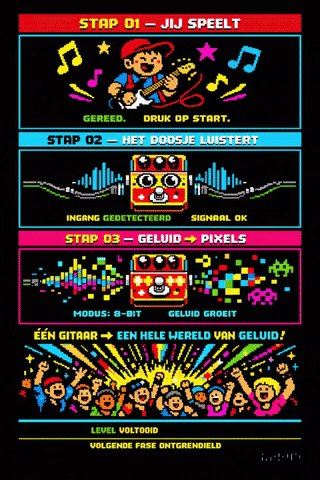
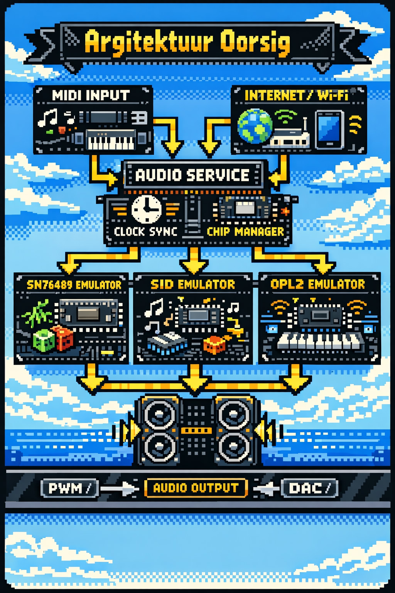

# de idee
**Project:** SN76489 CircuitPython Emulator  

# Variant B Project Summary
**Project:** SN76489 CircuitPython Emulator  
**Variant:** B  
**Datum:** 6-Mar-2026  
**Status:** Active baseline summary  
**Masterprompt:** MP-B-1.0.0

---

## 1. Projekdoel

Variant B is ’n vereenvoudigde projekspoor waarin die **SN76489 nie as fisiese chip in die MVP gebruik word nie**, maar **in CircuitPython geëmuleer word** op ’n **Wemos ESP32-S2 Mini**.

Die doel is om die kompleksiteit te verminder en eers ’n **werkende, meetbare en uitbreidbare emulator-POC** te bou.

Die projek moet dien as:

- persoonlike R&D platform
- recruiter-proof GitHub projek
- basis vir latere uitbreiding na ’n bruikbare mini-instrument
- moontlike toekomstige vergelyking met **Variant A — Hardware Interface**

---

## 2. Kernverskil met Variant A

### Variant A
Ouer hardware-rigting:

ESP32-S2 Mini  
→ PCF8574  
→ regte SN76489  
→ LM386 / audio ketting

### Variant B
Nuwe emulator-rigting:

ESP32-S2 Mini  
→ CircuitPython  
→ sagteware-SN76489-emulasie  
→ PWM-audio-uitset  
→ meetbare / hoorbare toon

Die belangrikste verskil is:

**Variant B bewys eers die klanklogika in sagteware, sonder die fisiese PSG-chip as MVP-afhanklikheid.**

---

## 3. Huidige MVP-rigting

Die eerste MVP vir Variant B is doelbewus klein.

### In MVP
- Wemos ESP32-S2 Mini
- CircuitPython
- USB MIDI IN only
- headless werking
- PWM-pin as eerste audio-uitvoer
- `config.json`
  - `midi_channel`
  - `log_level`
- logging:
  - INFO
  - DEBUG

### Eerste tegniese bewys
Die eerste suksesvolle bewys mag nog baie eenvoudig wees:

- een eenvoudige pieptoon
- PWM-sein meetbaar op die **Rigol DHO804**
- daarna eenvoudige toonstappe of note-progressie, bv.:
  - **C3, E3, F3**

---

## 4. Emulasiepad

Die emulasie groei in fases:

### Fase 1
- een eenvoudige toon op PWM

### Fase 2
- meer musikale note-uitvoer
- eerste SN76489-agtige toonlogika

### Fase 3
- 3 tone-kanale
- noise channel
- basiese attenuation / volume
- register-agtige gedrag

Die doel is:

- **eers bruikbare SN76489-agtige klank**
- **later meer akkuraatheid**

Nie andersom nie.

---

## 5. Wat bewustelik uit die eerste POC gehaal is

Om kompleksiteit te verminder, bly hierdie dinge **uit die eerste POC**:

- LCD/UI
- i18n
- web UI
- Bluetooth MIDI
- I2S as eerste implementasie
- eksterne DAC
- hardware-SN76489-chip
- volle chip-akkuraatheid

Hierdie items bly eerder:

- **roadmap-items**
- of **latere uitbreidings**

---

## 6. Audio-rigting

### Eerste voorkeur
- **PWM-pin**

### Tweede ondersoekpad
- **I2S**, maar net as PWM te swak of te beperk blyk

### Aanvaarde kompromie
Direkte PWM-audio mag:
- raserig wees
- swak klankkwaliteit hê
- ru klink

Dit is aanvaarbaar vir die eerste Discovery/MVP, mits:
- dit werk
- dit meetbaar is
- dit die emulator-pad bewys

---

## 7. Discovery-fokus vir Variant B

Die huidige Discovery vir Variant B moet hierdie dinge finaliseer:

1. eerste audio-uitvoerpad  
2. minimum emulasiescope  
3. headless MVP-keuse  
4. minimum config/logging  
5. grootste performance-risiko’s  

Discovery moet ook bevat:
- ’n **out-of-scope lys**
- ’n **risiko-matriks**

---

## 8. Huidige tegniese aannames

- MCU: **Wemos ESP32-S2 Mini**
- firmware: **CircuitPython**
- MIDI: **USB MIDI IN only**
- config: **JSON op flash filesystem**
- eerste audio-uitset: **PWM**
- logging: **INFO + DEBUG**
- eerste POC: **headless**
- ou hardware-kode bly **apart**
- web UI bly in roadmap
- Bluetooth MIDI bly in roadmap

---

## 9. Kodegenerasie-reël vir later

Vir latere code generation geld hierdie vaste projekreël:

- **geen globale veranderlikes**
- **alle kode en veranderlikes moet in ’n class wees**

Die doel hiervan is beter portability na ander Python-implementasies.

---

## 10. Huidige formele status

- **Masterprompt goedgekeur:** MP-B-1.0.0
- **Aktiewe variant:** Variant B
- **Huidige projekstap:** Discovery
- **Volgende artefak:** DR-B-v1.0 Discovery Report

---

## 11. Kort eenreël-samevatting

**Variant B is ’n CircuitPython-gebaseerde SN76489-emulator op ’n ESP32-S2, met ’n eerste MVP wat ’n eenvoudige PWM-toon vanaf USB MIDI meetbaar en hoorbaar moet maak, sonder die kompleksiteit van ’n fisiese PSG-chip.**

# Architectuur overzicht

# Ontwikkel cyclus

